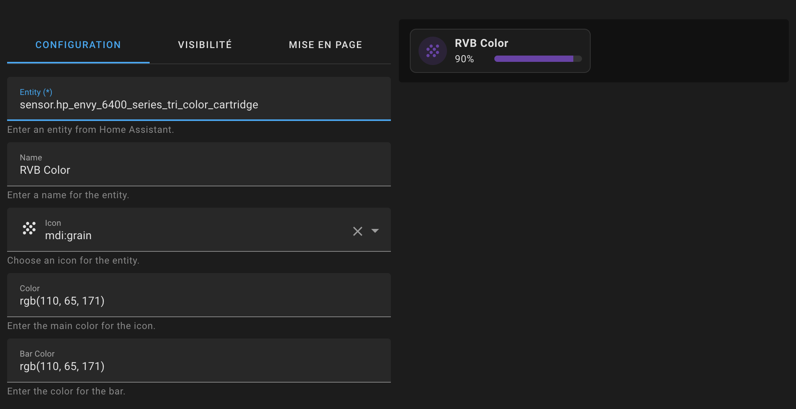

# lovelace-entity-progress-card
Entity progress card for Home Assistant


This custom version of the **Bar Card** for Home Assistant allows you to display a simple percentage bar that is quick and easy to integrate into your Lovelace cards. It blends seamlessly with the `Tile`/`Mushroom` look & feel of the latest Home Assistant versions. This card is based on custom CSS and leverages existing code to fine-tune the appearance.

## 🚀 Features
- Displays a percentage progress bar.
- Seamlessly integrates with the "Tile" look & feel of recent Home Assistant versions.
- Easily customizable using the card editor or YAML config : entity, name, colors, and bar color
  
## ⚙️ Prerequisites

- HA version: 2024+
> Ensure your Home Assistant instance is up to date to support this custom card.

## ⚙️ Installation Steps
### Manual Installation

1. Download the file `entity-progress-card.js` to the `/config/www/` directory in your Home Assistant setup.
2. Add `/local/entity-progress-card.js` to your Lovelace resources
```yaml
url: /local/entity-progress-card.js
type: module
```
3. Restart Home Assistant to load the new resource.

### HACS Installation (Recommended)

1. Add this repository to HACS by including it as a custom repository:
  - Go to `HACS` > `Integrations` > `⋮` > `Custom repositories`.
  - Paste the URL of this repository and select Lovelace as the category.
2. Install the Entity Progress Card from HACS.
3. Restart Home Assistant to finalize the installation.
4. Ensure the card is automatically added to your resources in Settings > Dashboards > Resources.


## 📝 Usage
### Parameters

You can customize the card using the following parameters:

- **`entity`** *(required)*:  
  The Home Assistant entity to display.  
  *Example:* `sensor.hp_envy_6400_series_tri_color_cartridge`

- **`name`** *(optional)*:  
  The name displayed on the progress bar. If omitted, the entity's friendly name will be used.  
  *Example:* `"RGB Color"`

- **`icon`** *(optional)*:  
  The icon associated with the entity. Supports Material Design Icons (MDI).  
  *Examples:* `mdi:lightbulb`, `mdi:thermometer`

- **`color`** *(optional)*:  
  The color of the icon. Accepts color names, RGB values, or HEX codes.  
  *Examples:* `"green"`, `"rgb(68, 115, 158)"`, `"#FF5733"`

- **`bar-color`** *(optional)*:  
  The color of the progress bar. Accepts color names, RGB values, or HEX codes.  
  *Examples:* `"blue"`, `"rgb(68, 115, 158)"`, `"#FF5733"`
  
### YAML
Here’s our example of how to use the Custom Bar Card with custom styles:

```yaml
type: custom:entity-progress-card
entity: sensor.hp_envy_6400_series_tri_color_cartridge
name: RVB
icon: mdi:grain
color: rgb(110, 65, 171)
bar_color: rgb(110, 65, 171)
```

### Card Editor
The card editor allows you to quickly set up and customize the card.


## 💡 Tips

- Use Material Design Icons (MDI) for a consistent look. Browse available icons at Material Design Icons.
- Experiment with color codes like HEX or RGB for precise customization.
- Combine with other Lovelace cards to create a visually cohesive dashboard.

## 🛠️ Known Issue

- In the card editor, you must switch to another field for a modification to be saved.
