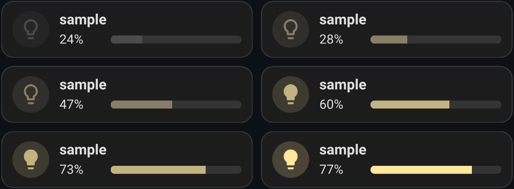
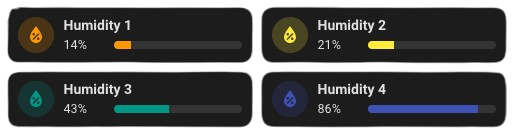
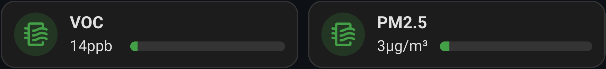

[](#)
# Lovelace Entity Progress Card
[](#)
[](#)
[](https://discord.gg/tyMQ2SfyNG)

Entity progress card for Home Assistant


This custom version of the **Bar Card** for Home Assistant allows you to display a simple percentage bar that is quick and easy to integrate into your Lovelace cards. It blends seamlessly with the `Tile`/`Mushroom` look & feel of the latest Home Assistant versions. This card is based on custom CSS and leverages existing code to fine-tune the appearance.

## 🚀 Features
- **Percentage Progress Bar**: Displays the progress of a specified entity in percentage.
- **Seamless Integration with Home Assistant's Modern UI**: Fully aligns with the "Tile" look & feel of recent Home Assistant versions.
- **Dynamic Theme**: Automatically adjusts icons and colors based on the context (e.g., Battery Theme), reflecting the entity's state.
- **Enhanced Customization**: Offers a balanced default setup while allowing users to further tailor the card's behavior and appearance through YAML or the card editor (full details below).
- **Smooth Animations**: Provides HTML elements that facilitate smooth, visually appealing animations, leveraging well-known mechanisms for easy implementation.
- **Interactive Features**: Includes a "More Info" option, enabling users to view additional entity details or navigate to another dashboard with a simple click, improving accessibility and usability.
- **Performance Optimized**: Code enhancements ensure better performance and maintainability, offering a more stable and responsive experience.
- **Multi-Language Support**: Provides localized error messages and descriptions, supporting multiple languages 🇬🇧 🇪🇸 🇩🇪 🇮🇹 🇫🇷 🇵🇱 🇳🇱 🇲🇰 🇵🇹 🇩🇰 🇸🇪 🇳🇴 (bokmål).
  
## ⚙️ Prerequisites

- HA version: 2024+
> [!IMPORTANT]
> Ensure your Home Assistant instance is up to date to support this custom card.

## 📦 Installation Steps
### HACS Installation (Recommended)

Use this button to add the repository to your HACS:

[](https://my.home-assistant.io/redirect/hacs_repository/?owner=francois-le-ko4la&repository=lovelace-entity-progress-card&category=plugin)

> [!TIP]
> If you are unable to use the button above, follow the steps below:
> 1. Add this repository to HACS by including it as a custom repository:
>   - Go to `HACS` > `Integrations` > `⋮` > `Custom repositories`.
>   - Paste the URL of this repository and select Lovelace as the category.
> 2. Install the Entity Progress Card from HACS.

### Manual Installation

1. Download the file `entity-progress-card.js` to the `/config/www/` directory in your Home Assistant setup.
2. Add `/local/entity-progress-card.js` to your Lovelace resources
```yaml
url: /local/entity-progress-card.js
type: module
```

## 📝 Usage
### Card Editor
The card editor allows you to quickly set up and customize the card.


### Parameters

You can customize the card using the following parameters:

- **`entity`** [entity] *(required)*:  
  The Home Assistant entity to display.
  
  *Example:*
    - `sensor.hp_envy_6400_series_tri_color_cartridge`
  
> [!NOTE]
> Supported entities are not hardcoded, ensuring flexibility.
> If you need a specific attribute, use the `attribute` parameter.

> [!IMPORTANT]
> Timer are supported (1.0.43). `attribute`, `min`, `max` parameters are not considered.

- **`attribute`** [entity] *(optional)*:  
  The Home Assistant entity's attribute to display.
  
  *Example:*
    - `brightness`
 
  *Supported entities:*
  
  | entity (supported)    | default attribute   |
  | --------------------- | ------------------- |
  | cover.xxx             | current_position    |
  | light.xxx             | brightness (%)      |
  | fan.xxx               | percentage          |
  | climate.xxx           | N/A                 |
  | humidifier.xxx        | N/A                 |
  | media_player.xxx      | N/A                 |
  | vacuum.xxx            | N/A                 |
  | device_tracker.xxx    | N/A                 |
  | weather.xxx           | N/A                 |
  
- **`name`** [string] *(optional)*:  
  The name displayed on the progress bar. If omitted, the entity's friendly name will be used.
  
  *Default:*
    - `<entity_name>`
      
  *Example:*
    - `"RGB Color"`

- **`layout`** [string {`horizontal`| `vertical`}] *(optional)*:  
  Determines the layout of the elements inside the card. You can choose between different layouts based on your visual preferences.
  
  *Default:*
    - `horizontal`
  
  *Examples:*
    - `horizontal`: Displays the elements horizontally, with a row layout (by default, the text and progress bar will be displayed side by side).  
    - `vertical`: Displays the elements vertically, with a column layout (by default, the text and progress bar will be stacked one below the other).

- **`icon`** [string] *(optional)*:  
  The icon associated with the entity. Supports Material Design Icons (MDI).
  
  *Examples:* `mdi:lightbulb`, `mdi:thermometer`

  *Default:*
    | Device Class                        | Icon (MDI)             |
    |-------------------------------------|------------------------|
    | battery                             | mdi:battery            |
    | carbon_dioxide                      | mdi:molecule-co2       |
    | cold                                | mdi:snowflake          |
    | connectivity                        | mdi:wifi               |
    | current                             | mdi:current-ac         |
    | door                                | mdi:door-open          |
    | energy                              | mdi:flash              |
    | gas                                 | mdi:fire               |
    | heat                                | mdi:fire               |
    | humidity                            | mdi:water-percent      |
    | illuminance                         | mdi:brightness-5       |
    | light                               | mdi:lightbulb          |
    | lock                                | mdi:lock               |
    | moisture                            | mdi:water              |
    | motion                              | mdi:motion-sensor      |
    | occupancy                           | mdi:account            |
    | opening                             | mdi:window-open        |
    | plug                                | mdi:power-plug         |
    | power                               | mdi:flash              |
    | power_factor                        | mdi:flash              |
    | pressure                            | mdi:gauge              |
    | problem                             | mdi:alert              |
    | safety                              | mdi:shield-check       |
    | shutter                             | mdi:window-shutter     |
    | smoke                               | mdi:smoke-detector     |
    | sound                               | mdi:volume-high        |
    | switch                              | mdi:power-socket       |
    | temperature                         | mdi:thermometer        |
    | timestamp                           | mdi:calendar-clock     |
    | tv                                  | mdi:television         |
    | vibration                           | mdi:vibrate            |
    | volatile_organic_compounds_parts    | mdi:molecule           |
    | voltage                             | mdi:flash              |
    | window                              | mdi:window-open        |

  *Order of Priority for the Icon:*
    - Theme/Custom Theme: The icon derived from the theme or style applied to the item.
    - Icon Parameter: A custom icon specifically defined for the item.
    - Icon Associated with the Entity: The icon directly linked or representative of the entity.
    - Icon Associated with the Entity's device_class: temperature, humidity...
    - Default: The icon used by default if no other is specified.

- **`color`** [string] *(optional)*:  
  The color of the icon. Accepts color names, RGB values, or HEX codes.
  
  *Default:*
    - `var(--state-icon-color)`

  *Examples:* `"green"`, `"rgb(68, 115, 158)"`, `"#FF5733"`, `var(--state-icon-color)`

- **`bar_size`** [string {`small`|`medium`|`large`}] *(optional)*:  
  Customizes the appearance of the progress bar by selecting a predefined size.
  Choose from small, medium, or large to adjust the visual scale of the bar.
  
  *Default:*
    - `small`

  *Example:*
    - `medium`

- **`bar_color`** [string] *(optional)*:  
  The color of the progress bar. Accepts color names, RGB values, or HEX codes.
  
  *Default:*
    - `var(--state-icon-color)`

  *Examples:* `"blue"`, `"rgb(68, 115, 158)"`, `"#FF5733"`, `var(--state-icon-color)`

- **`theme`** [string {`battery`|`cpu`|`light`|`memory`|`temperature`|`humidity`|`pm25`|`voc`}] *(optional)*:  
  Allows customization of the progress bar's appearance using a predefined theme.
  This theme dynamically adjusts the `icon`, `color` and `bar-color` parameters based on the battery level, eliminating the need for manual adjustments or complex Jinja2 templates.  
  *Example:*
    - `battery`
    - `light`

- **`reverse`** [boolean] *(optional)*:

  Used only for entities of type timer. 
  If set to true, the timer functions as a countdown (in seconds or percentage).

- **`custom_theme`** [array] *(optional)*:
  
  Defines a list of custom theme rules based on value ranges. Setting this variable disables the theme variable. 
  This variable can only be defined in YAML.

  *Properties of each item:*
    - min [number] (required): The minimum value for this range.
    - max [number] (required): The maximum value for this range.
    - color [string] (required): The color of the icon.
    - icon [string] (optional): The icon to display.

  *Order of Priority for the Icon:*
    - Theme/Custom Theme: The icon derived from the theme or style applied to the item.
    - Icon Parameter: A custom icon specifically defined for the item.
    - Icon Associated with the Entity: The icon directly linked or representative of the entity.
    - Icon Associated with the Entity's device_class: temperature, humidity...
    - Default: The icon used by default if no other is specified.

  *Example:*
  ```yaml
  custom_theme:
    - min: 0
      max: 10
      color: yellow
      icon: mdi:abacus
    - min: 10
      max: 20
      color: green
      icon: mdi:ab-testing
    - min: 20
      max: 50
      color: var(--state-icon-color)
      icon: mdi:abacus
  ```

> [!NOTE]
> [`min`, `max`[ / [`min`, `max`) : The range includes the min value but excludes the max value.

> [!IMPORTANT]
> Please follow these guidelines for defining your themes:
> - Intervals must be valid: Each range should respect the rule `min` < `max`.
> - Seamless continuity: Each `max` must connect smoothly to the next `min`, with no awkward gaps or overlaps between ranges.
> - Boundary flexibility: If a value falls below the lowest defined interval, the lowest range will be applied. Conversely, if a value exceeds the highest interval, the highest range will be used.
> 
> This is an advanced feature that may require some trial and error during customization. For a seamless editing experience, if the theme definition is incorrect, the card simulation will revert to a standard configuration and ignore the `custom_theme` definition.

> [!TIP]
> If you wish to define colors for discontinuous ranges, you will need to create intermediary ranges to ensure continuity, using default colors such as var(--state-icon-color) for these filler ranges.
>   ```yaml
>  # Default settings:
>  #   - Color: var(--state-icon-color)
>  #   - Icon: mdi:abacus
>  # 
>  # Specific ranges:
>  #   - 10 to 20: 
>  #       - Color: green
>  #       - Icon: mdi:ab-testing
>  #   - 50 to 60: 
>  #       - Color: red
>  #       - Icon: mdi:ab-testing
>  custom_theme:
>    # value < 10:
>    - min: 0
>      max: 10
>      color: var(--state-icon-color)
>      icon: mdi:abacus
>    # 10 <= value < 20:
>    - min: 10
>      max: 20
>      color: green
>      icon: mdi:ab-testing
>    # 20 <= value < 50:
>    - min: 20
>      max: 50
>      color: var(--state-icon-color)
>      icon: mdi:abacus
>    # 50 <= value < 60:
>    - min: 50
>      max: 60
>      color: red
>      icon: mdi:ab-testing
>    # 60 <= value:
>    - min: 60
>      max: 70
>      color: var(--state-icon-color)
>      icon: mdi:abacus
>  ```

- **`max_value`** [numeric/entity] *(optional)*:  
  Allows representing standard values and calculating the percentage relative to the maximum value.
  This value can be numeric (float/int) or an entity and real value must be > 0.
  
  *Default:*
    - `100%`

  *Example:*
    - LQI @ 150 (entity) with max_value @ 255 (static value -> max_value = 255)
    - A (entity_a) with max_value (entity_b)

- **`min_value`** [numeric] *(optional)*:  
  Defines the minimum value to be used when calculating the percentage.  
  This allows the percentage to be relative to both a minimum (min_value, which represents 0%) and a maximum (max_value, which represents 100%).  
  This value must be numeric (either a float or an integer).

  *Default:*
    - `0`

  *Example:*
    Suppose you are measuring the weight of a connected litter box, where:
    - `min_value` = 6 (the minimum weight representing an empty box, i.e., 0%).
    - `max_value` = 11 (the maximum weight representing a full box, i.e., 100%).
    - `value` = 8 (the current weight).
    - `percentage` = 40%

- **`unit`** [string] *(optional)*:  
  Allows representing standard unit.  
  By default, the unit is % and allow you to get a ratio.  
  Specifies the unit to display the entity's actual value, ignoring max_value. The max_value is still used for the progress bar representation.
  
  *Default:*
    - `%`
      
  *Example:*
    - `°C` for temperature.
    - `kWh` for energy consumption.
    - `s` for timer
    - `timer` for timer (display HH:MM:SS without unit)
    - `flextimer` for timer (same than timer but truncate the display according to the current value)
    
- **`decimal`** [int >=0] *(optional)*:  
  Defines the number of decimal places to display for numerical values.  
  The `decimal` value will be determined based on the following priority:
  - `Display Precision` from the entity (if defined in Home Assistant).
  - `decimal` setting in the YAML configuration.
  - `Default Value` (if no other value is set).
  
  *Default values:*
    - `decimal` = 0 for percentage (%)
    - `decimal` = 2 for other unit (°C, kWh...)

  *Example:*  
    - `1` for displaying 50.6%.
    - `0` for displaying 51%
    -  `1` for displaying 20.7°C

> [!IMPORTANT]
> Before version 1.0.20, the default values were different (2 for percentages
> and 0 for other units). When updating, you will need to adjust the parameter
> according to your needs.

- **`navigate_to`** [string] *(optional)*:  
  Specifies a URL to navigate to when the card is clicked.
  If defined, clicking the card will redirect to the specified location.
  This parameter takes precedence over show_more_info if both are defined.

  *Default values:*
    - `null` (no navigation).

  *Example:*
    - `/lovelace/dashboard` to navigate to another Home Assistant dashboard ("dashboard").
    - `/lovelace/5` to navigate to another Home Assistant dashboard (5).
    - `https://example.com` to open an external link.

- **`show_more_info`** [boolean] *(optional)*:  
  Determines whether clicking on the card will open the entity's "more info" dialog in Home Assistant.  
  Defaults to true. If set to false, clickingthe card will not trigger any "more info" action.
  
  *Default:*
    - `true`
  
  *Example:*
    - `true` to enable "more info" on click.
    - `false` to disable the "more info" dialog.
  
### YAML
Here’s our example of how to use the Custom Bar Card with custom styles:

```yaml
type: custom:entity-progress-card
entity: sensor.hp_envy_6400_series_tri_color_cartridge
name: RVB
icon: mdi:grain
color: rgb(110, 65, 171)
bar_color: rgb(110, 65, 171)
```


Another example with `grid_option` and vertical `layout`:
```yaml
type: custom:entity-progress-card
entity: sensor.hp_envy_6400_series_tri_color_cartridge
name: RVB
icon: mdi:grain
color: yellow
bar_color: green
layout: vertical
grid_options:
  columns: 3
  rows: 2
```


## 💡 Sample Usage

> [!TIP]
>  - Use Material Design Icons (MDI) for a consistent look. Browse available icons at Material Design Icons.
>  - Experiment with color codes like HEX or RGB for precise customization.
>  - Combine with other Lovelace cards to create a visually cohesive dashboard.

> [!IMPORTANT]
>
> Below, you'll find examples that highlight the interoperability of this card with other popular Home Assistant projects.
> To replicate these samples, ensure the following are set up:
>
>  - vertical-stack-in-card ([GitHub link](https://github.com/ofekashery/vertical-stack-in-card))
>  - auto-entities ([GitHub link](https://github.com/thomasloven/lovelace-auto-entities))
>  - card_mod ([GitHub link](https://github.com/thomasloven/lovelace-card-mod))

### Battery dashboard

This card enables the creation of a streamlined battery dashboard by leveraging theme capabilities and `auto-entities` custom card.

```yaml
type: custom:auto-entities
filter:
  include:
    - attributes:
        device_class: battery
      options:
        type: custom:entity-progress-card
        entity: this.entity_id
        theme: battery
card:
  square: false
  type: grid
  columns: 2
show_empty: true
card_param: cards
sort:
  method: state
  numeric: true
  ignore_case: false
```


### Litter box

Do you want a percentage based on a minimum and maximum quantity? Here’s an example with a litter box:

```yaml
type: custom:entity-progress-card
entity: sensor.petkit_puramax_2_litter_weight
max_value: 12
min_value: 6
name: Litière
bar_color: var(--disabled-color)
grid_options:
  columns: 6
  rows: 1
```

### Themes
#### Battery

```yaml
type: custom:entity-progress-card
entity: sensor.xxx_battery_level
theme: battery
```

The `battery` configuration defines how different battery charge levels are visually represented using colors and icons.  
This system uses a **linear gradient**, meaning the color transitions progressively across the charge percentage range.  

The battery levels and their corresponding icons and colors are as follows:

*   **< 10%**:   `mdi:battery-alert` → Critical battery (`var(--state-sensor-battery-low-color)`)  
*   **≥ 10%**:   `mdi:battery-alert` → Low battery (`var(--state-sensor-battery-low-color)`)  
*   **≥ 20%**:   `mdi:battery-20` → Low battery (`var(--state-sensor-battery-medium-color)`)  
*   **≥ 30%**:   `mdi:battery-30` → Medium battery (`var(--state-sensor-battery-medium-color)`)  
*   **≥ 40%**:   `mdi:battery-40` → Medium battery (`var(--state-sensor-battery-medium-color)`)  
*   **≥ 50%**:   `mdi:battery-50` → Moderate battery (`var(--yellow-color)`)  
*   **≥ 60%**:   `mdi:battery-60` → Moderate battery (`var(--yellow-color)`)  
*   **≥ 70%**:   `mdi:battery-70` → Moderate battery (`var(--yellow-color)`)  
*   **≥ 80%**:   `mdi:battery-80` → High battery (`var(--state-sensor-battery-high-color)`)  
*   **≥ 90%**:   `mdi:battery-90` → High battery (`var(--state-sensor-battery-high-color)`)  
*   **≥ 100%**:  `mdi:battery` → Fully charged (`var(--state-sensor-battery-high-color)`)  

Icons change progressively from `mdi:battery-alert` at low levels to `mdi:battery` when fully charged.  
The **linear approach** ensures a smooth transition between battery levels.

#### Light

```yaml
type: custom:entity-progress-card
entity: light.bandeau_led
attribute: brightness
theme: light
```

The `light` configuration, designed by [@harmonie-durrant](https://github.com/harmonie-durrant), defines how different brightness levels are visually represented using colors and icons.  
This system uses a **linear gradient**, meaning the color transitions smoothly across the brightness percentage range.  

The brightness levels and their corresponding colors are as follows:

*   **< 25%**:   `#4B4B4B` → Dim light (`mdi:lightbulb-outline`)  
*   **≥ 25%**:   `#877F67` → Soft warm light (`mdi:lightbulb-outline`)  
*   **≥ 50%**:   `#C3B382` → Medium warm light (`mdi:lightbulb`)  
*   **≥ 75%**:   `#FFE79E` → Bright warm light (`mdi:lightbulb`)  
*   **≥ 100%**:  `#FFE79E` → Maximum brightness (`mdi:lightbulb`)  

The `mdi:lightbulb-outline` icon is used for lower brightness levels, while `mdi:lightbulb` is displayed when the light intensity increases.  
Thanks to the **linear** approach, the brightness smoothly transitions between these levels.



#### Temperature

```yaml
type: custom:entity-progress-card
entity: sensor.xxx
attribute: temperature
unit: °C
min_value: -20
max_value: 45
theme: temperature
```

We can use `min_value` and `max_value` to define the range of values we want to represent with our color gradient.
We use predefined intervals, each associated with a specific color:

* -50°C - -30°C / -58°F - -22°F: `var(--deep-purple-color)`
* -30°C - -15°C / -22°F - 5°F: `var(--dark-blue-color)`
* -15°C - -2°C / 5°F - 28.4°F: `var(--blue-color)`
* -2°C - 2°C / 28.4°F - 35.6°F: `var(--light-blue-color)`
* 2°C - 8°C / 35.6°F - 46.4°F: `var(--cyan-color)`
* 8°C - 16°C / 46.4°F - 60.8°F: `var(--teal-color)`
* 16°C - 18°C / 60.8°F - 64.4°F: `var(--green-teal-color)`
* 18°C - 20°C / 64.4°F - 68°F: `var(--light-green-color)`
* 20°C - 25°C / 68°F - 77°F: `var(--success-color)`
* 25°C - 27°C / 77°F - 80.6°F: `var(--yellow-color)`
* 27°C - 29°C / 80.6°F - 84.2°F: `var(--amber-color)`
* 29°C - 34°C / 84.2°F - 93.2°F: `var(--deep-orange-color)`
* 34°C - 50°C / 93.2°F - 122°F: `var(--red-color)`

> [!IMPORTANT]
> Fahrenheit values are converted to apply the correct color. Make sure to set your unit to `°F` correctly in order to see the accurate color representation.


#### Humidity

```yaml
type: custom:entity-progress-card
entity: sensor.xxx
attribute: humidity
theme: humidity
```

The `humidity` configuration defines how different humidity levels are represented with colors and icons.  
Unlike a linear gradient, this system uses predefined humidity ranges, each associated with a specific color and icon.  

The ranges and their corresponding colors are as follows:

*   0% - 23%:   `var(--red-color)` → Very dry air  
*   23% - 30%:  `var(--accent-color)` → Dry air  
*   30% - 40%:  `var(--yellow-color)` → Slightly dry air  
*   40% - 50%:  `var(--success-color)` → Optimal humidity  
*   50% - 60%:  `var(--teal-color)` → Comfortable humidity  
*   60% - 65%:  `var(--light-blue-color)` → Slightly humid air  
*   65% - 80%:  `var(--indigo-color)` → Humid air  
*   80% - 100%: `var(--deep-purple-color)` → Very humid air  

Each range is visually represented using the `mdi:water-percent` icon, ensuring a clear and intuitive display of humidity levels.



#### VOC

```yaml
type: custom:entity-progress-card
entity: sensor.xxx_voc
unit: ppb
decimal: 0
max_value: 300
theme: voc
```

The `voc` configuration defines how different levels of volatile organic compounds (VOCs) are represented using colors and icons.  
Instead of a linear gradient, this system categorizes VOC levels into predefined ranges, each associated with a specific color for better visualization.  

The ranges and their corresponding colors are as follows:

*   0 - 300 ppb:     `var(--success-color)` → Good air quality  
*   300 - 500 ppb:   `var(--yellow-color)` → Acceptable air quality  
*   500 - 3000 ppb:  `var(--accent-color)` → Moderate air quality  
*   3000 - 25000 ppb: `var(--red-color)` → Poor air quality  
*   25000 - 50000 ppb: `var(--deep-purple-color)` → Hazardous

> [!IMPORTANT]
> The information provided in this HA card is based on thresholds from the following [source](https://support.getawair.com/hc/en-us/articles/19504367520023-Understanding-Awair-Score-and-Air-Quality-Factors-Measured-By-Awair-Element).
> This color code is for informational purposes only and should not be taken as professional advice or a standard to follow. It is crucial to consult the device's official documentation or current standards for the most accurate and up-to-date information. In case of any discrepancy between the information provided here and the device's documentation or current standards, the latter shall prevail.
> The lower the value, the better it is generally considered to be.
> With this card you can use `custom_theme` to define your own ranges.
 
Each range is visually represented using the `mdi:air-filter` icon, ensuring a clear and intuitive display of VOC levels.



#### PM 2.5

```yaml
type: custom:entity-progress-card
entity: sensor.xxx_pm25
unit: µg/m³
decimal: 0
max_value: 50
theme: pm25
```

The `pm25` configuration defines how different concentrations of fine particulate matter (PM2.5) are represented using colors and icons.  
Rather than a linear gradient, this system categorizes PM2.5 levels into predefined ranges, each mapped to a specific color for easy interpretation.

The ranges and their corresponding colors are as follows:

*   0 - 12 µg/m³:   `var(--success-color)` → Good air quality  
*   12 - 35 µg/m³:  `var(--yellow-color)` → Moderate air quality  
*   35 - 55 µg/m³:  `var(--accent-color)` → Unhealthy for sensitive groups  
*   55 - 150 µg/m³: `var(--red-color)` → Unhealthy air quality  
*   150 - 200 µg/m³: `var(--deep-purple-color)` → Very unhealthy air quality  

> [!IMPORTANT]
> The information provided in this HA card is based on thresholds from the following [source](https://support.getawair.com/hc/en-us/articles/19504367520023-Understanding-Awair-Score-and-Air-Quality-Factors-Measured-By-Awair-Element).
> This color code is for informational purposes only and should not be taken as professional advice or a standard to follow. It is crucial to consult the device's official documentation or current standards for the most accurate and up-to-date information. In case of any discrepancy between the information provided here and the device's documentation or current standards, the latter shall prevail.
> The lower the value, the better it is generally considered to be.
> With this card you can use `custom_theme` to define your own ranges.

Each range is visually represented using the `mdi:air-filter` icon, ensuring a clear and intuitive display of PM2.5 pollution levels.


### card_mod / animation

We can use `card_mod` to add dynamic animations to the icon, enhancing the visual experience and providing a more engaging user interface.

*Example:*
```yaml
type: custom:entity-progress-card
entity: sensor.hp_envy_6400_series_tri_color_cartridge
name: RVB
icon: mdi:grain
color: rgb(110, 65, 171)
bar_color: rgb(110, 65, 171)
card_mod:
  style: |-
    ha-icon {
      animation: boing 3s ease infinite;
      transform-origin: 50% 90%;
    }
    @keyframes boing {
      0% { transform: scale3d(1, 1, 1); }
      7% { transform: scale3d(1.25, 0.75, 1); }
      10% { transform: scale3d(0.75, 1.25, 1); }
      12% { transform: scale3d(1.15, 0.85, 1); }
      16% { transform: scale3d(0.95, 1.05, 1); }
      19% { transform: scale3d(1.05, 0.95, 1); }
      25% { transform: scale3d(1, 1, 1); }
    }
```
> [!TIP]
> We expose the `ha-icon` and `ha-shape` elements to properly animate the card.

### vertical-stack-in-card

We can use `vertical-stack-in-card` to group multiple cards into a cohesive layout.
This approach is particularly useful when combining custom cards while maintaining a
consistent design. Additionally, we leverage `auto-entities` to dynamically list entities
based on specific attributes or filters, allowing for flexible and automatic card
generation. Finally, `card_mod` is used to remove the borders and shadows, ensuring a
clean and seamless appearance.

*Example:*
```yaml
type: custom:vertical-stack-in-card
cards:
  - type: custom:auto-entities
    filter:
      include:
        - attributes:
            device_class: battery
          options:
            type: custom:entity-progress-card
            entity: this.entity_id
            name: sample
            theme: battery
            card_mod:
              style:
                .: |-
                  :host {
                    --ha-card-border-width: 0px !important; /* Forcer la suppression des bordures */
                    box-shadow: none !important; /* Supprimer l'ombre pour enlever tout contour */
                  }
    sort:
      method: friendly_name
    card:
      square: false
      type: grid
      columns: 2
    card_param: cards
```

