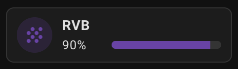
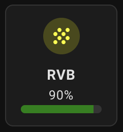
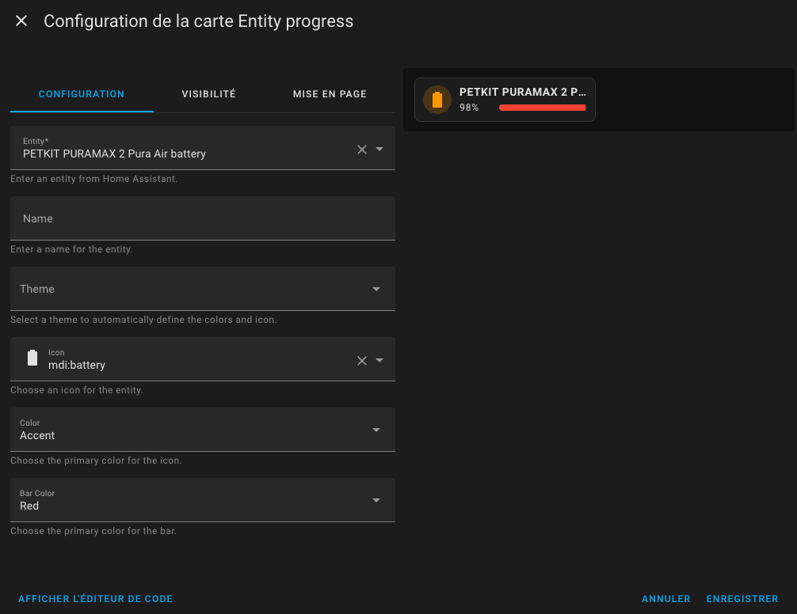
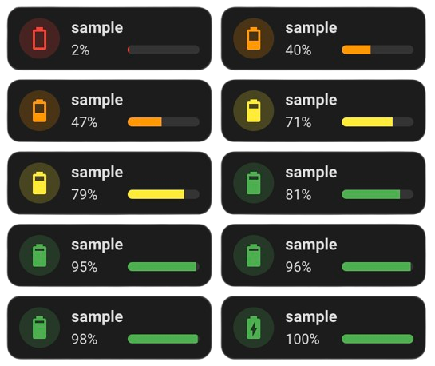
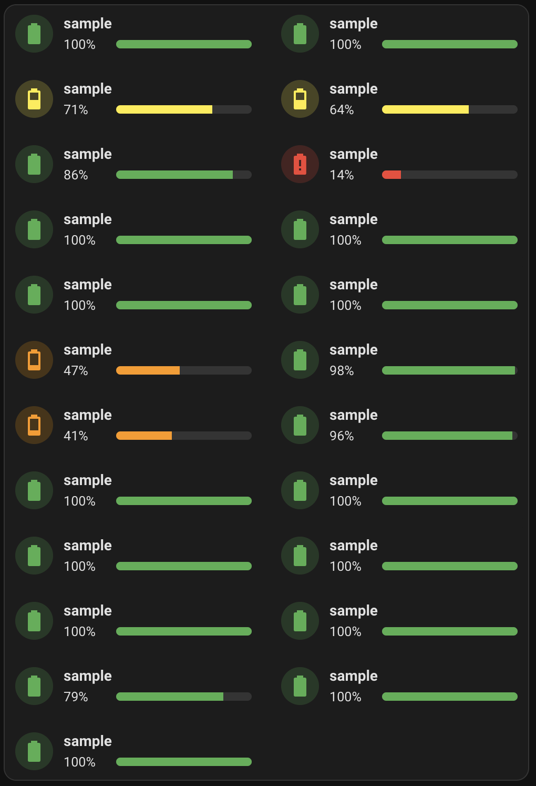

# Lovelace Entity Progress Card

Entity progress card for Home Assistant


This custom version of the **Bar Card** for Home Assistant allows you to display a simple percentage bar that is quick and easy to integrate into your Lovelace cards. It blends seamlessly with the `Tile`/`Mushroom` look & feel of the latest Home Assistant versions. This card is based on custom CSS and leverages existing code to fine-tune the appearance.

## 🚀 Features
- Displays a percentage progress bar.
- Seamlessly integrates with the "Tile" look & feel of recent Home Assistant versions.
- Easily customizable using the card editor or YAML config : entity, name, colors, bar color, unit... (full description below)
- Theme to automatically adjust icon and colors according to the context (Theme Battery)
- Automatically adapts to the user's language for error messages and descriptions, ensuring a localized experience. 🇬🇧🇪🇸🇩🇪🇫🇷
  
## ⚙️ Prerequisites

- HA version: 2024+
> Ensure your Home Assistant instance is up to date to support this custom card.

## 📦 Installation Steps
### HACS Installation (Recommended)

Use this button to add the repository to your HACS:

[](https://my.home-assistant.io/redirect/hacs_repository/?owner=francois-le-ko4la&repository=lovelace-entity-progress-card&category=plugin)

or follow these steps:
1. Add this repository to HACS by including it as a custom repository:
  - Go to `HACS` > `Integrations` > `⋮` > `Custom repositories`.
  - Paste the URL of this repository and select Lovelace as the category.
2. Install the Entity Progress Card from HACS.

### Manual Installation

1. Download the file `entity-progress-card.js` to the `/config/www/` directory in your Home Assistant setup.
2. Add `/local/entity-progress-card.js` to your Lovelace resources
```yaml
url: /local/entity-progress-card.js
type: module
```

## 📝 Usage
### Parameters

You can customize the card using the following parameters:

- **`entity`** [entity] *(required)*:  
  The Home Assistant entity to display.  
  *Example:*
    - `sensor.hp_envy_6400_series_tri_color_cartridge`

- **`name`** [string] *(optional)*:  
  The name displayed on the progress bar. If omitted, the entity's friendly name will be used.  
  *Example:*
    - `"RGB Color"`

- **`layout`** [string `horizontal`| `vertical`] *(optional)*:  
  Determines the layout of the elements inside the card. You can choose between different layouts based on your visual preferences.
  
  *Examples:*
    - `horizontal`: Displays the elements horizontally, with a row layout (by default, the text and progress bar will be displayed side by side).  
    - `vertical`: Displays the elements vertically, with a column layout (by default, the text and progress bar will be stacked one below the other).
  
  If no specific layout is set, the default layout is `horizontal`.

- **`icon`** [string] *(optional)*:  
  The icon associated with the entity. Supports Material Design Icons (MDI).  
  *Examples:* `mdi:lightbulb`, `mdi:thermometer`

- **`color`** [string] *(optional)*:  
  The color of the icon. Accepts color names, RGB values, or HEX codes.  
  *Examples:* `"green"`, `"rgb(68, 115, 158)"`, `"#FF5733"`, `var(--state-icon-color)`

- **`bar-color`** [string] *(optional)*:  
  The color of the progress bar. Accepts color names, RGB values, or HEX codes.  
  *Examples:* `"blue"`, `"rgb(68, 115, 158)"`, `"#FF5733"`, `var(--state-icon-color)`

- **`theme`** [string `battery`|`light`] *(optional)*:  
  Allows customization of the progress bar's appearance using a predefined theme.
  This theme dynamically adjusts the `icon`, `color` and `bar-color` parameters based on the battery level, eliminating the need for manual adjustments or complex Jinja2 templates.  
  *Example:*
  - `battery`

- **`max_value`** [numeric/entity] *(optional)*:  
  Allows representing standard values and calculating the percentage relative to the maximum value.
  This value can be numeric (float/int) or an entity and real value must be > 0.  
  *Example:*
  - LQI @ 150 (entity) with max_value @ 255 (static value -> max_value = 255)
  - A (entity_a) with max_value (entity_b)

- **`unit`** [string] *(optional)*:  
  Allows representing standard unit.  
  Specifies the unit to display the entity's actual value, ignoring max_value. The max_value is still used for the progress bar representation.  
  *Example:*
  - `°C` for temperature.
  - `kWh` for energy consumption.
    
- **`decimal`** [int >=0] *(optional)*:  
  Defines the number of decimal places to display for numerical values.  
  The `decimal` value will be determined based on the following priority:
  - `Display Precision` from the entity (if defined in Home Assistant).
  - `decimal` setting in the YAML configuration.
  - `Default Value` (if no other value is set).
  
  *Default values:*
    - `decimal` = 2 for percentage (%)
    - `decimal` = 0 for other unit (°C, kWh...)
  
  *Example:*
    - `1` for displaying 50.6%.
    - `0` for displaying 51%
    -  `1` for displaying 20.7°C

- **`show_more_info`** [boolean] *(optional)*:  
  Determines whether clicking on the card will open the entity's "more info" dialog in Home Assistant.  
  Defaults to true. If set to false, clickingthe card will not trigger any "more info" action.
  
  *Default:* true
  
  *Example:*
    - `true` to enable "more info" on click.
    - `false` to disable the "more info" dialog.
  
> Note:  
> `max_value`, `unit`, `decimal` & `show_more_info` can be set with the YAML editor only

### YAML
Here’s our example of how to use the Custom Bar Card with custom styles:

```yaml
type: custom:entity-progress-card
entity: sensor.hp_envy_6400_series_tri_color_cartridge
name: RVB
icon: mdi:grain
color: rgb(110, 65, 171)
bar_color: rgb(110, 65, 171)
decimal: 0
```



Another example with `grid_option` and vertical `layout`:
```yaml
type: custom:entity-progress-card
entity: sensor.hp_envy_6400_series_tri_color_cartridge
name: RVB
icon: mdi:grain
color: yellow
bar_color: green
decimal: 0
layout: vertical
grid_options:
  columns: 3
  rows: 2
```



### Card Editor
The card editor allows you to quickly set up and customize the card.



- The `Entity` field is required, and an error message will appear if it is not filled in.
- The `Name` field is an input form. If the `Name` field is left empty, the card will use the entity’s default name.
- The `Layout` can be selected.
- The `Icon` is selected directly from a dropdown with all available icons in Home Assistant.
- `Colors` can be selected from the provided list, which is based on standard Home Assistant colors. It’s possible to use a color outside of this list, but it must be set through YAML configuration.
- The `Theme` can be selected. Once a theme is chosen, the `icon`, `color`, and `bar-color` parameters will no longer be visible.

## 💡 Tips
### Usage

- Use Material Design Icons (MDI) for a consistent look. Browse available icons at Material Design Icons.
- Experiment with color codes like HEX or RGB for precise customization.
- Combine with other Lovelace cards to create a visually cohesive dashboard.

### Battery dashboard

This card enables the creation of a streamlined battery dashboard by leveraging theme capabilities and [auto-entities](https://github.com/thomasloven/lovelace-auto-entities) custom card.

```yaml
type: custom:auto-entities
filter:
  include:
    - attributes:
        device_class: battery
      options:
        type: custom:entity-progress-card
        entity: this.entity_id
        theme: battery
        decimal: 0
card:
  square: false
  type: grid
  columns: 2
show_empty: true
card_param: cards
sort:
  method: state
  numeric: true
  ignore_case: false
```



### card_mod / animation

We can use `card_mod` to add dynamic animations to the icon, enhancing the visual experience and providing a more engaging user interface.

*Example:*
```yaml
type: custom:entity-progress-card
entity: sensor.hp_envy_6400_series_tri_color_cartridge
name: RVB
icon: mdi:grain
color: rgb(110, 65, 171)
bar_color: rgb(110, 65, 171)
card_mod:
  style: |-
    ha-icon {
      animation: boing 3s ease infinite;
      transform-origin: 50% 90%;
    }
    @keyframes boing {
      0% { transform: scale3d(1, 1, 1); }
      7% { transform: scale3d(1.25, 0.75, 1); }
      10% { transform: scale3d(0.75, 1.25, 1); }
      12% { transform: scale3d(1.15, 0.85, 1); }
      16% { transform: scale3d(0.95, 1.05, 1); }
      19% { transform: scale3d(1.05, 0.95, 1); }
      25% { transform: scale3d(1, 1, 1); }
    }
```
We expose the `ha-icon` and `ha-shape` elements to properly animate the card.

### vertical-stack-in-card

We can use `vertical-stack-in-card` to group multiple cards into a cohesive layout. Additionally, we'll leverage `card_mod` to seamlessly remove the borders, creating a cleaner and more unified design.

*Example:*
```yaml
type: custom:vertical-stack-in-card
cards:
  - type: custom:auto-entities
    filter:
      include:
        - attributes:
            device_class: battery
          options:
            type: custom:entity-progress-card
            entity: this.entity_id
            name: sample
            theme: battery
            decimal: 0
            card_mod:
              style:
                .: |-
                  :host {
                    --ha-card-border-width: 0px !important; /* Forcer la suppression des bordures */
                    box-shadow: none !important; /* Supprimer l'ombre pour enlever tout contour */
                  }
    sort:
      method: friendly_name
    card:
      square: false
      type: grid
      columns: 2
    card_param: cards
```

