<a id="top"></a>

# 🍳 Cookbook

Full options, every variant, and the longer real-world recipes — more depth than
the [README](../README.md)'s quickstart calls for, but useful once you're past
the basics. See [`configuration.md`](configuration.md) if you want the
authoritative reference instead (every option, every type, every default,
cross-variant compatibility badges).

## Table of Contents

- 🧩 [Variant reference](#variant-reference) — which one, then options,
  defaults, and quick examples
  - 🧱 [Entity Progress Components](#components)
    - [Component Overview](#components-overview)
    - [Purpose & Use Cases](#purpose)
      - [Entity Progress Card](#purpose-progress-card)
      - [When to Use the Template Version?](#purpose-template)
      - [Badge vs. Card – Which One?](#purpose-badge)
  - [Entity Progress Card](#card)
    - [Options](#card-options)
    - [Getting Started](#card-getting-started)
    - [Power Features](#card-power-features)
  - [Entity Progress Card Template](#card-template)
    - [Options](#card-template-options)
    - [Getting Started](#card-template-getting-started)
    - [Power Features](#card-template-power-features)
  - [Entity Progress Badge](#badge)
    - [Options](#badge-options)
    - [Getting Started](#badge-getting-started)
  - [Entity Progress Badge Template](#badge-template)
    - [Options](#badge-template-options)
    - [Getting Started](#badge-template-getting-started)
  - [Entity Progress Tile Feature](#tile-feature)
    - [Options](#tile-feature-options)
    - [Getting Started](#tile-feature-getting-started)
  - [Entity Progress Multi-Card / Multi-Feature](#multi)
    - [Options](#multi-options)
    - [Getting Started](#multi-getting-started)
- ✨ [Effects & formatting](#effects-formatting) — cross-cutting, work the same
  on every variant
  - [Visual Effects](#visual-effects)
    - [`bar_effect`: shimmer, gradient, glass, radius](#effect-bar-effects)
    - [`bar_segments`: discrete blocks instead of a continuous fill](#effect-bar-segments)
    - [`interpolate`: smooth color transitions between zones](#effect-interpolate)
    - [`force_circular_background`: the icon's circle, always on](#effect-force-circular-background)
    - [`icon_animation`: washing_machine, battery_charging, spin, ping…](#effect-icon-animation)
    - [`alert_when`: the card reacts on its own](#effect-alert-when)
    - [`watermark`: markers without leaving the bar](#effect-watermark)
    - [`bar_color_mode: segment`: theme zones as distinct blocks](#effect-segment)
    - [`bar_color_mode: rainbow_full`: the whole theme, always visible](#effect-rainbow)
    - [`status_label`: a GitHub-style pill, colored automatically](#effect-status-label)
    - [`trend_indicator`: which way the value is moving](#effect-trend-indicator)
    - [`peak_marker`: min/max/average, right on the bar](#effect-peak-marker)
    - [`custom_theme`: your own color zones](#effect-custom-theme)
    - [`bar_stack`: several entities, one bar](#effect-bar-stack)
    - [`center_zero`: bidirectional bars](#effect-center-zero)
    - [`hide: [shape]`: drop the icon's circular background](#effect-hide-shape)
    - [`density: compact`: the smallest useful footprint, either layout](#effect-density-compact)
  - [Display Formatting](#display-formatting)
    - [`unit_position`: currency-style values](#format-unit-position)
    - [`value_compact`: abbreviate large numbers](#format-value-compact)
    - [`value_sign`: force an explicit +/-](#format-value-sign)
- 🌟 [Real-world recipes](#real-world-recipes) — full narrative walkthroughs
  - [Recreate the Showcase](#recreate-the-showcase)
    - [Living room — full rainbow, centered, with a status pill](#showcase-living-room)
    - [Garage — a pulsing alert on a vertical thermometer](#showcase-garage)
    - [Energy — two bars and a net balance, in one Tile feature](#showcase-energy)
  - 🧺
    [The Laundry Mystery: Decoding Washer Entities Across Brands](#laundry-mystery)
  - 🌀
    [Washing Machine Progress: Three Brands, Three Approaches](#washing-machine-three-brands)
  - 🧮 [Cracking a Complex Case with a Simple Helper](#simple-helper)
  - 🔒 [Don't Let It Expire! (SSL Certificate Countdown)](#ssl-expiry)
  - 🌅 [Follow the Sun](#follow-the-sun)

---

<a id="variant-reference"></a>

## Variant reference

Which one to use, and how to configure it once you've picked: an overview to
help you decide, then options, defaults, and quick examples. One chapter per
variant after the overview, same structure throughout: `Options`,
`Getting Started`, and (where it applies) `Power Features` linking out to the
recipes below.

<a id="components"></a>

### 🧱 Entity Progress Components

This documentation is meant to help you understand and use the different Entity
Progress components in Home Assistant (cards and badges, both standard and
template versions), providing clear guidance.

<a id="components-overview"></a>

#### 📚 Component Overview

| Component                                      | Description                                                      |
| ---------------------------------------------- | ---------------------------------------------------------------- |
| **Entity Progress Card**                       | A simple card displaying a progress bar for a single entity.     |
| **Entity Progress Card Template**              | A more advanced version with full Jinja templating support.      |
| **Entity Progress Badge**                      | A compact badge with a mini progress bar.                        |
| **Entity Progress Badge Template**             | A templatable badge version for advanced use cases.              |
| **Entity Progress Tile Feature**               | A native tile feature embedding a progress bar in a Tile card.   |
| **Entity Progress Multi-Card / Multi-Feature** | Stacks several progress bars into a single card or Tile feature. |

Each component is suited for different use cases, depending on display needs,
complexity, and UI layout.

[🔼 Back to top]

<a id="purpose"></a>

#### 🎯 Purpose & Use Cases

<a id="purpose-progress-card"></a>

##### ✅ Entity Progress Card

This card is ideal when:

- You want to display the progress of a single entity (e.g., battery level,
  completion percentage, charging status).
- You want easy visual representation with minimal configuration.
- You want to enable quick interactions via tap_action, hold_action, or
  double_tap_action.

_Examples_:

- Show a vacuum cleaner's cleaning progress.
- Display remaining battery percentage for a device.
- Monitor the progress of a running script or automation.

[🔼 Back to top]

<a id="purpose-template"></a>

##### 🧠 When to Use the Template Version?

Use the Template version (card or badge) when:

- You need to calculate the percentage manually from multiple sensor values
  (e.g., water tank level from height readings).
- Your use case involves conditional logic, math, or non-linear scales.
- You want to use Jinja2 templates directly in the YAML, without creating extra
  helpers or sensors.
- You need maximum flexibility without being restricted by the standard options.

_Examples_:

- Calculate energy usage progress from a total daily quota.
- Dynamically adjust color or shape based on a formula.
- Show remaining laundry time based on a template sensor.

[🔼 Back to top]

<a id="purpose-badge"></a>

##### 🔳 Badge vs. Card – Which One?

| Use a **Card** when…                         | Use a **Badge** when…                      |
| -------------------------------------------- | ------------------------------------------ |
| You want rich layout and interactivity       | Space is limited (e.g., header views)      |
| You need to show actions, icons, and text    | You just need quick-glance visuals         |
| You rely on theme integration and animations | You want to embed progress in compact form |

[🔼 Back to top]

---

<a id="card"></a>

### 🧩 Entity Progress Card

The one you'll reach for by default: one entity, one bar, zero surprises. Drop
it in, and it already knows what to show — right unit, right icon, right math,
no config needed to get something useful on screen.

Strong on: tap/hold/double-tap actions, theme-driven colors, and every
[visual effect](#visual-effects) (shimmer, rainbow, alerts, watermarks…) without
touching a template. Reach for it for a vacuum's cleaning progress, a device's
remaining battery, or any sensor whose percentage Home Assistant can already
work out on its own.

<a id="card-options"></a>

#### 🛠️ Options

<details>
<summary>Show options</summary>

| **Option**                   | **Type**               | **Default**               | **Description**                       | **Link**                                         |
| :--------------------------- | :--------------------- | :------------------------ | :------------------------------------ | :----------------------------------------------- |
| **Data Options**             |                        |                           |                                       |                                                  |
| `entity`                     | string (required)      | —                         | Main entity ID                        | [Config Ref.][config-entity]                     |
| `attribute`                  | string (optional)      | depends on entity         | Attribute to use as value             | [Config Ref.][config-attribute]                  |
| `name`                       | string (optional)      | entity name               | Custom name to show                   | [Config Ref.][config-name]                       |
| `unit`                       | string (optional)      | `auto`                    | Unit displayed                        | [Config Ref.][config-unit]                       |
| `decimal`                    | integer (optional)     | context-based             | Number of decimal places              | [Config Ref.][config-decimal]                    |
| `min_value`                  | float/Map (optional)   | `0` or `-100`             | Min for progress calculation          | [Config Ref.][config-min_value]                  |
| `max_value`                  | float/Map (optional)   | `100`                     | Max for progress calculation          | [Config Ref.][config-max_value]                  |
| `reverse`                    | boolean (optional)     | depends on entity         | Countdown-style behavior              | [Config Ref.][config-reverse]                    |
| `state_content`              | string/list (optional) | depends on domain         | Attribute to show near value          | [Config Ref.][config-state_content]              |
| `custom_info`                | Jinja (optional)       | —                         | Extra info near value                 | [Config Ref.][config-custom_info]                |
| `multiline`                  | boolean (optional)     | `false`                   | Split secondary text on 2 lines       | [Config Ref.][config-multiline]                  |
| `name_info`                  | Jinja (optional)       | —                         | Extra info near name                  | [Config Ref.][config-name_info]                  |
| `bar_stack`                  | Map (optional)         | —                         | Combine several entities in one bar   | [Config Ref.][config-bar_stack]                  |
| **Styling Options**          |                        |                           |                                       |                                                  |
| `icon`                       | string (optional)      | —                         | Icon override                         | [Config Ref.][config-icon]                       |
| `color`                      | string (optional)      | based on entity           | Icon color                            | [Config Ref.][config-color]                      |
| `icon_animation`             | string (optional)      | `none`                    | Animate icon on active state          | [Config Ref.][config-icon_animation]             |
| `badge_icon`                 | Jinja (optional)       | —                         | Dynamic badge icon                    | [Config Ref.][config-badge_icon]                 |
| `badge_color`                | Jinja (optional)       | —                         | Dynamic badge color                   | [Config Ref.][config-badge_color]                |
| `bar_color`                  | string (optional)      | `var(--state-icon-color)` | Color of progress bar                 | [Config Ref.][config-bar_color]                  |
| `bar_size`                   | string (optional)      | `small`                   | Size of the progress bar              | [Config Ref.][config-bar_size]                   |
| `bar_position`               | string (optional)      | `default`                 | Position of the progress bar          | [Config Ref.][config-bar_position]               |
| `bar_single_line`            | boolean (optional)     | `false`                   | single-line mode for overlay bars     | [Config Ref.][config-bar_single_line]            |
| `bar_segments`               | integer (optional)     | —                         | Render bar as discrete segments       | [Config Ref.][config-bar_segments]               |
| `bar_effect`                 | string/list/jinja      | —                         | Visual effects for the bar            | [Config Ref.][config-bar_effect]                 |
| `bar_color_mode`             | string (optional)      | `auto`                    | Bar fill color rendering mode         | [Config Ref.][config-bar_color_mode]             |
| `bar_scale`                  | string (optional)      | `linear`                  | Value-to-width mapping (linear/log)   | [Config Ref.][config-bar_scale]                  |
| `bar_max_width`              | string (optional)      | -                         | Limits the maximum width of the bar   | [Config Ref.][config-bar_max_width]              |
| `bar_orientation`            | string (optional)      | `ltr`                     | Bar direction                         | [Config Ref.][config-bar_orientation]            |
| `force_circular_background`  | boolean (optional)     | `false`                   | Force icon circle background          | [Config Ref.][config-force_circular_background]  |
| `trend_indicator`            | string (optional)      | `false`                   | Displays trend icons.                 | [Config Ref.][config-trend_indicator]            |
| `peak_marker`                | Map (optional)         | —                         | Min/max/average marks from history    | [Config Ref.][config-peak_marker]                |
| `text_shadow`                | boolean (optional)     | `false`                   | Display a text shadow (overlay)       | [Config Ref.][config-text_shadow]                |
| `density`                    | string (optional)      | `default`                 | Smallest useful footprint preset      | [Config Ref.][config-density]                    |
| `layout`                     | string (optional)      | `horizontal`              | Layout direction                      | [Config Ref.][config-layout]                     |
| `frameless`                  | boolean (optional)     | `false`                   | Remove card frame                     | [Config Ref.][config-frameless]                  |
| `marginless`                 | boolean (optional)     | `false`                   | Remove top/bottom margin              | [Config Ref.][config-marginless]                 |
| `height`                     | string (optional)      | —                         | Card height                           | [Config Ref.][config-height]                     |
| `min_width`                  | string (optional)      | —                         | Minimum width                         | [Config Ref.][config-min_width]                  |
| `reverse_secondary_info_row` | boolean (optional)     | `false`                   | Flip info bar layout                  | [Config Ref.][config-reverse_secondary_info_row] |
| `unit_spacing`               | string (optional)      | `auto`                    | Controls space between value and unit | [Config Ref.][config-unit_spacing]               |
| `center_zero`                | boolean (optional)     | `false`                   | Center the bar on 0                   | [Config Ref.][config-center_zero]                |
| `theme`                      | string (optional)      | —                         | Applies a preset theme                | [Config Ref.][config-theme]                      |
| `custom_theme`               | list (optional)        | —                         | Define color thresholds               | [Config Ref.][config-custom_theme]               |
| `interpolate`                | boolean (optional)     | —                         | Enables smooth color transition       | [Config Ref.][config-custom_theme]               |
| `hide`                       | list (optional)        | —                         | Hide parts of the card                | [Config Ref.][config-hide]                       |
| `watermark`                  | map (optional)         | —                         | Adds min/max overlays                 | [Config Ref.][config-watermark]                  |
| `alert_when`                 | map (optional)         | —                         | Highlight card on threshold crossing  | [Config Ref.][config-alert_when]                 |
| **Behavior And Actions**     |                        |                           |                                       |                                                  |
| `xyz_action`                 | map (optional)         | see defaults              | Tap/double/hold actions               | [Config Ref.][config-xyz_action]                 |

</details>
<br />

See [Full Configuration Reference][FCR].

**Percentage calculation**: Timer entities take min/max/current directly from
the timer (no `attribute`). Counter/Number entities use the entity's own
value/min/max (`max_value` can still override). Any other numeric entity is
treated as the current value, with min/max from `0`/`100`, config, or an
external entity via `max_value`.

[🔼 Back to top]

<a id="card-getting-started"></a>

#### 🧪 Getting Started

> [!TIP]
>
> Use Material Design Icons (MDI) for a consistent look. Browse available icons
> at Material Design Icons. Experiment with color codes like HEX or RGB for
> precise customization. Combine with other Lovelace cards to create a visually
> cohesive dashboard.

> [!IMPORTANT]
>
> Some examples below highlight interoperability with other popular Home
> Assistant projects. To replicate them, ensure the following are set up:
>
> 📌
> [vertical-stack-in-card](https://github.com/ofekashery/vertical-stack-in-card)
> 📌 [auto-entities](https://github.com/thomasloven/lovelace-auto-entities) 📌
> [card_mod](https://github.com/thomasloven/lovelace-card-mod)

**A pulsing alert on threshold** — the card reacts on its own, no template
needed:

<!-- markdownlint-disable-next-line MD013 -->
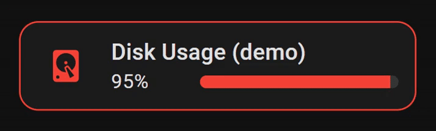

<details>
<summary>Show YAML</summary>

```yaml
type: custom:entity-progress-card
entity: sensor.disk_usage
name: Disk Usage
icon: mdi:harddisk
theme: critical_when_high
alert_when:
  above: 80
  color: red
  highlight: border
  animation: ping
```

</details>
<br />

**Three circuits, one bar** — combine several sensors toward one shared target
with [`bar_stack`](configuration.md#bar_stack):

<!-- markdownlint-disable-next-line MD013 -->
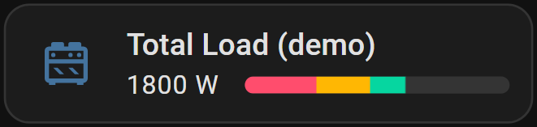

<br />
<details>
<summary>Show YAML</summary>

```yaml
type: custom:entity-progress-card
entity: sensor.circuit_kitchen_power
name: Total Load
max_value: 3000
decimal: 0
bar_color: '#FF4D6D'
bar_stack:
  mode: proportional
  entities:
    - entity: sensor.circuit_living_room_power
      color: '#FFB703'
    - entity: sensor.circuit_garage_power
      color: '#06D6A0'
```

</details>
<br />

**Basic usage**:

<!-- markdownlint-disable-next-line MD013 -->
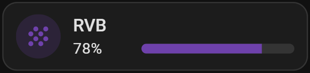

<br />
<details>
<summary>Show YAML</summary>

```yaml
type: custom:entity-progress-card
entity: sensor.hp_envy_6400_series_tri_color_cartridge
name: RVB
icon: mdi:grain
color: rgb(110, 65, 171)
bar_color: rgb(110, 65, 171)
icon_tap_action:
  action: more-info
```

</details>
<br />

**Grid option and vertical layout**:

<!-- markdownlint-disable-next-line MD013 -->
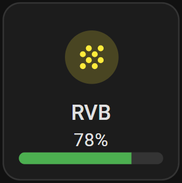

<br />
<details>
<summary>Show YAML</summary>

```yaml
type: custom:entity-progress-card
entity: sensor.hp_envy_6400_series_tri_color_cartridge
name: RVB
icon: mdi:grain
color: yellow
bar_color: green
icon_tap_action:
  action: more-info
layout: vertical
grid_options:
  columns: 3
  rows: 2
```

</details>
<br />

**Battery dashboard**, leveraging theme capabilities and `auto-entities`:

<!-- markdownlint-disable-next-line MD013 -->
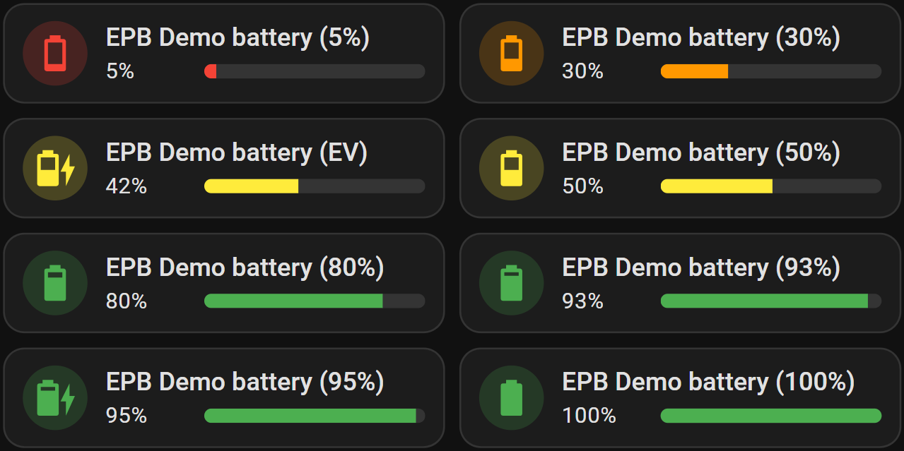

<br />
<details>
<summary>Show YAML</summary>

```yaml
type: custom:auto-entities
filter:
  include:
    - attributes:
        device_class: battery
      options:
        type: custom:entity-progress-card
        entity: this.entity_id # remove this line with auto-entities v1.14.1+
        theme: optimal_when_high
        icon_tap_action:
          action: more-info
card:
  square: false
  type: grid
  columns: 2
show_empty: true
card_param: cards
sort:
  method: state
  numeric: true
  ignore_case: false
```

</details>
<br />

**Litter box** — a percentage based on a minimum and maximum quantity:

<!-- markdownlint-disable-next-line MD013 -->
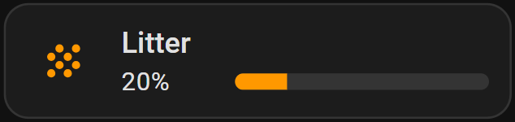

<br />
<details>
<summary>Show YAML</summary>

```yaml
type: custom:entity-progress-card
entity: sensor.petkit_puramax_2_poids_litiere
min_value: 6
max_value: 12
name: Litter
theme: optimal_when_high
grid_options:
  columns: 6
  rows: 1
```

</details>
<br />

**`card_mod` / animation** — dynamic animations on the icon:

<!-- markdownlint-disable-next-line MD013 -->
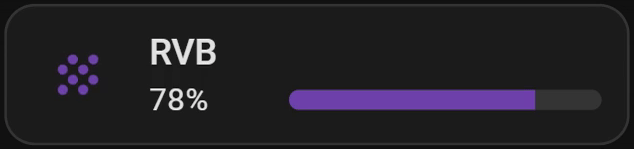

<br />
<details>
<summary>Show YAML</summary>

```yaml
type: custom:entity-progress-card
entity: sensor.hp_envy_6400_series_tri_color_cartridge
name: RVB
icon: mdi:grain
color: rgb(110, 65, 171)
bar_color: rgb(110, 65, 171)
card_mod:
  style: |-
    .icon {
      animation: boing 3s ease infinite;
      transform-origin: 50% 90%;
    }
    @keyframes boing {
      0% { transform: scale3d(1, 1, 1); }
      7% { transform: scale3d(1.25, 0.75, 1); }
      10% { transform: scale3d(0.75, 1.25, 1); }
      12% { transform: scale3d(1.15, 0.85, 1); }
      16% { transform: scale3d(0.95, 1.05, 1); }
      19% { transform: scale3d(1.05, 0.95, 1); }
      25% { transform: scale3d(1, 1, 1); }
    }
```

</details>
<br />

> [!TIP]
>
> We expose the `.icon` and `.shape` to properly animate the card.

**`vertical-stack-in-card`** — group multiple cards into a cohesive layout,
combined with `auto-entities` for dynamic listing and `card_mod` to strip
borders/shadows:

<!-- markdownlint-disable-next-line MD013 -->
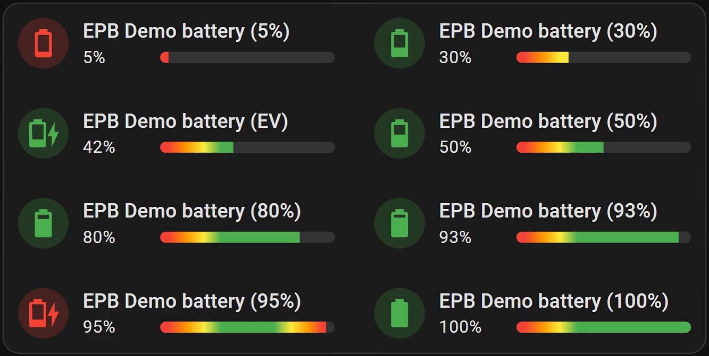

<br />
<details>
<summary>Show YAML</summary>

```yaml
type: custom:vertical-stack-in-card
cards:
  - type: custom:auto-entities
    filter:
      include:
        - attributes:
            device_class: battery
          options:
            type: custom:entity-progress-card
            entity: this.entity_id # remove this line with auto-entities v1.14.1+
            theme: battery_adaptive
            bar_color_mode: rainbow
            icon_animation: battery_charging
            icon_tap_action:
              action: more-info
            card_mod:
              style:
                .: |-
                  :host {
                    --ha-card-border-width: 0px !important; /* force-remove the border */
                    box-shadow: none !important; /* remove the shadow to drop any outline */
                  }
    sort:
      method: state
      numeric: true
      ignore_case: false
    card:
      square: false
      type: grid
      columns: 2
    card_param: cards
```

</details>
<br />

**Native `vertical-stack`** - no custom card needed, just a `tile` and an
`entity-progress-card` on the same entity in one block:

<!-- markdownlint-disable-next-line MD013 -->
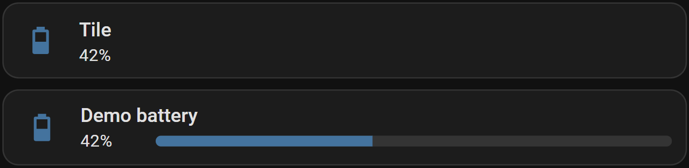

<br />
<details>
<summary>Show YAML</summary>

```yaml
type: vertical-stack
cards:
  - type: tile
    entity: sensor.xyz
    name: Tile
    vertical: false
    features_position: bottom
  - type: custom:entity-progress-card
    entity: sensor.xyz
    layout: horizontal
    bar_size: small
```

</details>
<br />

**Native `entities`** - drop it in as one row among regular entities, no wrapper
needed:

<!-- markdownlint-disable-next-line MD013 -->
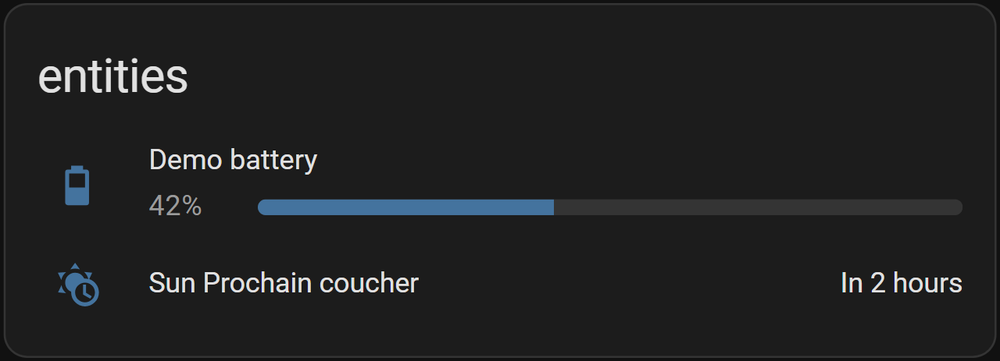

<br />
<details>
<summary>Show YAML</summary>

```yaml
type: entities
title: entities
entities:
  - type: custom:entity-progress-card
    entity: sensor.xyz
    layout: horizontal
    bar_size: small
  - entity: sensor.abc
```

</details>
<br />

> [!TIP]
>
> `height` wins outright inside any of these containers - set it explicitly
> (e.g. `height: 100px`) to break out of the container's own sizing.

<!-- markdownlint-disable-next-line MD013 -->
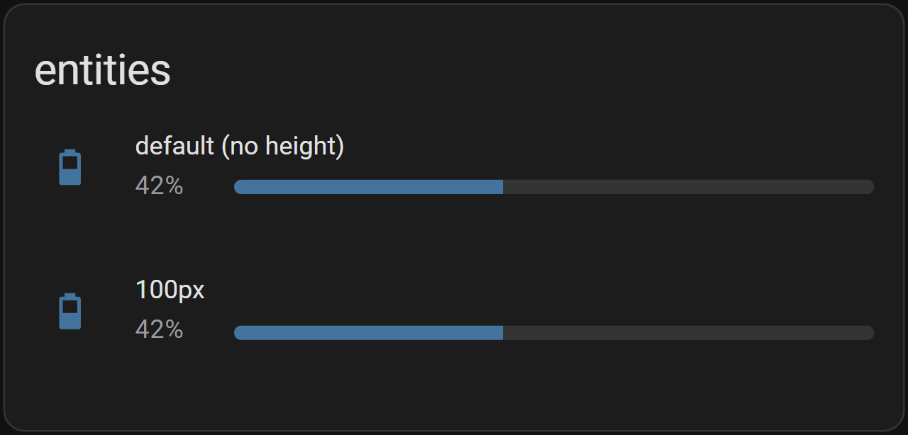
<br />
<br />

**Native `grid`** - `marginless`/`frameless` fuse the cells into a single
seamless block:

<!-- markdownlint-disable-next-line MD013 -->
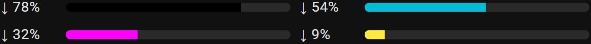

<br />
<details>
<summary>Show YAML</summary>

```yaml
type: grid
square: false
columns: 2
title: Grid Card
cards:
  - type: custom:entity-progress-card
    entity: sensor.ink_black
    bar_color: black
    hide:
      - name
      - icon
    marginless: true
    frameless: true
    height: auto
  - type: custom:entity-progress-card
    entity: sensor.ink_cyan
    bar_color: cyan
    hide:
      - name
      - icon
    marginless: true
    frameless: true
    height: auto
```

</details>
<br />

[🔼 Back to top]

<a id="card-power-features"></a>

#### 🚀 Power Features

Real-world setups that go beyond a quick config — brand-specific washing machine
quirks, deriving a percentage from a start/end time via a Helper, an SSL
certificate expiry countdown:

- 🧺
  [The Laundry Mystery: Decoding Washer Entities Across Brands](#laundry-mystery)
- 🌀
  [Washing Machine Progress: Three Brands, Three Approaches](#washing-machine-three-brands)
- 🧮 [Cracking a Complex Case with a Simple Helper](#simple-helper)
- 🔒 [Don't Let It Expire! (SSL Certificate Countdown)](#ssl-expiry)

[🔼 Back to top]

---

<a id="card-template"></a>

### 🧩 Entity Progress Card Template

When the base Card's math doesn't cover your case — multi-sensor formulas,
non-linear scales, conditional colors — this is where you drop into Jinja and
take over.

Strong on: every field (`name`, `percent`, `bar_color`, `icon`…) becomes its own
template, so nothing is off-limits. Reach for it for a water tank's level
computed from a height sensor, a laundry cycle's remaining time derived from a
template sensor, or any percentage that needs conditional logic instead of a
fixed min/max.

> [!NOTE]
>
> The keyword `entity` can be used in Jinja to represent the entity defined at
> the card level.

<a id="card-template-options"></a>

#### 🛠️ Options

<details>
<summary>Show options</summary>

| **Option**                   | **Type**           | **Description**                                                                | **Link**                                         |
| :--------------------------- | :----------------- | :----------------------------------------------------------------------------- | :----------------------------------------------- |
| **Data Options**             |                    |                                                                                |                                                  |
| `entity`                     | string (optional)  | Entity ID.                                                                     | [Config Ref.][config-entity]                     |
| **Jinja Options**            |                    |                                                                                |                                                  |
| `name`                       | JINJA              | Renders the customized entity name                                             | [Config Ref.][name-jinja]                        |
| `icon`                       | JINJA              | Main icon shown on the card                                                    | [Config Ref.][icon-jinja]                        |
| `secondary`                  | JINJA              | Renders the secondary content (e.g., unit, status, additional info)            | [Config Ref.][secondary-jinja]                   |
| `percent`                    | JINJA              | Numerical value representing progress (0–100%), affects progress bar width     | [Config Ref.][percent-jinja]                     |
| `color`                      | JINJA              | Dynamic color for the icon and shape, adapted using `ThemeManager`             | [Config Ref.][color-jinja]                       |
| `bar_color`                  | JINJA              | Dynamic progress bar color, also handled through `ThemeManager`                | [Config Ref.][bar_color-jinja]                   |
| **Styling Options**          |                    |                                                                                |                                                  |
| `badge_icon`                 | Jinja (optional)   | Dynamic badge icon                                                             | [Config Ref.][config-badge_icon]                 |
| `badge_color`                | Jinja (optional)   | Dynamic badge color                                                            | [Config Ref.][config-badge_color]                |
| `bar_size`                   | string (optional)  | Customize the size or thickness of the progress bar.                           | [Config Ref.][config-bar_size]                   |
| `bar_position`               | string (optional)  | Position of the progress bar                                                   | [Config Ref.][config-bar_position]               |
| `bar_single_line`            | boolean (optional) | single-line mode for overlay bars                                              | [Config Ref.][config-bar_single_line]            |
| `bar_segments`               | integer (optional) | Render bar as discrete segments                                                | [Config Ref.][config-bar_segments]               |
| `bar_effect`                 | string/list/jinja  | Visual effects for the bar                                                     | [Config Ref.][config-bar_effect]                 |
| `bar_max_width`              | string (optional)  | Limits the maximum width of the bar                                            | [Config Ref.][config-bar_max_width]              |
| `bar_orientation`            | string (optional)  | Define the direction of the progress bar (e.g., `ltr`, `rtl`).                 | [Config Ref.][config-bar_orientation]            |
| `icon_animation`             | string (optional)  | Animate icon on active state                                                   | [Config Ref.][config-icon_animation]             |
| `force_circular_background`  | boolean (optional) | Force icon circle background.                                                  | [Config Ref.][config-force_circular_background]  |
| `trend_indicator`            | string (optional)  | Displays trend icons.                                                          | [Config Ref.][config-trend_indicator]            |
| `text_shadow`                | boolean (optional) | Display a text shadow (overlay)                                                | [Config Ref.][config-text_shadow]                |
| `density`                    | string (optional)  | Smallest useful footprint preset (`default`, `compact`).                       | [Config Ref.][config-density]                    |
| `layout`                     | string (optional)  | Adjust the overall layout (e.g., `horizontal`, `vertical`).                    | [Config Ref.][config-layout]                     |
| `frameless`                  | boolean (optional) | Remove the default card border and background for a seamless, flat appearance. | [Config Ref.][config-frameless]                  |
| `marginless`                 | boolean (optional) | Remove vertical margin for a more compact template display.                    | [Config Ref.][config-marginless]                 |
| `height`                     | string (optional)  | Card height                                                                    | [Config Ref.][config-height]                     |
| `min_width`                  | string (optional)  | Set a minimum width for the template to ensure consistent layout.              | [Config Ref.][config-min_width]                  |
| `reverse_secondary_info_row` | boolean (optional) | Flip info bar layout.                                                          | [Config Ref.][config-reverse_secondary_info_row] |
| `multiline`                  | boolean (optional) | Split secondary text on 2 lines.                                               | [Config Ref.][config-multiline]                  |
| `center_zero`                | boolean (optional) | Center the bar on 0.                                                           | [Config Ref.][config-center_zero]                |
| `hide`                       | list (optional)    | Hide parts of the card.                                                        | [Config Ref.][config-hide]                       |
| `watermark`                  | map (optional)     | Adds min/max overlays.                                                         | [Config Ref.][config-watermark]                  |
| **Behavior & Actions**       |                    |                                                                                |                                                  |
| `xyz_action`                 | map (optional)     | Configure custom actions (e.g., `tap`, `hold`, etc.).                          | [Config Ref.][config-xyz_action]                 |

</details>
<br />

See [Full Configuration Reference][FCR].

[🔼 Back to top]

<a id="card-template-getting-started"></a>

#### 🧪 Getting Started

<!-- markdownlint-disable-next-line MD013 -->
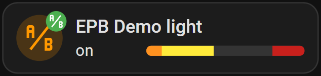

<br />
<details>
<summary>Show YAML</summary>

```yaml
type: custom:entity-progress-card-template
entity: light.led0
icon: |-
  
    mdi:ab-testing
  
    mdi:abacus
  
name: "{{ state_attr('light.led0', 'friendly_name') }}"
secondary: "{{ states('light.led0') }}"
badge_icon: |-
  
    mdi:ab-testing
  
    mdi:library
  
badge_color: |-
  
    green
  
    grey
  
percent: |-
  
    {{ (state_attr('light.led0', 'brightness') | float * 100 / 255) | round(2) }}
  
    0
  
color: |-
  
    orange
  
    grey
  
bar_color: |-
  
    yellow
  
    red
  
watermark:
  low: 10
tap_action:
  action: navigate
  navigation_path: /config
```

</details>
<br />

[🔼 Back to top]

<a id="card-template-power-features"></a>

#### 🚀 Power Features

A dynamic sun-tracking bar — progress toward the next sunrise/sunset, live
countdown, color that flips with the horizon — entirely computed in Jinja:

- 🌅 [Follow the Sun](#follow-the-sun)

[🔼 Back to top]

---

<a id="badge"></a>

### 🧩 Entity Progress Badge

The Card, shrunk to fit a header row — same read at a glance, a fraction of the
space.

Strong on: dashboard headers, sidebars, and anywhere a full card would crowd the
layout. Reach for it for a quick battery or Wi-Fi glance sitting next to your
view's other badges, not as the dashboard's main focus.

<a id="badge-options"></a>

#### 🛠️ Options

<details>
<summary>Show options</summary>

| **Option**                   | **Type**               | **Default**               | **Description**                       | **Link**                                         |
| :--------------------------- | :--------------------- | :------------------------ | :------------------------------------ | :----------------------------------------------- |
| **Data Options**             |                        |                           |                                       |                                                  |
| `entity`                     | string (required)      | —                         | Main entity ID                        | [Config Ref.][config-entity]                     |
| `attribute`                  | string (optional)      | depends on entity         | Attribute to use as value             | [Config Ref.][config-attribute]                  |
| `name`                       | string (optional)      | entity name               | Custom name to show                   | [Config Ref.][config-name]                       |
| `unit`                       | string (optional)      | `auto`                    | Unit displayed                        | [Config Ref.][config-unit]                       |
| `decimal`                    | integer (optional)     | context-based             | Number of decimal places              | [Config Ref.][config-decimal]                    |
| `min_value`                  | float/Map (optional)   | `0` or `-100`             | Min for progress calculation          | [Config Ref.][config-min_value]                  |
| `max_value`                  | float/Map (optional)   | `100`                     | Max for progress calculation          | [Config Ref.][config-max_value]                  |
| `reverse`                    | boolean (optional)     | depends on entity         | Countdown-style behavior              | [Config Ref.][config-reverse]                    |
| `state_content`              | string/list (optional) | depends on domain         | Attribute to show near value          | [Config Ref.][config-state_content]              |
| `custom_info`                | Jinja (optional)       | —                         | Extra info near value                 | [Config Ref.][config-custom_info]                |
| `name_info`                  | Jinja (optional)       | —                         | Extra info near name                  | [Config Ref.][config-name_info]                  |
| `bar_stack`                  | Map (optional)         | —                         | Combine several entities in one bar   | [Config Ref.][config-bar_stack]                  |
| **Styling Options**          |                        |                           |                                       |                                                  |
| `icon`                       | string (optional)      | —                         | Icon override                         | [Config Ref.][config-icon]                       |
| `color`                      | string (optional)      | based on entity           | Icon color                            | [Config Ref.][config-color]                      |
| `bar_color`                  | string (optional)      | `var(--state-icon-color)` | Color of progress bar                 | [Config Ref.][config-bar_color]                  |
| `bar_size`                   | string (optional)      | `small`                   | Size of the progress bar              | [Config Ref.][config-bar_size]                   |
| `bar_segments`               | integer (optional)     | —                         | Render bar as discrete segments       | [Config Ref.][config-bar_segments]               |
| `bar_effect`                 | string/list/jinja      | —                         | Visual effects for the bar            | [Config Ref.][config-bar_effect]                 |
| `bar_color_mode`             | string (optional)      | `auto`                    | Bar fill color rendering mode         | [Config Ref.][config-bar_color_mode]             |
| `bar_scale`                  | string (optional)      | `linear`                  | Value-to-width mapping (linear/log)   | [Config Ref.][config-bar_scale]                  |
| `bar_orientation`            | string (optional)      | `ltr`                     | Bar direction                         | [Config Ref.][config-bar_orientation]            |
| `frameless`                  | boolean (optional)     | `false`                   | Remove card frame                     | [Config Ref.][config-frameless]                  |
| `marginless`                 | boolean (optional)     | `false`                   | Remove top/bottom margin              | [Config Ref.][config-marginless]                 |
| `min_width`                  | string (optional)      | —                         | Minimum width                         | [Config Ref.][config-min_width]                  |
| `reverse_secondary_info_row` | boolean (optional)     | `false`                   | Flip info bar layout                  | [Config Ref.][config-reverse_secondary_info_row] |
| `unit_spacing`               | string (optional)      | `auto`                    | Controls space between value and unit | [Config Ref.][config-unit_spacing]               |
| `center_zero`                | boolean (optional)     | `false`                   | Center the bar on 0                   | [Config Ref.][config-center_zero]                |
| `theme`                      | string (optional)      | —                         | Applies a preset theme                | [Config Ref.][config-theme]                      |
| `custom_theme`               | list (optional)        | —                         | Define color thresholds               | [Config Ref.][config-custom_theme]               |
| `interpolate`                | boolean (optional)     | —                         | Enables smooth color transition       | [Config Ref.][config-interpolate]                |
| `hide`                       | list (optional)        | —                         | Hide parts of the card                | [Config Ref.][config-hide]                       |
| `watermark`                  | map (optional)         | —                         | Adds min/max overlays                 | [Config Ref.][config-watermark]                  |
| `alert_when`                 | map (optional)         | —                         | Highlight card on threshold crossing  | [Config Ref.][config-alert_when]                 |
| **Behavior And Actions**     |                        |                           |                                       |                                                  |
| `xyz_action`                 | map (optional)         | see defaults              | Tap/double/hold actions               | [Config Ref.][config-xyz_action]                 |

</details>
<br />

See [Full Configuration Reference][FCR]. We use the same syntax as the card.

[🔼 Back to top]

<a id="badge-getting-started"></a>

#### 🧪 Getting Started

<!-- markdownlint-disable-next-line MD013 -->
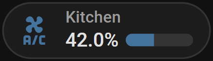

<br />
<details>
<summary>Show YAML</summary>

```yaml
type: custom:entity-progress-badge
entity: sensor.xyz
name: Kitchen
decimal: 1
icon: mdi:air-conditioner
```

</details>
<br />

**With a theme and a bar effect** — same idea, dressed up for a header view:

<!-- markdownlint-disable-next-line MD013 -->
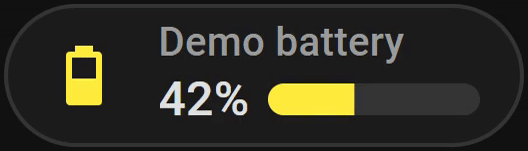

<br />
<details>
<summary>Show YAML</summary>

```yaml
type: custom:entity-progress-badge
entity: sensor.living_room_battery
theme: optimal_when_high
bar_effect: shimmer
```

</details>
<br />

[🔼 Back to top]

---

<a id="badge-template"></a>

### 🧩 Entity Progress Badge Template

Same shrink, but Jinja-powered end to end — for when a badge needs the same
custom math as the Card Template.

Strong on: the same conditional logic and multi-sensor formulas as the Card
Template, at badge size. Reach for it when a header row needs a computed
percentage — a tank level, a custom quota — instead of a value Home Assistant
already exposes directly.

> [!NOTE]
>
> The keyword `entity` can be used in Jinja to represent the entity defined at
> the card level.

<a id="badge-template-options"></a>

#### 🛠️ Options

<details>
<summary>Show options</summary>

| **Option**                   | **Type**           | **Description**                                                                | **Link**                                         |
| :--------------------------- | :----------------- | :----------------------------------------------------------------------------- | :----------------------------------------------- |
| **Data Options**             |                    |                                                                                |                                                  |
| `entity`                     | string (optional)  | Entity ID.                                                                     | [Config Ref.][config-entity]                     |
| **Jinja Options**            |                    |                                                                                |                                                  |
| `name`                       | JINJA              | Renders the customized entity name                                             | [Config Ref.][name-jinja]                        |
| `icon`                       | JINJA              | Main icon shown on the card                                                    | [Config Ref.][icon-jinja]                        |
| `secondary`                  | JINJA              | Renders the secondary content (e.g., unit, status, additional info)            | [Config Ref.][secondary-jinja]                   |
| `percent`                    | JINJA              | Numerical value representing progress (0–100%), affects progress bar width     | [Config Ref.][percent-jinja]                     |
| `color`                      | JINJA              | Dynamic color for the icon and shape, adapted using `ThemeManager`             | [Config Ref.][color-jinja]                       |
| `bar_color`                  | JINJA              | Dynamic progress bar color, also handled through `ThemeManager`                | [Config Ref.][bar_color-jinja]                   |
| **Styling Options**          |                    |                                                                                |                                                  |
| `bar_size`                   | string (optional)  | Customize the size or thickness of the progress bar.                           | [Config Ref.][config-bar_size]                   |
| `bar_segments`               | integer (optional) | Render bar as discrete segments                                                | [Config Ref.][config-bar_segments]               |
| `bar_effect`                 | string/list/jinja  | Visual effects for the bar                                                     | [Config Ref.][config-bar_effect]                 |
| `bar_orientation`            | string (optional)  | Define the direction of the progress bar (e.g., `ltr`, `rtl`).                 | [Config Ref.][config-bar_orientation]            |
| `frameless`                  | boolean (optional) | Remove the default card border and background for a seamless, flat appearance. | [Config Ref.][config-frameless]                  |
| `marginless`                 | boolean (optional) | Remove vertical margin for a more compact template display.                    | [Config Ref.][config-marginless]                 |
| `min_width`                  | string (optional)  | Set a minimum width for the template to ensure consistent layout.              | [Config Ref.][config-min_width]                  |
| `reverse_secondary_info_row` | boolean (optional) | Flip info bar layout.                                                          | [Config Ref.][config-reverse_secondary_info_row] |
| `center_zero`                | boolean (optional) | Center the bar on 0.                                                           | [Config Ref.][config-center_zero]                |
| `hide`                       | list (optional)    | Hide parts of the card.                                                        | [Config Ref.][config-hide]                       |
| `watermark`                  | map (optional)     | Adds min/max overlays.                                                         | [Config Ref.][config-watermark]                  |
| **Behavior & Actions**       |                    |                                                                                |                                                  |
| `xyz_action`                 | map (optional)     | Configure custom actions (e.g., `tap`, `hold`, etc.).                          | [Config Ref.][config-xyz_action]                 |

</details>
<br />

See [Full Configuration Reference][FCR].

[🔼 Back to top]

<a id="badge-template-getting-started"></a>

#### 🧪 Getting Started

<!-- markdownlint-disable-next-line MD013 -->
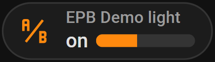

<br />
<details>
<summary>Show YAML</summary>

```yaml
type: custom:entity-progress-badge-template
entity: light.led0
icon: |-
  
    mdi:ab-testing
  
    mdi:abacus
  
name: "{{ state_attr('light.led0', 'friendly_name') }}"
secondary: "{{ states('light.led0') }}"
percent: |-
  
    {{ (state_attr('light.led0', 'brightness') | float * 100 / 255) | round(2) }}
  
    0
  
```

</details>
<br />

**Color escalation** — three-way severity, computed entirely in Jinja:

<!-- markdownlint-disable-next-line MD013 -->
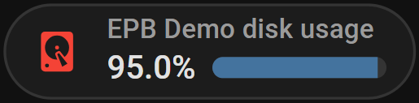

<br />
<details>
<summary>Show YAML</summary>

```yaml
type: custom:entity-progress-badge-template
entity: sensor.disk_usage
icon: mdi:harddisk
name: "{{ state_attr('sensor.disk_usage', 'friendly_name') }}"
secondary: "{{ states('sensor.disk_usage') }}%"
percent: "{{ states('sensor.disk_usage') | float(0) }}"
color: |-
  
  
    red
  
    orange
  
    green
  
```

</details>
<br />

[🔼 Back to top]

---

<a id="tile-feature"></a>

### 🧩 Entity Progress Tile Feature

The **Entity Progress Tile Feature** (`entity-progress-feature`) embeds a
progress bar directly inside a standard Home Assistant **Tile** card. It renders
as a native feature row and supports overlay positions (`top`, `bottom`) that
anchor the bar to the card edge without increasing the tile height.

Strong on: staying inside the Tile card's own layout — its icon, its name, its
tap actions — instead of adding a second card next to it. Reach for it when a
Tile already shows the entity you care about and just needs a progress row
bolted on, not a replacement.

<a id="tile-feature-options"></a>

#### 🛠️ Options

<details>
<summary>Show options</summary>

| **Option**          | **Type**               | **Default**               | **Description**                     | **Link**                              |
| :------------------ | :--------------------- | :------------------------ | :---------------------------------- | :------------------------------------ |
| **Data Options**    |                        |                           |                                     |                                       |
| `entity`            | string (required)      | —                         | Main entity ID                      | [Config Ref.][config-entity]          |
| `attribute`         | string (optional)      | depends on entity         | Attribute to use as value           | [Config Ref.][config-attribute]       |
| `min_value`         | float/Map (optional)   | `0`                       | Min for progress calculation        | [Config Ref.][config-min_value]       |
| `max_value`         | float/Map (optional)   | `100`                     | Max for progress calculation        | [Config Ref.][config-max_value]       |
| **Styling Options** |                        |                           |                                     |                                       |
| `bar_color`         | string (optional)      | `var(--state-icon-color)` | Color of progress bar               | [Config Ref.][config-bar_color]       |
| `bar_size`          | string (optional)      | `xlarge`                  | Size of the progress bar            | [Config Ref.][config-bar_size]        |
| `bar_orientation`   | string (optional)      | `ltr`                     | Bar direction                       | [Config Ref.][config-bar_orientation] |
| `bar_color_mode`    | string (optional)      | `auto`                    | Bar fill color rendering mode       | [Config Ref.][config-bar_color_mode]  |
| `bar_scale`         | string (optional)      | `linear`                  | Value-to-width mapping (linear/log) | [Config Ref.][config-bar_scale]       |
| `bar_effect`        | string/list/jinja      | —                         | Visual effects for the bar          | [Config Ref.][config-bar_effect]      |
| `bar_position`      | string (optional)      | `default`                 | Position of the bar inside the tile | [Config Ref.][config-bar_position]    |
| `bar_segments`      | integer (optional)     | —                         | Render bar as discrete segments     | [Config Ref.][config-bar_segments]    |
| `center_zero`       | boolean/map (optional) | `false`                   | Center the bar on 0                 | [Config Ref.][config-center_zero]     |
| `theme`             | string (optional)      | —                         | Applies a preset theme              | [Config Ref.][config-theme]           |
| `custom_theme`      | list (optional)        | —                         | Define color thresholds             | [Config Ref.][config-custom_theme]    |
| `interpolate`       | boolean (optional)     | `false`                   | Enables smooth color transition     | [Config Ref.][config-interpolate]     |
| `watermark`         | map (optional)         | —                         | Adds min/max overlays               | [Config Ref.][config-watermark]       |
| **Bar Stack**       |                        |                           |                                     |                                       |
| `bar_stack`         | Map (optional)         | —                         | Combine several entities in one bar | [Config Ref.][config-bar_stack]       |

</details>
<br />

See [Full Configuration Reference][FCR].

[🔼 Back to top]

<a id="tile-feature-getting-started"></a>

#### 🧪 Getting Started

<!-- markdownlint-disable-next-line MD013 -->
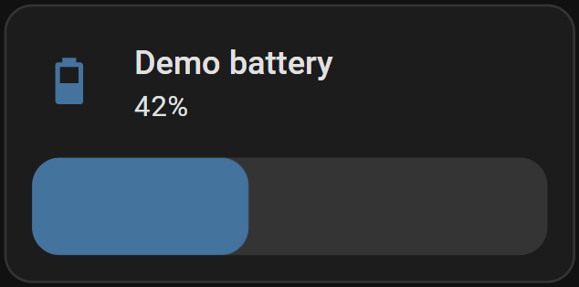

<br />
<details>
<summary>Show YAML</summary>

```yaml
type: tile
entity: sensor.battery_level
features:
  - type: custom:entity-progress-feature
    entity: sensor.battery_level
```

</details>
<br />

**Overlay mode** — anchor the bar to the top or bottom of the tile without
increasing the card height:

<!-- markdownlint-disable-next-line MD013 -->
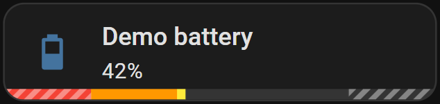

<br />
<details>
<summary>Show YAML</summary>

```yaml
type: tile
entity: sensor.battery_level
features:
  - type: custom:entity-progress-feature
    entity: sensor.battery_level
    bar_position: bottom
    theme: optimal_when_high
    bar_color_mode: segment
    watermark:
      type: striped
      opacity: 0.4
      low:
        value: 20
        color: white
      high:
        value: 80
        color: white
```

</details>
<br />

[🔼 Back to top]

---

<a id="multi"></a>

### 🧩 Entity Progress Multi-Card / Multi-Feature

Several entities, one card: instead of a wall of individual bars, stack them
under a single header.

Strong on: keeping a related group visually together without eating a grid cell
per entity. Reach for it for a room's three window sensors, a car's tire
pressures, or any small cluster of bars that only makes sense read side by side.

> [!NOTE]
>
> New in 1.6.1. YAML only for now — no visual editor yet.

`entity-progress-multi-card` and `entity-progress-multi-feature` stack several
progress bars into a single card or a single Tile feature, instead of one bar
per entity/feature. Each bar is a real `entity-progress-feature` under the hood,
so it keeps its own more-info tap, its own colors, and its own state — the
aggregator only stacks them and divides the available height.

<a id="multi-options"></a>

#### 🛠️ Options

<details>
<summary>Show options</summary>

| **Option**   | **Type**           | **Default**        | **Description**                                            | **Link**                         |
| :----------- | :----------------- | :----------------- | :--------------------------------------------------------- | :------------------------------- |
| `entities`   | list (required)    | —                  | List of card/feature configs, at minimum an `entity` each  | [Config Ref.][config-entities]   |
| `show_value` | boolean (optional) | `false`            | Show each entity's value/unit next to its bar              | [Config Ref.][config-show_value] |
| `rows`       | integer (optional) | one row per entity | `entity-progress-multi-card` only — Sections grid row span | [Config Ref.][config-rows]       |

</details>
<br />

Any option set at the top level (outside `entities`) applies to every item as a
shared default; an item can override it individually. `bar_size` defaults to
`small` for every item — pick `xsmall` to fit more bars in the same space.

See [Full Configuration Reference][FCR].

[🔼 Back to top]

<a id="multi-getting-started"></a>

#### 🧪 Getting Started

**Standalone card**:

<!-- markdownlint-disable-next-line MD013 -->
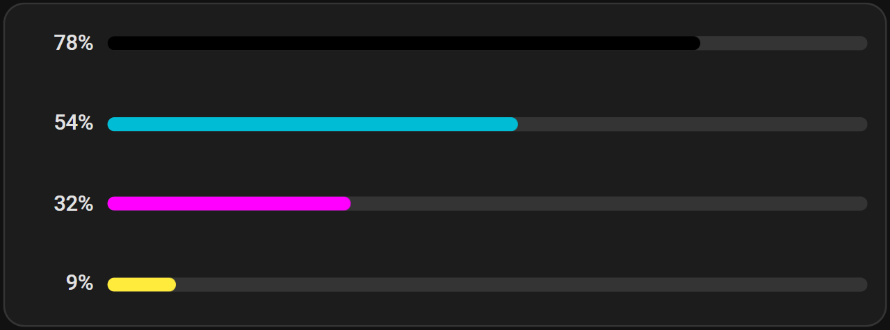

<br />
<details>
<summary>Show YAML</summary>

```yaml
type: custom:entity-progress-multi-card
bar_size: small
show_value: true
decimal: 0
entities:
  - entity: sensor.printer_black_cartridge
    bar_color: black
  - entity: sensor.printer_cyan_cartridge
    bar_color: cyan
  - entity: sensor.printer_magenta_cartridge
    bar_color: magenta
  - entity: sensor.printer_yellow_cartridge
    bar_color: yellow
card_mod:
  style: |
    :host {
      --epb-multi-value-width: 40px; # aligns every % to the same width
    }
```

</details>
<br />

**Inside a Tile card**:

<!-- markdownlint-disable-next-line MD013 -->
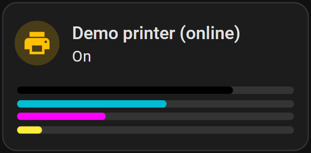

<br />
<details>
<summary>Show YAML</summary>

```yaml
type: tile
entity: sensor.printer
features:
  - type: custom:entity-progress-multi-feature
    bar_size: xsmall
    entities:
      - entity: sensor.printer_black_cartridge
        bar_color: black
      - entity: sensor.printer_cyan_cartridge
        bar_color: cyan
      - entity: sensor.printer_magenta_cartridge
        bar_color: magenta
      - entity: sensor.printer_yellow_cartridge
        bar_color: yellow
```

</details>
<br />

[🔼 Back to top]

---

<a id="effects-formatting"></a>

## Effects & formatting

Cross-cutting, work the same on every variant above, not tied to any one of
them.

<a id="visual-effects"></a>

### ✨ Visual Effects

Most of what makes this card feel alive doesn't show up in a static screenshot.
Each GIF below is captured straight from
[`docs/demo-dashboard.yaml`](demo-dashboard.yaml) — the card's own test bench —
so what you see is exactly what you get, at real speed.

This chapter doesn't walk through every single one yet — captures take time —
but every option below is real, shipped, and documented in full in
[`configuration.md`](configuration.md), whether or not it has a GIF here
already:

- **Bar**: [`bar_effect`](configuration.md#bar_effect) (shimmer,
  shimmer_reverse, gradient, gradient_reverse, glass, radius),
  [`bar_segments`](configuration.md#bar_segments),
  [`bar_color_mode`](configuration.md#bar_color_mode) (segment, rainbow,
  rainbow_full), [`bar_orientation`](configuration.md#bar_orientation) (rtl, up,
  down), [`bar_stack`](configuration.md#bar_stack) (stacked, proportional, net)
- **Icon**: [`icon_animation`](configuration.md#icon_animation) (spin, pulse,
  bounce, shake, ping, reveal, washing_machine, battery_charging),
  [`force_circular_background`](configuration.md#force_circular_background),
  [`hide: [shape]`](configuration.md#hide)
- **Alerts & markers**: [`alert_when`](configuration.md#alert_when) (static,
  blink, ping — border, background, or label),
  [`watermark`](configuration.md#watermark) (blended, area, striped, triangle,
  round, line), [`status_label`](configuration.md#status_label),
  [`trend_indicator`](configuration.md#trend_indicator)
- **Color & theme**: [`custom_theme`](configuration.md#custom_theme),
  [`interpolate`](configuration.md#interpolate),
  [`center_zero`](configuration.md#center_zero)
- **Layout**: [`layout`](configuration.md#layout) (horizontal, vertical),
  [`density`](configuration.md#density) (compact, either layout)

<a id="effect-bar-effects"></a>

#### `bar_effect`: shimmer, gradient, glass, radius

<!-- markdownlint-disable-next-line MD013 -->
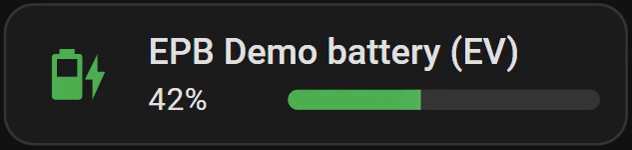

A light sweep loops continuously across the bar — the "still working" cue for
anything long-running. Combinable (`[radius, shimmer]`), reversible
(`shimmer_reverse`, `gradient_reverse`).

<br />
<details>
<summary>Show YAML</summary>

```yaml
type: custom:entity-progress-card
entity: sensor.phone_battery
theme: critical_when_low
bar_effect:
  - shimmer
```

</details>
<br />

See [`bar_effect`](configuration.md#bar_effect) for the full list.

[🔼 Back to top]

<a id="effect-bar-segments"></a>

#### `bar_segments`: discrete blocks instead of a continuous fill

<!-- markdownlint-disable-next-line MD013 -->
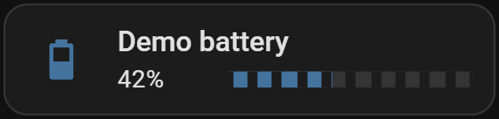

Battery-cell style — both the track and the fill are split into blocks, gaps
visible on both the empty and filled portions:

<br />
<details>
<summary>Show YAML</summary>

```yaml
type: custom:entity-progress-card
entity: sensor.battery
bar_segments: 10
```

</details>
<br />

Works with any orientation, size, or color mode/effect.

[🔼 Back to top]

<a id="effect-interpolate"></a>

#### `interpolate`: smooth color transitions between zones

<!-- markdownlint-disable-next-line MD013 -->
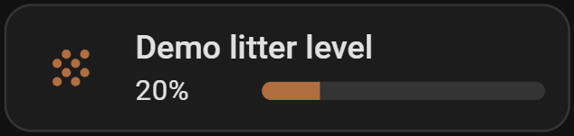

Without it, `custom_theme` zones cut sharply from one color to the next. With
it, the color blends smoothly as the value crosses each boundary:

<br />
<details>
<summary>Show YAML</summary>

```yaml
type: custom:entity-progress-card
entity: sensor.tank_level
interpolate: true
custom_theme:
  - min: 0
    max: 50
    color: red
  - min: 50
    max: 100
    color: green
```

</details>
<br />

[🔼 Back to top]

<a id="effect-force-circular-background"></a>

#### `force_circular_background`: the icon's circle, always on

<!-- markdownlint-disable-next-line MD013 -->
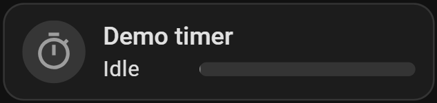

The opposite of [`hide: [shape]`](#effect-hide-shape) — forces the circular
background behind the icon regardless of HA version, entity domain, or action
configured, for a consistent Mushroom-style look everywhere:

<br />
<details>
<summary>Show YAML</summary>

```yaml
type: custom:entity-progress-card
entity: timer.living_room
force_circular_background: true
```

</details>
<br />

[🔼 Back to top]

<a id="effect-icon-animation"></a>

#### `icon_animation`: washing_machine, battery_charging, spin, ping…

<!-- markdownlint-disable-next-line MD013 -->
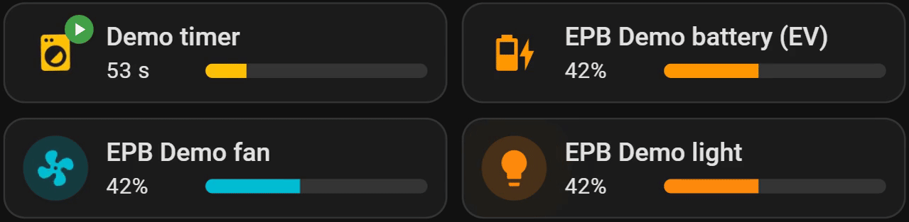

The icon itself reacts to what the entity is actually doing. `washing_machine`
and `battery_charging` check the entity's own domain-specific status, no config
needed beyond the name; the rest (`spin`, `pulse`, `bounce`, `shake`, `ping`,
`reveal`) play on any entity with a genuine active/inactive state — see
[`icon_animation`](configuration.md#icon_animation) for exactly how each one is
detected.

<br />
<details>
<summary>Washing Machine - Show YAML</summary>

```yaml
type: custom:entity-progress-card
entity: sensor.washing_machine_progress
icon_animation: washing_machine
```

</details>

<details>
<summary>EV - Show YAML</summary>

```yaml
type: custom:entity-progress-card
entity: sensor.ev_battery
icon_animation: battery_charging
```

</details>

<details>
<summary>Fan - Show YAML</summary>

```yaml
type: custom:entity-progress-card
entity: fan.living_room
icon_animation: spin
```

</details>

<details>
<summary>Light - Show YAML</summary>

```yaml
type: custom:entity-progress-card
entity: light.living_room
icon_animation: ping
```

</details>
<br />

Pair `icon_animation: battery_charging` with
[`theme: battery_adaptive`](configuration.md#theme) and the **bar** reacts too,
not just the icon - both read the same `battery_charging` attribute:

<!-- markdownlint-disable-next-line MD013 -->
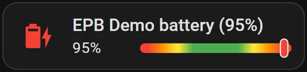

<br />
<details>
<summary>Show YAML</summary>

```yaml
type: custom:entity-progress-card
entity: sensor.ev_battery
theme: battery_adaptive
bar_color_mode: rainbow_full
icon_animation: battery_charging
```

</details>
<br />

[🔼 Back to top]

<a id="effect-alert-when"></a>

#### `alert_when`: the card reacts on its own

<!-- markdownlint-disable-next-line MD013 -->


A ring bursts around the card the moment a threshold is crossed — impossible to
miss on a wall-mounted dashboard, no `card_mod` needed.

<details>
<summary>Show YAML</summary>

```yaml
type: custom:entity-progress-card
entity: sensor.disk_usage
name: Disk Usage
icon: mdi:harddisk
theme: critical_when_high
alert_when:
  above: 80
  color: red
  highlight: border
  animation: ping
```

</details>
<br />

`highlight: label` reuses the [`status_label`](configuration.md#status_label)
pill instead of touching the border/background — a fixed piece of text that only
shows up while the alert is actually active:

<!-- markdownlint-disable-next-line MD013 -->
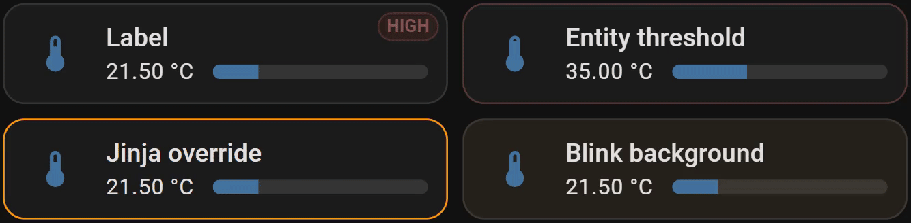

<br />
<details>
<summary>Show YAML</summary>

```yaml
type: custom:entity-progress-card
entity: sensor.server_disk_usage
alert_when:
  above: 90
  color: red
  highlight: label
  label: 'HIGH'
```

</details>
<br />

<details>
<summary>
  The threshold itself doesn't have to be a fixed number either — an entity:
  Show YAML
</summary>

```yaml
type: custom:entity-progress-card
entity: sensor.cpu_temperature
alert_when:
  above:
    entity: sensor.cpu_temperature_limit
  color: red
```

</details>

<details>
<summary>
  or a full Jinja condition, returning an object to override just that push
  (anything left out falls back to the static value below):
  Show YAML
</summary>

```yaml
type: custom:entity-progress-card
entity: sensor.cpu_temperature
alert_when:
  jinja: >-
    
    {{ {'color': 'red', 'animation': 'ping'} }}
    {{ {'color': 'orange'} }}
    false
  color: red
  animation: static
```

</details>
<br />

`highlight: background` paints the whole card instead of just the border -
`animation: blink` toggles it on and off instead of a single pulse:

<br />
<details>
<summary>Show YAML</summary>

```yaml
type: custom:entity-progress-card
entity: sensor.cpu_temperature
alert_when:
  below: 10
  color: orange
  highlight: background
  animation: blink
```

</details>
<br />

See [`alert_when`](configuration.md#alert_when) for every
`highlight`/`animation` combination, and `watermark`/`min_value`/`max_value` for
the same entity-or-Jinja pattern applied to thresholds that don't alert.

[🔼 Back to top]

<a id="effect-watermark"></a>

#### `watermark`: markers without leaving the bar

<!-- markdownlint-disable-next-line MD013 -->
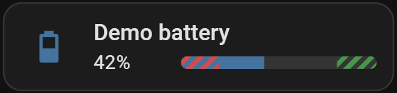

Low/high reference lines drawn directly on the bar — six styles
(`blended`/`area`/`striped`/`triangle`/`round`/`line`), each reading differently
at a glance:

<!-- markdownlint-disable-next-line MD013 -->
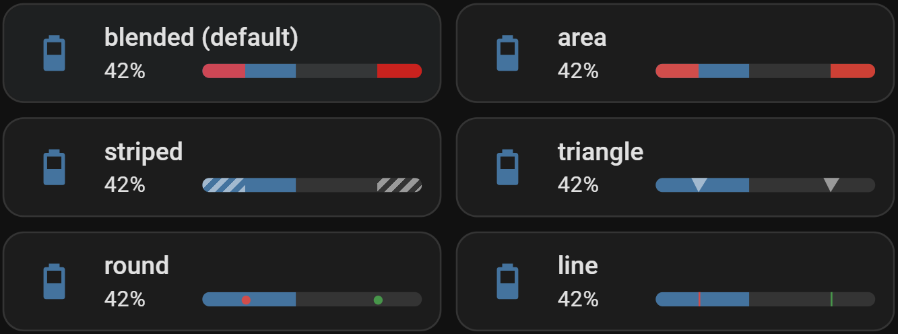

<br />
<details>
<summary>Show YAML</summary>

```yaml
type: custom:entity-progress-card
entity: sensor.water_tank_level
watermark:
  low:
    value: 20
    color: red
  high:
    value: 80
    color: green
  type: striped
```

</details>
<br />

That's `type: striped` - see [`watermark`](configuration.md#watermark) for what
the other five (`blended`, `area`, `triangle`, `round`, `line`) each look like.

[🔼 Back to top]

<a id="effect-segment"></a>

#### `bar_color_mode: segment`: theme zones as distinct blocks

<!-- markdownlint-disable-next-line MD013 -->
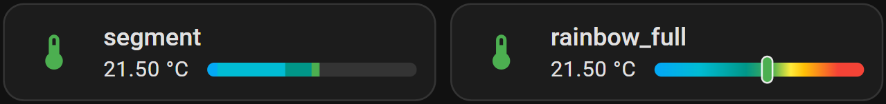

Each theme zone renders as its own colored block, visible up to the current
value — useful to see at a glance how far through each zone the entity has
progressed, instead of one flat fill color.

<details>
<summary>Show YAML</summary>

```yaml
type: custom:entity-progress-card
entity: sensor.outdoor_temperature
theme: temperature
max_value: 40
bar_color_mode: segment
```

</details>
<br />

[🔼 Back to top]

<a id="effect-rainbow"></a>

#### `bar_color_mode: rainbow_full`: the whole theme, always visible

<!-- markdownlint-disable-next-line MD013 -->


The track shows the theme's complete gradient end to end, with a marker sliding
along it — useful when the zones themselves matter more than how full the bar
is.

<details>
<summary>Show YAML</summary>

```yaml
type: custom:entity-progress-card
entity: sensor.outdoor_temperature
theme: temperature
max_value: 40
bar_color_mode: rainbow_full
```

</details>
<br />

See [`bar_color_mode`](configuration.md#bar_color_mode) for `segment` and plain
`rainbow`.

[🔼 Back to top]

<a id="effect-status-label"></a>

#### `status_label`: a GitHub-style pill, colored automatically

<!-- markdownlint-disable-next-line MD013 -->
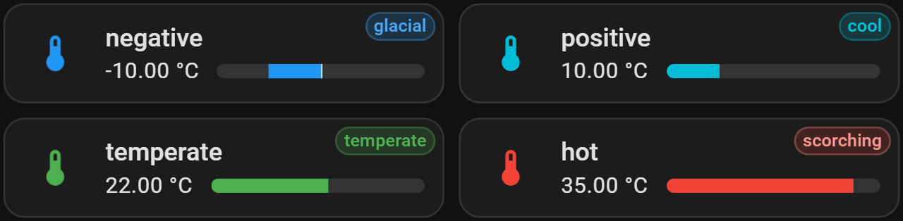

A short piece of text — `glacial`, `scorching`, `ok` — with no color to pick
yourself: the pill's background/border/text are derived from whatever color the
bar is already showing (theme zone, `custom_theme` zone, or a plain
`bar_color`), the same recipe GitHub's own issue labels use. Established
weather-report terms instead of a plain cold/hot split, still just a Jinja
condition on the value — no zone list to keep in sync with the theme.

<br />
<details>
<summary>Show YAML</summary>

```yaml
type: custom:entity-progress-card
entity: sensor.outdoor_temperature
theme: temperature
max_value: 40
status_label:
  jinja: >-
    
    glacial
    cold
    cool
    temperate
    warm
    scorching
    
  position: right
```

</details>
<br />

See [`status_label`](configuration.md#status_label) for the `{label, color}`
object form and `color_source`.

[🔼 Back to top]

<a id="effect-trend-indicator"></a>

#### `trend_indicator`: which way the value is moving

<!-- markdownlint-disable-next-line MD013 -->
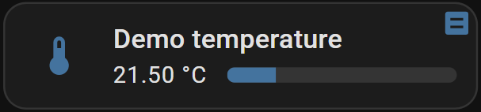

A small chevron in the top-right corner — up, down, or flat. Shares that corner
with `status_label`, which wins if both are set:

<br />
<details>
<summary>Show YAML</summary>

```yaml
type: custom:entity-progress-card
entity: sensor.temperature
trend_indicator: true
```

</details>
<br />

[🔼 Back to top]

<a id="effect-peak-marker"></a>

#### `peak_marker`: min/max/average, right on the bar

<!-- markdownlint-disable-next-line MD013 -->
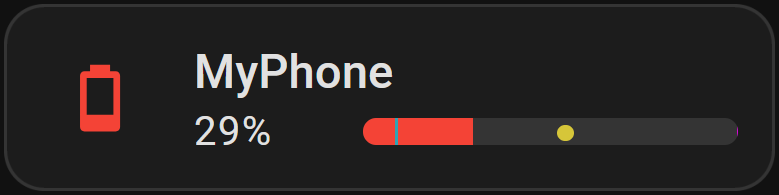

Marks the minimum, maximum, and average value seen over a time window, directly
on the bar — Card only. Each mark is opt-in: `true` (top-level
`type`/`opacity`), a color string (shorthand), or a full
`{ type, opacity, color }` override:

<br />
<details>
<summary>Show YAML</summary>

```yaml
type: custom:entity-progress-card
entity: sensor.temperature
peak_marker:
  window: 2h
  min: cyan
  max: magenta
  average:
    type: round
    color: yellow
```

</details>
<br />

[🔼 Back to top]

<a id="effect-custom-theme"></a>

#### `custom_theme`: your own color zones

<!-- markdownlint-disable-next-line MD013 -->
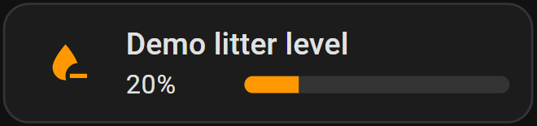

Not every value fits a built-in theme. Define your own value-range → color (+
icon) rules directly:

<br />
<details>
<summary>Show YAML</summary>

```yaml
type: custom:entity-progress-card
entity: sensor.tank_level
custom_theme:
  - min: 0
    max: 20
    color: red
    icon: mdi:water-alert
  - min: 20
    max: 60
    color: orange
    icon: mdi:water-minus
  - min: 60
    max: 100
    color: green
    icon: mdi:water-check
```

</details>
<br />

[🔼 Back to top]

<a id="effect-bar-stack"></a>

#### `bar_stack`: several entities, one bar

<!-- markdownlint-disable-next-line MD013 -->
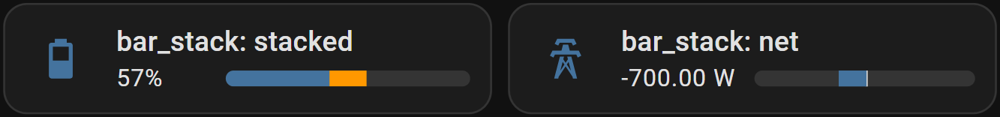

Three modes, three different questions answered:

- **`stacked`** (default) — a breakdown, each entity keeps its own literal
  width. A home battery's charged capacity, with what's reserved shown
  separately:

  <br />
  <details>
  <summary>Show YAML</summary>

  ```yaml
  type: custom:entity-progress-card
  entity: sensor.battery_storage_soc
  bar_stack:
    entities:
      - entity: sensor.battery_storage_reserved
        color: orange
  ```

  </details>
  <br />

- **`proportional`** — every entity's share of a shared target, the bar always
  fills edge-to-edge. Several circuits against one breaker limit:

  <br />
  <details>
  <summary>Show YAML</summary>

  ```yaml
  type: custom:entity-progress-card
  entity: sensor.circuit_a_power
  max_value: 3000
  bar_stack:
    mode: proportional
    entities:
      - entity: sensor.circuit_b_power
      - entity: sensor.circuit_c_power
  ```

  </details>
  <br />

- **`net`** — one algebraic total, positive or negative. Combined with
  `center_zero`, a balance that can go either way — grid draw when positive,
  export when negative:

  <br />
  <details>
  <summary>Show YAML</summary>

  ```yaml
  type: custom:entity-progress-card
  entity: sensor.grid_consumption_power
  min_value: -3000
  max_value: 3000
  center_zero: true
  bar_stack:
    mode: net
    entities:
      - entity: sensor.solar_production_power
        subtract: true
  ```

  </details>
  <br />

See [`bar_stack`](configuration.md#bar_stack) for `subtract`, ordering, and
auto-shaded colors.

[🔼 Back to top]

<a id="effect-center-zero"></a>

#### `center_zero`: bidirectional bars

<!-- markdownlint-disable-next-line MD013 -->
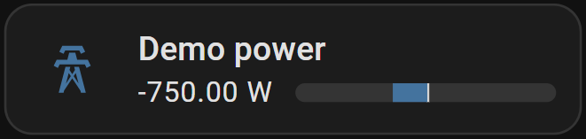

For anything that fluctuates around a baseline — a power balance, a temperature
delta — the bar grows from the center instead of from an edge:

<br />
<details>
<summary>Show YAML</summary>

```yaml
type: custom:entity-progress-card
entity: sensor.energy_balance
center_zero: true
min_value: -3000
max_value: 3000
```

</details>
<br />

See [`center_zero`](configuration.md#center_zero) for a custom center point
(e.g. a nominal voltage) and [`bar_stack`](configuration.md#bar_stack)'s `net`
mode, which combines naturally with it.

[🔼 Back to top]

<a id="effect-hide-shape"></a>

#### `hide: [shape]`: drop the icon's circular background

<!-- markdownlint-disable-next-line MD013 -->
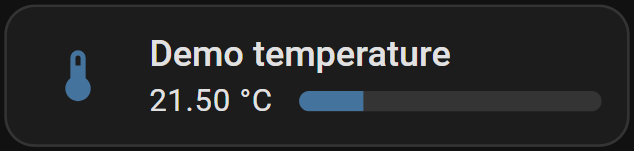

For a flatter look, without `card_mod`:

<br />
<details>
<summary>Show YAML</summary>

```yaml
type: custom:entity-progress-card
entity: sensor.living_room_temperature
hide:
  - shape
```

</details>
<br />

Same result, via CSS instead of YAML: the
[`--epb-icon-shape-opacity`](theme.md#css) hook.

[🔼 Back to top]

<a id="effect-density-compact"></a>

#### `density: compact`: the smallest useful footprint, either layout

<!-- markdownlint-disable-next-line MD013 -->
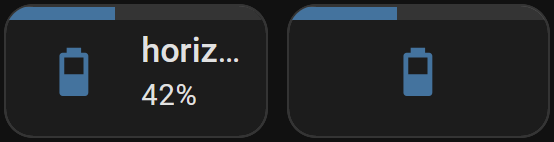

One option, two shapes depending on [`layout`](configuration.md#layout):
`horizontal` narrows the card to a single column, name and value still shown;
`vertical` has no matching narrow shape, so it hides `name`/ `secondary_info`
instead and drops to a single grid row — icon and a thin bar, nothing else:

<br />
<details>
<summary>Show YAML</summary>

```yaml
type: custom:entity-progress-card
entity: sensor.cpu_usage
density: compact
```

```yaml
type: custom:entity-progress-card
entity: sensor.cpu_usage
layout: vertical
density: compact
```

</details>
<br />

See [`density`](configuration.md#density) for exactly what it sets under the
hood (`bar_position`, `hide`, `multiline`) and how it interacts with a Sections
view's own grid sizing.

[🔼 Back to top]

---

<a id="display-formatting"></a>

### 🔢 Display Formatting

Not animated, but just as much about the card reading correctly at a glance —
how the number itself is shown.

<a id="format-unit-position"></a>

#### `unit_position`: currency-style values

<!-- markdownlint-disable-next-line MD013 -->
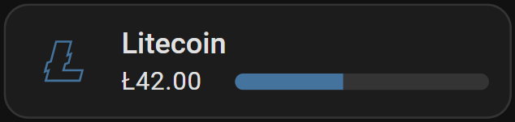

<br />
<details>
<summary>Show YAML</summary>

```yaml
type: custom:entity-progress-card
entity: sensor.account_balance
unit: $
unit_position: before
unit_spacing: no-space
```

</details>
<br />

`$100` instead of `100$`. Has no effect once `unit` is empty or hidden.

[🔼 Back to top]

<a id="format-value-compact"></a>

#### `value_compact`: abbreviate large numbers

<!-- markdownlint-disable-next-line MD013 -->
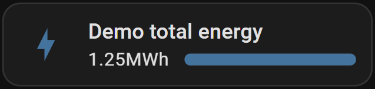

<br />
<details>
<summary>Show YAML</summary>

```yaml
type: custom:entity-progress-card
entity: sensor.total_energy
value_compact: true
unit_spacing: no-space
```

</details>
<br />

`1200` becomes `1.2k`, `1500000` becomes `1.5M` — locale-aware, trailing zeros
trimmed (`1.2k`, not `1.20k`).

[🔼 Back to top]

<a id="format-value-sign"></a>

#### `value_sign`: force an explicit +/-

<!-- markdownlint-disable-next-line MD013 -->
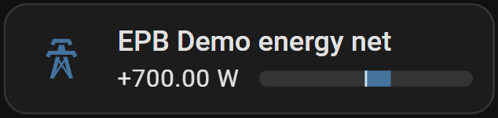

<br />
<details>
<summary>Show YAML</summary>

```yaml
type: custom:entity-progress-card
entity: sensor.power_balance
center_zero: true
min_value: -3000
max_value: 3000
value_sign: true
```

</details>
<br />

`42` becomes `+42`, zero stays unsigned. Clarifies the direction of a delta at a
glance — most useful on `center_zero`/`bar_stack: { mode: net }` cards.

[🔼 Back to top]

---

<a id="real-world-recipes"></a>

## Real-world recipes

Full narrative walkthroughs (why, how, and the YAML that got there), the ones
linked from each variant's `Power Features` above.

<a id="recreate-the-showcase"></a>

### 🌟 Recreate the Showcase

The GIF at the top of the [README](../README.md) isn't a mockup — it's this
project's own [demo dashboard](demo-dashboard.yaml) (the "EP Showcase" view),
built from ordinary options combined a bit more generously than usual. Here's
exactly how three of its cards are put together.

<a id="showcase-living-room"></a>

#### Living room — full rainbow, centered, with a status pill

<!-- markdownlint-disable-next-line MD013 -->
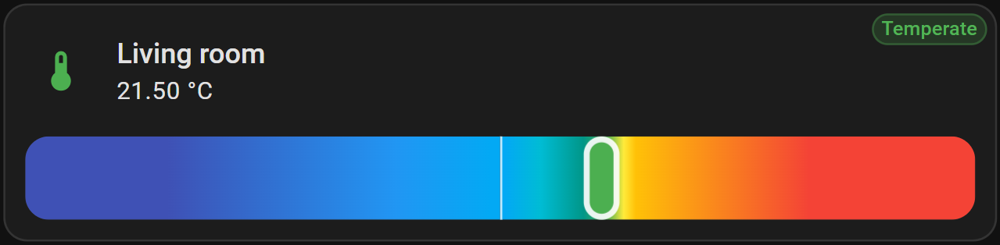

<br />
<details>
<summary>Show YAML</summary>

```yaml
type: custom:entity-progress-card
entity: sensor.living_room_temperature
name: Living room
theme: temperature
bar_color_mode: rainbow_full
center_zero: true
bar_size: xlarge
status_label:
  jinja: Temperate
```

</details>
<br />

Four options doing the work: [`theme: temperature`](configuration.md#theme)
supplies the color zones,
[`bar_color_mode: rainbow_full`](configuration.md#bar_color_mode) shows the
whole gradient with a sliding marker instead of a partial fill,
[`center_zero`](configuration.md#center_zero) centers it, and a plain-text
[`status_label`](configuration.md#status_label) adds the pill — no Jinja
condition needed for a fixed label.

[🔼 Back to top]

<a id="showcase-garage"></a>

#### Garage — a pulsing alert on a vertical thermometer

<!-- markdownlint-disable-next-line MD013 -->
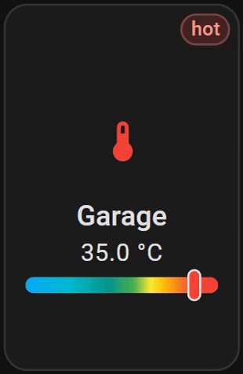

<br />
<details>
<summary>Show YAML</summary>

```yaml
type: custom:entity-progress-card
entity: sensor.garage_temperature
name: Garage
theme: temperature
layout: vertical
max_value: 40
decimal: 1
bar_color_mode: rainbow_full
alert_when:
  above: 30
  color: red
  highlight: label
  label: hot
  animation: ping
```

</details>
<br />

Same `rainbow_full` idea as Living room, this time
[`layout: vertical`](configuration.md#layout) and an
[`alert_when`](configuration.md#alert_when) label that only appears — and pings
— once the value actually crosses 30.

[🔼 Back to top]

<a id="showcase-energy"></a>

#### Energy — two bars and a net balance, in one Tile feature

<!-- markdownlint-disable-next-line MD013 -->
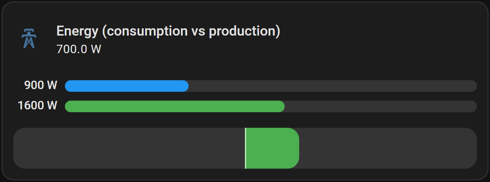

<br />
<details>
<summary>Show YAML</summary>

```yaml
type: tile
entity: sensor.energy_net
icon: mdi:transmission-tower
name: Energy (consumption vs production)
features:
  - type: custom:entity-progress-multi-feature
    bar_size: medium
    show_value: true
    decimal: 0
    entities:
      - entity: sensor.grid_consumption
        name: Consumption
        bar_color: blue
        max_value: 3000
      - entity: sensor.solar_production
        name: Production
        bar_color: green
        max_value: 3000
  - type: custom:entity-progress-feature
    entity: sensor.solar_production
    name: Net
    center_zero: true
    min_value: -3000
    max_value: 3000
    bar_color: green
    bar_stack:
      mode: net
      entities:
        - entity: sensor.grid_consumption
          subtract: true
          color: blue
card_mod:
  style: |
    :host {
      --epb-multi-value-width: 45px;
    }
```

</details>
<br />

One native HA `tile` card, two of our features stacked inside it: an
[`entity-progress-multi-feature`](#multi) shows consumption and production side
by side with their values, and a second
[`entity-progress-feature`](#tile-feature) below it renders the same data as one
[`bar_stack: net`](configuration.md#bar_stack) balance, `center_zero` centered.
`card_mod` only widens the value column
([`--epb-multi-value-width`](configuration.md#multi-show_value)) so three-digit
watt values don't wrap.

[🔼 Back to top]

---

<a id="laundry-mystery"></a>

### 🧺 The Laundry Mystery: Decoding Washer Entities Across Brands

**Why?**

Each washing machine brand has its own way of providing entities in Home
Assistant. As a result, you often end up with multiple entities that have
different names depending on the integration used. This can make managing these
entities tricky, especially if you want a simple and clear card to track the
standard elements of your washing machine.

The goal here is to simplify the display of important information related to
your washing machine, regardless of the brand, by centralizing key data such as
operational status, progress percentage, and remaining time, while maintaining
flexibility to adapt to entity variations based on the integration used.

**Searching for Entities**

Before configuring your card, it's essential to research the specific entities
for your washing machine integration. To do this, you will need to explore Home
Assistant's developer tools to pinpoint the necessary information. Let's take
this personal integration as an example:

- **`sensor.washing_machine_operation_state`**: This entity is very specific to
  my washing machine brand and the **Home Connect** integration that comes with
  it. It tracks the machine's operation state (running, paused, etc.).
- **`sensor.washing_machine_progress_current_percentage`**: This is a custom
  sensor defined in `configuration.yaml`. The integration only reports a
  percentage when the machine is running. The template sets it to 0% when the
  integration reports 'unavailable'.
- **`sensor.washing_machine_remaining_program_time`**: This entity shows the
  estimated time left until the program finishes. However, the entity's name
  doesn't exactly match what the integration provides.

These entities are crucial for getting a complete overview of the washing
machine's status, but they vary significantly depending on the brand and
integration.

**Setting Up the Card**

Once the entities are identified, you can configure your card in YAML to display
the necessary information.

Below an example that is currently used:

<br />
<details>
<summary>Show YAML</summary>

```yaml
type: custom:entity-progress-card
entity: sensor.washing_machine_progress_current_percentage
name: Washing Machine
color: primary
tap_action:
  action: more-info
icon_tap_action:
  action: more-info
bar_color: primary
bar_size: large
badge_icon: >-
  mdi:power-onmdi:power-off 
badge_color: >-
   blue  disabled 
name_info: >-
   ready at
  {{ as_timestamp( states('sensor.washing_machine_remaining_program_time') ) |
  timestamp_custom('%H:%M', true) }}
```

</details>
<br />

In this example, the card displays:

- The progress percentage
- The operational status
- The remaining time

**Conclusion**

Using Jinja and custom entity configurations in Home Assistant provides advanced
flexibility for adapting the card to the specifics of each washing machine. With
this approach, you can create a single card that works with different
integrations while displaying relevant information in a clear and consistent
manner.

[🔼 Back to top]

---

<a id="washing-machine-three-brands"></a>

### 🌀 Washing Machine Progress: Three Brands, Three Approaches

**Why?**

Not every washing-machine integration exposes the same data, so how you get a
progress percentage on the card depends entirely on which integration you're
using. Here are three real, verified examples — from "just point the card at it"
to "you need a helper".

**1. Home Connect (Bosch/Siemens) — direct, no extra config**

Home Connect exposes progress natively as a percentage sensor
(`sensor.<appliance>_program_progress`, 0-100%). Just point `entity` at it:

<br />
<details>
<summary>Show YAML</summary>

```yaml
type: custom:entity-progress-card
entity: sensor.washing_machine_program_progress
name: Washing Machine
```

</details>
<br />

**2. Miele — Jinja `max_value`, no helper needed**

Miele exposes `elapsed_time` and `remaining_time` (minutes) but no ready-made
percentage. Combine them with a Jinja `max_value`. `unit: '%'` is required here:
`elapsed_time` has `device_class: duration`, and without it the card would show
the raw elapsed time instead of the percentage (the bar fill itself is correct
either way — only the text label is affected):

<br />
<details>
<summary>Show YAML</summary>

```yaml
type: custom:entity-progress-card
entity: sensor.washing_machine_elapsed_time
unit: '%'
max_value:
  jinja: >
    {{ (states('sensor.washing_machine_elapsed_time') | float(0))
       + (states('sensor.washing_machine_remaining_time') | float(0)) }}
```

</details>
<br />

**3. Samsung (SmartThings) — the worst case, full helper setup**

SmartThings is the hardest of the three: it only exposes `machine_state`
(run/pause/stop), `job_state` (current phase), and `completion_time` (an
absolute end-of-cycle timestamp) — no elapsed time, no remaining time, and no
start time to anchor a calculation. Unlike the previous two, this can't be
solved with card config alone: you first need to _create_ a start time yourself,
then apply the "Simple Helper" technique from the next recipe:

- Create an `input_datetime` helper (e.g. `input_datetime.washer_start`).
- Add an automation that sets it to `now()` whenever
  `sensor.washing_machine_machine_state` changes to `run`.
- Follow [Cracking a Complex Case with a Simple Helper](#simple-helper) below,
  using `input_datetime.washer_start` as the start time and
  `sensor.washing_machine_completion_time` as the end time.

[🔼 Back to top]

---

<a id="simple-helper"></a>

### 🧮 Cracking a Complex Case with a Simple Helper

**Why?**

We want to monitor a process and we have entities for:

- start time: states.sensor.print_puppy_start_time (time)
- finish time: states.sensor.print_puppy_end_time (time)
- and remaining time: sensor.print_puppy_remaining_time (min)

Our goal is to display the percentage of remaining time and show the remaining
time in minutes. Unfortunately, the standard usage of this card cannot achieve
what we need directly, but...

**Mathematical Model**

Using a simple model, we can calculate the percentage of remaining time with:

$$P_{\text{remain}} = \frac{t_{\text{remain}}}{\Delta T} \times 100$$

Where:

- $P_{\text{remain}}$: Percentage of remaining time (the expected result).
- $t_{\text{remain}}$: Remaining time (in minutes).
- $\Delta T$: Total duration of the task (in minutes).

The good news is that we can use an entity to define the `max_value` and
dynamically calculate the percentage. Therefore, we need to find a way to
determine $\Delta T$.

**How?**

We'll use a Helper (Number) to handle this calculation. It's simple to define
and can be set up according to various needs.

- Go to `settings` > `Devices and services` > `Helpers` > `Create Helper` >
  `Template` > `Template a number`
- Define the template to do the delta automatically
  - Choose a name and define your state template:

    <br />
    <details>
    <summary>Show YAML</summary>

    ```yaml
    
    
    
      {{ ((as_datetime(end_time) - as_datetime(start_time)).days * 1440) + ((as_datetime(end_time) - as_datetime(start_time)).seconds / 60) | int }}
    
      unknown
    
    ```

    </details>
    <br />

    > Check your syntax. Here, we are using entity values; therefore, we access
    > the value through xyz.state. Sometimes, the value will be an attribute.

  - Set the minimum, maximum, step value, and unit accordingly.
  - Check the current value to ensure it's working properly.

- Define the card:

  <br />
  <details>
  <summary>Show YAML</summary>

  ```yaml
  type: custom:entity-progress-card
  entity: sensor.print_puppy_remaining_time
  max_value: number.totaldurationofthetask
  decimal: 0
  bar_color: green
  icon: mdi:clock-end
  ```

  </details>
  <br />

**Conclusion**

By implementing this model through the helper, we can accurately calculate and
display the percentage of remaining time for any task. This approach provides a
dynamic and intuitive way to monitor progress, ensuring that the displayed
percentage accurately reflects the time remaining regardless of the task's total
duration. This solution effectively extends our card usage vision, and enhances
the user experience.

[🔼 Back to top]

---

<a id="ssl-expiry"></a>

### 🔒 Don't Let It Expire! (SSL Certificate Countdown)

This example is similar to the previous one that used a Home Assistant helper
but relying more on system-level tools — offering potentially greater efficiency
at the cost of increased system dependency. We provide this example for
illustration purposes only. Make sure to verify that no integration already
exists before attempting this type of deployment. In the epilogue, we suggest a
more universal way to achieve the same result.

**Why?**

SSL certificates are critical for securing HTTPS connections. If one expires, it
can make your services inaccessible — including your Home Assistant interface
when accessed remotely.

The challenge? Certificates (especially Let's Encrypt) usually last only 90
days, and it's easy to forget when they expire.

👉 The goal here is to automatically track how many days are left (countdown)
before your SSL certificate expires and visually display this countdown as a
color-coded progress bar in the Lovelace dashboard.

**How?**

Here, we're using a Home Assistant instance running in Docker with access to
Linux commands.

We will:

- Create a custom command_line sensor that calculates the number of days until
  the certificate expires.
- Setup the card with the new sensor.
- Add dynamic color coding to indicate urgency (red when close to expiry, green
  when safe).

**Implementation**

- Create the command_line sensor, add this to your configuration.yaml (or
  sensors.yaml if split):

  <br />
  <details>
  <summary>Show YAML</summary>

  ```yaml
  sensor:
    - platform: command_line
      name: 'SSL Certificate Expiry'
      command: >
        echo $(( ($(date -u -d "$(curl -vI --insecure https://<hostname>:<port>
        2>&1 | grep -i 'expire date' | awk -F': ' '{print $2}' | sed -E
        's/Jan/01/; s/Feb/02/; s/Mar/03/; s/Apr/04/; s/May/05/; s/Jun/06/;
        s/Jul/07/; s/Aug/08/; s/Sep/09/; s/Oct/10/; s/Nov/11/; s/Dec/12/' | awk
        '{print $4"-"$1"-"$2" "$3}')" +%s) - $(date +%s) ) / 86400 ))
      unit_of_measurement: 'days'
      scan_interval: 3600
  ```

  </details>
  <br />

  You'll need to adjust this part to match your specific environment.

- Add this card to your Lovelace dashboard:

  <br />
  <details>
  <summary>Show YAML</summary>

  ```yaml
  type: custom:entity-progress-card
  entity: sensor.ssl_certificate_expiry
  name: SSL Certificate Expiry
  icon: mdi:certificate
  decimal: 0
  min_value: 0
  max_value: 90
  bar_orientation: rtl
  custom_theme:
    - min: 0
      max: 10
      color: red
    - min: 10
      max: 20
      color: yellow-color
    - min: 20
      max: 90
      color: green
  grid_options:
    columns: 12
    rows: 1
  ```

  </details>
  <br />

**Conclusion**

With this setup, Home Assistant becomes a proactive security monitor for your
SSL certificates. You get a clear visual on how much time is left — and can
renew in time to avoid downtime.

This method is reusable for any use case that can be monitored at the system
level.

**Epilogue**

It was fun to develop and can certainly be used as-is, but in practice, it
relies on Linux system commands, which makes it less portable than the previous
examples.

Ultimately, to meet the original goal, we can simply enable the `cert_expiry`
integration, which provides the certificate's expiration timestamp in a more
standardized and platform-independent way. Home Assistant helpers are powerful
tools, and whenever possible, they should be preferred to simplify
implementation.

With `cert_expiry` entity we can define a template helper (number) to generate a
countdown with:

- create the template helper
- define a name (number.cert_expiry_entity_id)
- define state template

  <br />
  <details>
  <summary>Show YAML</summary>

  ```yaml
  
  
    
    
    
    {{ diff | round(1) if diff > 0 else 0 }}
  
    unknown # 0 to avoid error in HA log
  
  ```

  </details>
  <br />

- define min/max value: 0 and 90
- step: 1
- unit_of_measurement: days

Create the card:

<br />
<details>
<summary>Show YAML</summary>

```yaml
type: custom:entity-progress-card
entity: number.cert_expiry_entity_id
name: SSL Certificate Expiry
icon: mdi:certificate
decimal: 0
bar_orientation: rtl
custom_theme:
  - min: 0
    max: 10
    color: red
  - min: 10
    max: 20
    color: yellow
  - min: 20
    max: 90
    color: green
unit: '%'
state_content: state
grid_options:
  columns: 12
  rows: 1
```

</details>
<br />

Now you have a working solution that avoids operating system dependencies and is
more efficient within Home Assistant's ecosystem. Obviously, in the case of a
Let's Encrypt certificate, it's recommended to:

- have a renewal process in place
- add a trigger to generate an alert before the certificate expires

These topics are beyond the scope of this guide.

[🔼 Back to top]

---

<a id="follow-the-sun"></a>

### 🌅 Follow the Sun

**🧐 Why?**

You want a visual representation of the sun's next event (sunrise or sunset) and
the progress until it happens, directly in your Home Assistant dashboard.
Instead of showing static time values, you aim to give users contextual, visual
feedback on when the next sun transition will occur, and how far along we are
toward it.

**⚙️ How?**

This card uses `custom:entity-progress-card-template` and dynamic Jinja2
templates to show:

- 📛 name Dynamically shows:
  - Next Rise: HH:MM if sunrise is next,
  - Next Setting: HH:MM if sunset is next,
  - or a fallback if sun data isn't available.
- 🎨 bar_color & color
  - Bar turns orange when the sun is above the horizon.
  - Turns light gray / invisible when it's below the horizon.
- 📄 secondary Displays a live countdown (e.g., in 02:34:12) until the next sun
  event, accounting for whether sunrise or sunset is next.
- 📊 percent Calculates progress between the last and the next sun event.
  - For example, at 50%: you're halfway between yesterday's and today's sunrise.
  - Or halfway between yesterday's and today's sunset, depending on current
    time.
- 🖱️ tap_action Opens the standard more-info view for the sun.sun entity when
  tapped.

<!-- markdownlint-disable-next-line MD013 -->
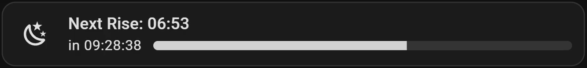

<br />
<details>
<summary>Show YAML</summary>

```yaml
type: custom:entity-progress-card-template
name: >
     
    
      Next Rise: {{ sunrise.timestamp() | timestamp_custom('%H:%M', true) }}
    
      Next Setting: {{ sunset.timestamp() | timestamp_custom('%H:%M', true) }}
    
  
    Sun information not available
  
entity: sun.sun
bar_color: |
  
    lightgray
  
    orange
  
color: |
  
    none
  
    orange
  
secondary: >
     
    
      
      
    
      
      
    
    
    
    
      
      {% set hours = (total_seconds % 86400) // 3600 %}
      {% set minutes = (total_seconds % 3600) // 60 %}
      {% set seconds = (total_seconds % 60) %}
      in
      
        {{ days }}d
      
      {{ '%02d:%02d:%02d' | format(hours | int, minutes | int, seconds | int) }}
    
      now
    
  
    --:--:--
  
percent: >
     
    
      
      
    
      
      
    
    
    
    
      {{ ((elapsed / total) * 100) | round(2) }}
    
      0
    
  
    0
  
tap_action:
  action: more-info
grid_options:
  columns: 12
  rows: 1
```

</details>
<br />

**✅ Conclusion**

This card provides a beautiful and intuitive sun progress indicator, using both
visual (progress bar + color) and textual (countdown + time) information. It
adapts based on current time and sun data, making it a smart and engaging way to
track solar cycles from your dashboard.

[🔼 Back to top]

<!-- Links -->

[🔼 Back to top]: #top
[FCR]:
  https://github.com/francois-le-ko4la/lovelace-entity-progress-card/blob/main/docs/configuration.md
[config-entity]:
  https://github.com/francois-le-ko4la/lovelace-entity-progress-card/blob/main/docs/configuration.md#entity
[config-attribute]:
  https://github.com/francois-le-ko4la/lovelace-entity-progress-card/blob/main/docs/configuration.md#attribute
[config-name]:
  https://github.com/francois-le-ko4la/lovelace-entity-progress-card/blob/main/docs/configuration.md#name
[config-unit]:
  https://github.com/francois-le-ko4la/lovelace-entity-progress-card/blob/main/docs/configuration.md#unit
[config-decimal]:
  https://github.com/francois-le-ko4la/lovelace-entity-progress-card/blob/main/docs/configuration.md#decimal
[config-min_value]:
  https://github.com/francois-le-ko4la/lovelace-entity-progress-card/blob/main/docs/configuration.md#min_value
[config-max_value]:
  https://github.com/francois-le-ko4la/lovelace-entity-progress-card/blob/main/docs/configuration.md#max_value
[config-reverse]:
  https://github.com/francois-le-ko4la/lovelace-entity-progress-card/blob/main/docs/configuration.md#reverse
[config-state_content]:
  https://github.com/francois-le-ko4la/lovelace-entity-progress-card/blob/main/docs/configuration.md#state_content
[config-custom_info]:
  https://github.com/francois-le-ko4la/lovelace-entity-progress-card/blob/main/docs/configuration.md#custom_info
[config-multiline]:
  https://github.com/francois-le-ko4la/lovelace-entity-progress-card/blob/main/docs/configuration.md#multiline
[config-name_info]:
  https://github.com/francois-le-ko4la/lovelace-entity-progress-card/blob/main/docs/configuration.md#name_info
[config-bar_stack]:
  https://github.com/francois-le-ko4la/lovelace-entity-progress-card/blob/main/docs/configuration.md#bar_stack
[config-icon]:
  https://github.com/francois-le-ko4la/lovelace-entity-progress-card/blob/main/docs/configuration.md#icon
[config-color]:
  https://github.com/francois-le-ko4la/lovelace-entity-progress-card/blob/main/docs/configuration.md#color
[config-icon_animation]:
  https://github.com/francois-le-ko4la/lovelace-entity-progress-card/blob/main/docs/configuration.md#icon_animation
[config-badge_icon]:
  https://github.com/francois-le-ko4la/lovelace-entity-progress-card/blob/main/docs/configuration.md#badge_icon
[config-badge_color]:
  https://github.com/francois-le-ko4la/lovelace-entity-progress-card/blob/main/docs/configuration.md#badge_color
[config-bar_color]:
  https://github.com/francois-le-ko4la/lovelace-entity-progress-card/blob/main/docs/configuration.md#bar_color
[config-bar_size]:
  https://github.com/francois-le-ko4la/lovelace-entity-progress-card/blob/main/docs/configuration.md#bar_size
[config-bar_position]:
  https://github.com/francois-le-ko4la/lovelace-entity-progress-card/blob/main/docs/configuration.md#bar_position
[config-bar_single_line]:
  https://github.com/francois-le-ko4la/lovelace-entity-progress-card/blob/main/docs/configuration.md#bar_single_line
[config-bar_segments]:
  https://github.com/francois-le-ko4la/lovelace-entity-progress-card/blob/main/docs/configuration.md#bar_segments
[config-bar_effect]:
  https://github.com/francois-le-ko4la/lovelace-entity-progress-card/blob/main/docs/configuration.md#bar_effect
[config-bar_color_mode]:
  https://github.com/francois-le-ko4la/lovelace-entity-progress-card/blob/main/docs/configuration.md#bar_color_mode
[config-bar_scale]:
  https://github.com/francois-le-ko4la/lovelace-entity-progress-card/blob/main/docs/configuration.md#bar_scale
[config-bar_max_width]:
  https://github.com/francois-le-ko4la/lovelace-entity-progress-card/blob/main/docs/configuration.md#bar_max_width
[config-bar_orientation]:
  https://github.com/francois-le-ko4la/lovelace-entity-progress-card/blob/main/docs/configuration.md#bar_orientation
[config-force_circular_background]:
  https://github.com/francois-le-ko4la/lovelace-entity-progress-card/blob/main/docs/configuration.md#force_circular_background
[config-trend_indicator]:
  https://github.com/francois-le-ko4la/lovelace-entity-progress-card/blob/main/docs/configuration.md#trend_indicator
[config-peak_marker]:
  https://github.com/francois-le-ko4la/lovelace-entity-progress-card/blob/main/docs/configuration.md#peak_marker
[config-text_shadow]:
  https://github.com/francois-le-ko4la/lovelace-entity-progress-card/blob/main/docs/configuration.md#text_shadow
[config-density]:
  https://github.com/francois-le-ko4la/lovelace-entity-progress-card/blob/main/docs/configuration.md#density
[config-layout]:
  https://github.com/francois-le-ko4la/lovelace-entity-progress-card/blob/main/docs/configuration.md#layout
[config-frameless]:
  https://github.com/francois-le-ko4la/lovelace-entity-progress-card/blob/main/docs/configuration.md#frameless
[config-marginless]:
  https://github.com/francois-le-ko4la/lovelace-entity-progress-card/blob/main/docs/configuration.md#marginless
[config-height]:
  https://github.com/francois-le-ko4la/lovelace-entity-progress-card/blob/main/docs/configuration.md#height
[config-min_width]:
  https://github.com/francois-le-ko4la/lovelace-entity-progress-card/blob/main/docs/configuration.md#min_width
[config-reverse_secondary_info_row]:
  https://github.com/francois-le-ko4la/lovelace-entity-progress-card/blob/main/docs/configuration.md#reverse_secondary_info_row
[config-unit_spacing]:
  https://github.com/francois-le-ko4la/lovelace-entity-progress-card/blob/main/docs/configuration.md#unit_spacing
[config-center_zero]:
  https://github.com/francois-le-ko4la/lovelace-entity-progress-card/blob/main/docs/configuration.md#center_zero
[config-theme]:
  https://github.com/francois-le-ko4la/lovelace-entity-progress-card/blob/main/docs/configuration.md#theme
[config-custom_theme]:
  https://github.com/francois-le-ko4la/lovelace-entity-progress-card/blob/main/docs/configuration.md#custom_theme
[config-interpolate]:
  https://github.com/francois-le-ko4la/lovelace-entity-progress-card/blob/main/docs/configuration.md#interpolate
[config-hide]:
  https://github.com/francois-le-ko4la/lovelace-entity-progress-card/blob/main/docs/configuration.md#hide
[config-watermark]:
  https://github.com/francois-le-ko4la/lovelace-entity-progress-card/blob/main/docs/configuration.md#watermark
[config-alert_when]:
  https://github.com/francois-le-ko4la/lovelace-entity-progress-card/blob/main/docs/configuration.md#alert_when
[config-xyz_action]:
  https://github.com/francois-le-ko4la/lovelace-entity-progress-card/blob/main/docs/configuration.md#xyz_action
[config-entities]:
  https://github.com/francois-le-ko4la/lovelace-entity-progress-card/blob/main/docs/configuration.md#multi-entities
[config-show_value]:
  https://github.com/francois-le-ko4la/lovelace-entity-progress-card/blob/main/docs/configuration.md#multi-show_value
[config-rows]:
  https://github.com/francois-le-ko4la/lovelace-entity-progress-card/blob/main/docs/configuration.md#multi-rows
[name-jinja]:
  https://github.com/francois-le-ko4la/lovelace-entity-progress-card/blob/main/docs/configuration.md#name-jinja
[icon-jinja]:
  https://github.com/francois-le-ko4la/lovelace-entity-progress-card/blob/main/docs/configuration.md#icon-jinja
[secondary-jinja]:
  https://github.com/francois-le-ko4la/lovelace-entity-progress-card/blob/main/docs/configuration.md#secondary-jinja
[percent-jinja]:
  https://github.com/francois-le-ko4la/lovelace-entity-progress-card/blob/main/docs/configuration.md#percent-jinja
[color-jinja]:
  https://github.com/francois-le-ko4la/lovelace-entity-progress-card/blob/main/docs/configuration.md#color-jinja
[bar_color-jinja]:
  https://github.com/francois-le-ko4la/lovelace-entity-progress-card/blob/main/docs/configuration.md#bar_color-jinja
