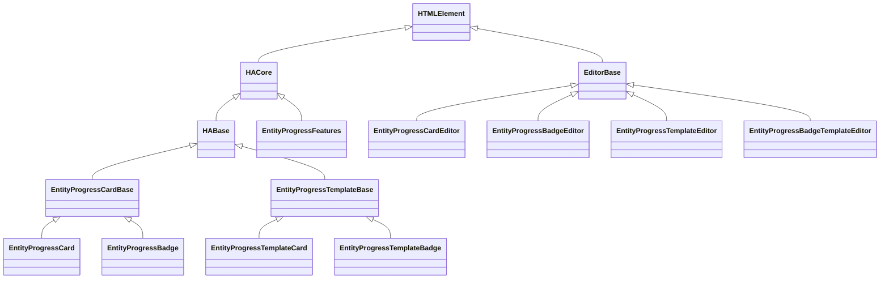
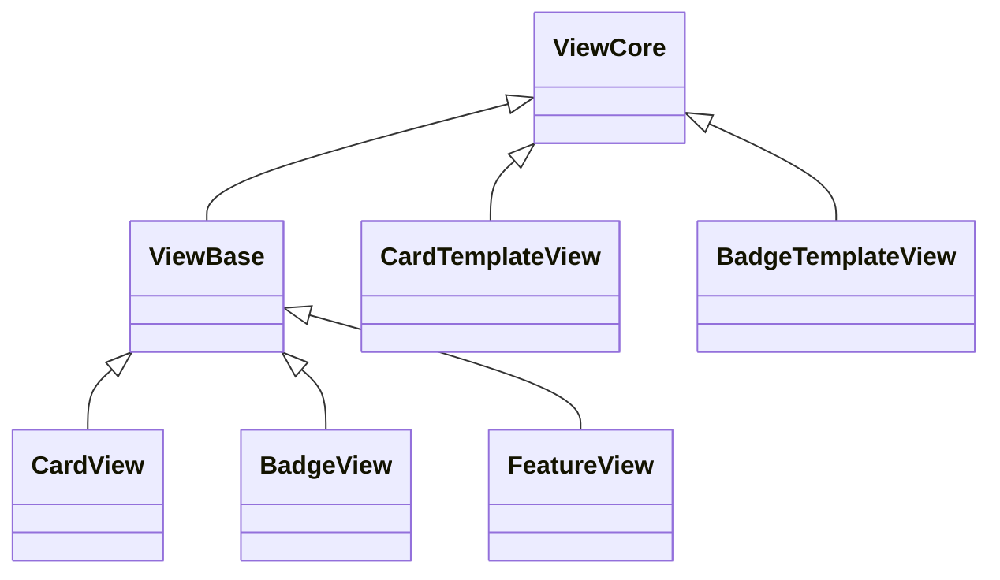
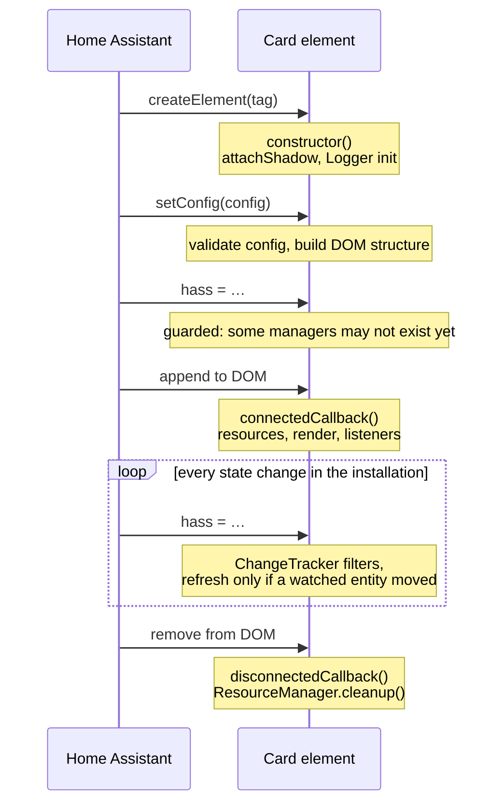

# 🛠️ Development Guide

This document describes the internal architecture of the Entity Progress Card
for contributors and maintainers. It complements the user-facing
[Configuration Reference](configuration.md) and [Theme Guide](theme.md).

- [Design principles](#design-principles)
- [Object architecture](#object-architecture)
- [Card lifecycle](#card-lifecycle)
- [Home Assistant integration](#home-assistant-integration)
- [Rendering & performance](#rendering--performance)
- [Jinja template subscriptions](#jinja-template-subscriptions)
- [Configuration validation](#configuration-validation)
- [Security](#security)
- [Editor architecture](#editor-architecture)
- [Internationalization](#internationalization)
- [Adding a new option](#adding-a-new-option)
- [Release process](#release-process)
- [Logging & debugging](#logging--debugging)

---

## Design principles

- **Zero runtime dependency.** The card ships as one bundled, dependency-free
  JavaScript file (built from the `src/` module tree by `scripts/build.js`,
  see [Release process](#release-process)) — no Lit, no external sanitizer,
  no CDN request at runtime. This constrains some choices and explains the
  hand-rolled infrastructure described below.
- **Vanilla web components.** Cards are plain `HTMLElement` subclasses with
  shadow DOM. The reactive-update machinery a framework would provide (batching,
  diffing, style sharing) is implemented by dedicated helper classes
  (`DOMHelper`, `ChangeTracker`, `ObjStructure`).
- **Progressive enhancement.** Modern browser APIs (Constructable Stylesheets…)
  are used behind feature detection; older engines covered by the README support
  table fall back to the legacy behavior.
- **Fail soft.** A malformed config, a missing attribute or an unavailable
  entity must degrade into a visible error state or a safe default — never into
  an uncaught exception (Home Assistant would replace the card with a red error
  card).

## Object architecture

The file is organized in layers, bottom-up:

```text
┌─────────────────────────────────────────────────────────────────┐
│ Custom elements (cards / badges / feature / editors)            │  HA-facing
├─────────────────────────────────────────────────────────────────┤
│ Views (ViewCore → ViewBase → CardView, BadgeView, …)            │  per-card state
├─────────────────────────────────────────────────────────────────┤
│ Config helpers + validation (BaseConfigHelper, types, schemas)  │  config layer
├─────────────────────────────────────────────────────────────────┤
│ Domain helpers (EntityHelper, PercentHelper, ThemeManager, …)   │  business logic
├─────────────────────────────────────────────────────────────────┤
│ Infrastructure (DOMHelper, ResourceManager, Logger, is/has, …)  │  utilities
└─────────────────────────────────────────────────────────────────┘
```

### Custom element hierarchy



| Class                                        | Responsibility                                                                                                                                                                                                                                                                                                                                                                                                                                                                                                                                                                                              |
| -------------------------------------------- | ----------------------------------------------------------------------------------------------------------------------------------------------------------------------------------------------------------------------------------------------------------------------------------------------------------------------------------------------------------------------------------------------------------------------------------------------------------------------------------------------------------------------------------------------------------------------------------------------------------- |
| `HACore`                                     | Shadow DOM setup, `setConfig`/`set hass` contract, render pipeline, resource lifecycle, WebSocket watching, Jinja subscription management. Abstract.                                                                                                                                                                                                                                                                                                                                                                                                                                                        |
| `HABase`                                     | Entity-driven rendering: icon, badge, shape, trend, hidden components, standard text fields, base Jinja handlers. Abstract.                                                                                                                                                                                                                                                                                                                                                                                                                                                                                 |
| `EntityProgressCardBase`                     | Full card behavior (auto-refresh for timers, CSS updates, standard fields).                                                                                                                                                                                                                                                                                                                                                                                                                                                                                                                                 |
| `EntityProgressCard` / `EntityProgressBadge` | Concrete card/badge: static metadata (`_cardStructure`, `_baseClass`), stub config.                                                                                                                                                                                                                                                                                                                                                                                                                                                                                                                         |
| `EntityProgressTemplateBase`                 | Jinja-first variants: every visible field comes from a template subscription.                                                                                                                                                                                                                                                                                                                                                                                                                                                                                                                               |
| `EntityProgressFeatures`                     | Tile feature (progress bar embedded in a native Tile card), including the row-size fix for `top`/`bottom` positions. Extends `HACore` directly (not `EntityProgressCardBase`) and has its own `_updateCSS()` — a separate implementation from Card/Badge's shared one, not a missing one. Its view (`FeatureView`) still extends `ViewBase` and its HTML still comes from the same `StructureElements.progressBar` builder as Card/Badge, so anything `ViewBase` exposes (theme, watermark, `bar_stack`, `center_zero`, …) works identically here — YAML-only, since the Tile Feature has no visual editor. |

Each concrete class carries **static** metadata consumed by the shared pipeline:
`_cardStructure` (an `ObjStructure` instance), `_cardStyle` (CSS text),
`_baseClass` (CSS class / type name), `_hiddenComponents`,
`_hasDisabledIconTap`, …

### View hierarchy

Views hold the **per-card state** derived from config + hass. The custom element
delegates every "what should be displayed" question to its view
(`this._cardView`) and keeps only DOM concerns for itself.



- `ViewCore` — config storage, entity value wrappers (`EntityOrValue`),
  watermark values, action helpers, trend memory.
- `ViewBase` — adds the full entity pipeline: `PercentHelper`, `ThemeManager`,
  `EntityCollectionHelper` (bar_stack), max-value entity, color resolution,
  badge info.
- Template views (`CardTemplateView`, `BadgeTemplateView`) intentionally skip
  `ViewBase`: their content comes from Jinja subscriptions, not from entity
  state computation.

Each view owns a matching **config helper** (`CardConfigHelper`,
`BadgeTemplateConfigHelper`, …) that validates and negotiates the raw YAML.

### Domain helpers

| Helper                                                    | Role                                                                                                                                                                                                                                                                                                                                                                                                                                                                                                                                                                                                                                                                                                                                                                                                                                                                                                                |
| --------------------------------------------------------- | ------------------------------------------------------------------------------------------------------------------------------------------------------------------------------------------------------------------------------------------------------------------------------------------------------------------------------------------------------------------------------------------------------------------------------------------------------------------------------------------------------------------------------------------------------------------------------------------------------------------------------------------------------------------------------------------------------------------------------------------------------------------------------------------------------------------------------------------------------------------------------------------------------------------- |
| `HassProviderSingleton`                                   | Single access point to the `hass` object: entity props, attributes, names/areas/floors, localization, locale-aware formatting. Shared by all cards on the page.                                                                                                                                                                                                                                                                                                                                                                                                                                                                                                                                                                                                                                                                                                                                                     |
| `ChangeTracker`                                           | Per-card filter deciding whether a `hass` update concerns this card (reference comparison of watched entities' state objects).                                                                                                                                                                                                                                                                                                                                                                                                                                                                                                                                                                                                                                                                                                                                                                                      |
| `EntityHelper` / `EntityOrValue`                          | Wraps one entity (or a literal value): type detection (timer, counter, number, duration), value extraction, validity/availability.                                                                                                                                                                                                                                                                                                                                                                                                                                                                                                                                                                                                                                                                                                                                                                                  |
| `EntityCollectionHelper`                                  | The `bar_stack` feature: `proportional` mode renormalizes shares against the combined total (a.k.a. "100% stacked"), `stacked` places each entity at its own position on the min/max scale, `net` reduces everything to one algebraic total. Width/share math always runs on `#magnitude` (`Math.abs`) - a raw negative value must never produce a negative width. An entity counts as negative (`net`'s sign, or the arm it lands in with `center_zero`) via `#isNegative`: marked `subtract`, **or** its own raw value is already negative - checking both instead of just flipping the sign on `subtract` avoids double-negating an already-negative value back to positive. With `center_zero`, `stacked`/`proportional` split by that same `#isNegative` into two independent arm gradients (`getDivergingGradients`) applied via dedicated CSS variables (`--epb-stack-*`) instead of the single shared fill. |
| `ProgressCalc` / `PercentHelper`                          | Percentage math (min/max/center-zero/reversed) and locale-aware value+unit formatting.                                                                                                                                                                                                                                                                                                                                                                                                                                                                                                                                                                                                                                                                                                                                                                                                                              |
| `ThemeManager`                                            | Built-in & custom themes: color/icon per value zone, `segment`/`rainbow` gradients, HA color name adaptation.                                                                                                                                                                                                                                                                                                                                                                                                                                                                                                                                                                                                                                                                                                                                                                                                       |
| `NumberFormatter`                                         | Value/unit/duration formatting (`Intl.NumberFormat`, timedelta parsing).                                                                                                                                                                                                                                                                                                                                                                                                                                                                                                                                                                                                                                                                                                                                                                                                                                            |
| `ObjStructure` + `StructureTemplates`/`StructureElements` | HTML structure factory: pure string builders + per-option `<template>` cache (see [Rendering](#rendering--performance)).                                                                                                                                                                                                                                                                                                                                                                                                                                                                                                                                                                                                                                                                                                                                                                                            |

### Infrastructure

| Class                | Role                                                                                                                                                                                                                                                                                                                                                                                                                                                                                                                                                                        |
| -------------------- | --------------------------------------------------------------------------------------------------------------------------------------------------------------------------------------------------------------------------------------------------------------------------------------------------------------------------------------------------------------------------------------------------------------------------------------------------------------------------------------------------------------------------------------------------------------------------- |
| `DOMHelper`          | Registered-element map + **RAF-batched, value-cached DOM writes** (`setStyle`, `setHTML`, `toggleClass`, …). A write whose value matches the cache is skipped before touching the DOM; pending writes are flushed once per animation frame. Also hosts the HTML sanitizer. `setStyle` never unsets a value on its own (nullish writes are just skipped) — a CSS custom property that's only conditionally applied (e.g. `bar_stack`'s diverging-arm gradient) needs an explicit `removeStyle` call when the condition stops holding, or it stays stuck from a stale render. |
| `ResourceManager`    | Ownership of every disposable resource (intervals, timeouts, listeners, WS subscriptions, observers) keyed by id; `cleanup()` releases everything on disconnect. Also provides `throttle` / `throttleDebounce`.                                                                                                                                                                                                                                                                                                                                                             |
| `ActionHelper`       | Bridges HA's `action-handler` (tap/hold/double-tap) to `hass-action` events, with icon-vs-card hit detection. Idempotent `init()`.                                                                                                                                                                                                                                                                                                                                                                                                                                          |
| `Logger`             | Per-class leveled logging with optional method wrapping (`wrapAll`) for call tracing.                                                                                                                                                                                                                                                                                                                                                                                                                                                                                       |
| `is` / `has`         | Type guards used everywhere (`is.number` rejects `NaN`/`Infinity`, `is.strictNumericString` vs lax `is.numericString`, …).                                                                                                                                                                                                                                                                                                                                                                                                                                                  |
| `RegistrationHelper` | `customElements.define` + `window.customCards` / `customBadges` / `customCardFeatures` registration.                                                                                                                                                                                                                                                                                                                                                                                                                                                                        |

## Card lifecycle

### The web component contract

Cards are **autonomous custom elements**. The relevant callbacks and the HA
calls interleave like this — note that Home Assistant sets `config` and `hass`
**before** attaching the element to the DOM:



Two consequences drive the code style:

1. **Everything reachable from `setConfig`/`set hass` must tolerate a
   not-yet-connected element** (`_resourceManager` may be `null`, the DOM may
   not exist). Guards like `this._resourceManager?.…` are load-bearing, not
   defensive noise.
2. **`connectedCallback` can run many times** (view navigation, edit mode, DOM
   moves). Everything it does must be idempotent: listeners are attached once
   (`ActionHelper.#initialized`), the render is guarded by `#isRendered`,
   resource re-creation is keyed.

### Function chain

**`setConfig(config)`** (HACore):

```text
setConfig
 ├─ reset()                      # if already rendered (editor keystroke)
 │   ├─ remove 'transition-ready' class
 │   ├─ _dom.destroy()           # clear element map + caches
 │   └─ shadowRoot.innerHTML = ''  (adoptedStyleSheets survive)
 ├─ _cardView.config = {…}       # validation + negotiation (ConfigHelper)
 ├─ _registerWatchedEntities()   # rebuild the ChangeTracker watch set
 ├─ render()
 └─ _handleHassUpdate()          # if hass already known
```

**`render()`** (once per connection/config, guarded by `#isRendered`):

```text
render
 ├─ _createCardElements()
 │   ├─ adopt shared CSSStyleSheet   (or legacy <style> fallback)
 │   ├─ create card element, register it in DOMHelper
 │   ├─ _buildStyle()                # base classes, watermark, bar effect
 │   └─ card.replaceChildren(clone)  # <template> cache keyed by structure options
 ├─ shadowRoot.replaceChildren(…)
 ├─ _storeDOM()                      # register the few dynamic elements (_domKeys)
 └─ RAF → add 'transition-ready'     # enables CSS transitions after first paint
```

The `transition-ready` class exists so the bar does **not** animate from 0 on
the very first paint — transitions are only enabled one frame later.

**`set hass(hass)`** (every state change in the installation):

```text
set hass
 ├─ ChangeTracker.hassState = hass   # reference-compare watched entities
 ├─ if first hass or a watched entity changed:
 │   ├─ HassProviderSingleton.hass = hass
 │   └─ _handleHassUpdate()
 │       └─ refresh()
 │           ├─ _cardView.refresh(hass)      # recompute values/percent/theme
 │           ├─ _manageErrorMessage()        # error card state
 │           └─ _updateDynamicElements()
 │               ├─ _showIcon / _showBadge / _manageShape / _updateTrend
 │               ├─ _updateCSS()             # CSS custom properties via DOMHelper
 │               └─ _processJinjaFields()    # throttled; no-op if subscribed
 └─ _watchWebSocket()                 # once
```

All DOM writes in this chain go through `DOMHelper`: value-cached (no-op if
unchanged) and RAF-batched (one flush per frame). An idle card whose watched
entities did not change costs **one Map lookup and n reference comparisons** per
hass update — nothing else. Cards with **no** watched entity (pure Jinja
template cards) skip the refresh entirely: their content arrives via push
subscriptions.

**`disconnectedCallback()`**:

```text
disconnectedCallback
 ├─ ResourceManager.cleanup()   # intervals, listeners, WS subscriptions, observers
 ├─ _resourceManager = null
 └─ clear template-subscription signatures  # allows resubscription on reconnect
```

### Timers: auto-refresh

Running `timer.*` entities need sub-second visual progress although HA only
pushes state changes on start/pause/finish. `_handleHassUpdate` starts a
`ResourceManager`-owned interval (`autoRefresh`) while `_cardView.isActiveTimer`
is true, and stops it otherwise. The interval calls `refresh()` which recomputes
elapsed time from `finishes_at`.

## Home Assistant integration

### Registration

At module load (bottom of the file):

```js
RegistrationHelper.registerCard(META.types.card, EntityProgressCard, EntityProgressCardEditor);
RegistrationHelper.registerBadge(META.types.badge, EntityProgressBadge, …);
RegistrationHelper.registerCardFeature(META.types.feature, EntityProgressFeatures);
…
```

`RegistrationHelper` does two things per component:

1. `customElements.define(tag, class)` — guarded by `customElements.get` so a
   double-load (HACS + manual resource) logs a warning instead of throwing.
2. Pushes a descriptor into `window.customCards` / `window.customBadges` /
   `window.customCardFeatures` (deferred by 1 s) so the card appears in HA's
   card picker with name, description and preview support.

### The HA ↔ card contract

| HA calls                               | Purpose                                                                                                     |
| -------------------------------------- | ----------------------------------------------------------------------------------------------------------- |
| `setConfig(config)`                    | Raw YAML config. Must throw on unusable config (HA shows the error card). Called on every editor keystroke. |
| `hass` setter                          | New immutable snapshot on every state change of the whole installation.                                     |
| `getCardSize()` / `getLayoutOptions()` | Masonry & sections-grid sizing. Derived from layout/bar options by the view.                                |
| `static getConfigElement()`            | Returns the visual editor element (`document.createElement('<tag>-editor')`).                               |
| `static getStubConfig(hass)`           | Initial config in the card picker; picks a sensible entity from `hass`.                                     |

Conventions relied upon:

- **`hass.states` objects are immutable** — the frontend replaces the object on
  change. `ChangeTracker` exploits this: change detection is reference equality,
  exactly like native cards' `shouldUpdate`.
- **Actions** are delegated to HA: the card binds the global `<action-handler>`
  element (created lazily if absent, as the HA frontend does) and emits
  `hass-action` events; HA executes more-info/toggle/navigate.
- **Native components** are reused in the editor (`ha-selector`,
  `ha-expansion-panel`, `ha-filter-chip`, `ha-button`, `ha-svg-icon`) and in the
  card (`ha-card`, `ha-icon`, `ha-state-icon`, `ha-alert`). This keeps look &
  feel aligned with each HA release, at the cost of depending on their (stable)
  public behavior.
- **Theming** goes through HA CSS custom properties (`--primary-color`,
  `--state-icon-color`, `--ha-card-*`) plus the card's public `--epb-*` API (see
  [Theme Guide](theme.md)); dark-mode switches need no JavaScript.

### WebSocket

Beyond the `hass` object, the card talks to HA through the shared WebSocket
connection (`hass.connection`) for Jinja rendering — see next section. The
`disconnected` / `ready` connection events are watched to drop and restore
subscriptions across reconnections (HA restart, network loss).

## Rendering & performance

Techniques used to keep N cards cheap on a dashboard that updates constantly:

1. **Shared constructed stylesheets.** The ~47 KB CSS is parsed once into a
   `CSSStyleSheet` and adopted by reference by every shadow root
   (`getSharedStyleSheet`). Feature-detected; Firefox < 101 / Safari < 16.4 fall
   back to a per-instance `<style>` element.
2. **`<template>` cache.** `ObjStructure.clone(options)` builds the HTML string
   once per unique structure-option set, parses it into a `<template>`, and
   every subsequent render clones the tree. The cache key is the JSON of the
   options object — **the DOM structure depends on config options** (layout, bar
   position, center-zero…), so each distinct combination gets its own template
   and identical cards share one.
3. **Value-cached, RAF-batched DOM writes** (`DOMHelper`). Redundant writes are
   dropped before touching the DOM; the rest are coalesced into one
   `requestAnimationFrame` flush.
4. **Reference-based change detection** (`ChangeTracker`), so the per-update
   cost of an idle card is a few `!==`.
5. **Compositor-only animations.** The bar fill animates with
   `transform: translateX/Y`; gradient/glass effects live on a `::before` scaled
   with `transform` too. No `width`/`background-size` animation → no per-frame
   repaint. `contain: layout paint` bounds invalidation to the bar.
6. **Push-based Jinja** with subscription dedup (next section) instead of
   polling or resubscribing.

## Jinja template subscriptions

Template-capable options (`badge_icon`, `bar_effect`, `hide`, `min_value`,
`max_value`, `watermark.low`, `watermark.high`, and all fields of the template
cards) are rendered **server-side by HA** via `render_template` WebSocket
subscriptions: HA pushes a new result whenever an entity referenced inside the
template changes. The card never evaluates Jinja itself.

`min_value`/`max_value`/`watermark.low`/`watermark.high` use an explicit
`{ jinja: "..." }` map rather than sniffing a bare string, because a plain
string is already meaningful there (an entity ID) — disambiguating the two at
runtime is exactly what this shape avoids. `validJinjaFields`'s `rawValueFor`
resolves both flat keys (`min_value`) and one level of nested dot-path keys
(`watermark.low`) the same way `#resolveValue` does for editor fields. The
resolved number is cached on the view (`jinjaMinValue`, `jinjaWatermarkLow`, …)
and read with `??` ahead of the static value in `#setStdValues`/the `watermark`
getter — never written directly into `EntityOrValue`, which only understands
numbers and entity IDs.

Key mechanics (`_processJinjaFields` / `_subscribeToTemplate`):

- **Signature dedup.** Each subscription is identified by
  `template + '\0' + entity-variable`. If an identical subscription is live or
  in flight, the call is a no-op — refreshes cost zero WS traffic. The signature
  is reserved _before_ the `await`, which also prevents concurrent duplicate
  subscriptions; a superseded in-flight subscription unsubscribes itself on
  resolution.
- **Invalidation.** Signatures are cleared when the WS drops (`disconnected`
  event), on `disconnectedCallback`, and on subscription failure (allowing
  retry). Orphan subscriptions (field removed from config) are cleaned on the
  next processing cycle.
- **Throttling.** `_processJinjaFields` runs through `throttleDebounce(300 ms)`:
  leading execution for responsiveness, trailing execution only for calls
  rejected by the throttle.
- **Result handling.** `render_template` returns **native types** — handlers
  normalize (`list` or comma-string for `bar_effect`/`hide`, number or numeric
  string for `percent`) and render errors are caught and logged rather than
  crashing the WS callback.

## Configuration validation

`BaseConfigHelper` subclasses run the raw YAML through a schema built with the
`types` combinators (`YamlSchemaFactory`). Principles:

- **Negotiation, not rejection**: an invalid property is dropped
  (`SKIP_PROPERTY`) or replaced by its default, and a message is surfaced in the
  editor preview; the card still renders whenever possible.
- The negotiated config (`_configHelper.config`) is what views consume; the raw
  config is what the editor round-trips, so user YAML is never rewritten behind
  their back.
- Deprecated options are detected and logged with a migration hint.

## Security

Jinja results rendered as HTML (`name`, `secondary`, `custom_info`, `name_info`)
pass through the allowlist sanitizer in `DOMHelper.setHTML`:

- Tags: `b`, `i`, `u`, `span`, `div`, `br` — anything else is unwrapped (text
  preserved); `script`/`style`/`iframe`/`object`/`embed` are dropped with their
  content.
- Attributes: `class`, plus `style` restricted to `color` / `background-color`.
  Event handlers and URLs never survive.

Rationale: templates are authored by the dashboard owner, but they often
interpolate strings the owner does _not_ control (media titles, network device
names, MQTT payloads). Details in the
[Supported HTML](configuration.md#supported-html) section.

When adding a new render path, use `setText` unless HTML is a documented feature
of the field — and never bypass `setHTML`'s sanitizer with a raw `innerHTML`
assignment.

## Editor architecture

Editors share `EditorBase`:

- A declarative **field map** (`static _fields`) organized in expansion panels;
  each field is an `ha-selector` (or a custom element:
  `entity-progress-effect-chips`, `entity-progress-hide-chips`,
  `entity-progress-bar-stack-editor`).
- **Render once, update forever**: the DOM is built on first
  `connectedCallback`; every subsequent `setConfig` only pushes values,
  visibility (`showIf`) and dynamic selectors through `EditorDOMHelper` (same
  RAF/cache batching as the card).
- Fields read the **negotiated** config so entity-driven defaults show up,
  except `template`/`action` fields which read the raw config to avoid flicker
  while typing Jinja.
- `virtual` fields (UI-only toggles), `target` remapping, `onChange`/`onClear`
  hooks cover the YAML↔UI mismatches; `_`-prefixed keys carry ephemeral UI state
  and are stripped before `config-changed` is dispatched.
- Custom elements that edit an **array of row-objects** (`bar_stack`'s entities,
  `custom_theme`'s zones) share `ListEditorBase`: a label, a list container, the
  build-once/render-on-change lifecycle, and `_deleteRow`/`_updateItem` — the
  same template-method pattern `ChipsBase`/`SingleSelectChipsBase` use for the
  chip family. A concrete row editor only implements
  `_buildDOM()`/`_render()`/`_dispatch()` and its own per-field builders.

## Internationalization

All user-visible strings live in the module-level `TRANSLATIONS` constant — **39
languages**, one flat object per language code:

```js
const TRANSLATIONS = {
  en: {
    card:   { msg:   { entityNotFound: '…', … } },        // runtime messages
    editor: { title: { … },                               // panel headers
              field: { … },                               // field labels
              option: { bar_size: { … }, hide: { … }, … } // select/chip options
            },
  },
  fr: { … },
  …
};
```

- Lookup goes through `HassProviderSingleton.localize('editor.field.unit')` — a
  dot-path resolver over the active language, loaded on the first `hass`
  assignment and reloaded on language change. Missing keys return the key itself
  (never `undefined`), and editor option maps fall back to the default language
  (`CARD.config.language = 'en'`).

> [!IMPORTANT]
>
> **The `TRANSLATIONS` block in the JS is generated — never edit it by hand.**
> The source of truth is the per-language JSON files in
> [`translations/`](../translations) (same `card`/`editor` tree, one file per
> language code). Any language change — new key, fixed wording, new language —
> goes through those JSON files first, then the block is rebuilt into
> `src/utils/translations.js`:
>
> ```bash
> # everything goes through the unified toolchain:
> node scripts/translations.js add-key editor.field.foo --values foo.json
> node scripts/translations.js synchronize --to-js   # regenerate the JS block
> node scripts/translations.js validate              # JSON ↔ JS ↔ template
> ```
>
> A hand edit of the JS block would be silently overwritten by the next
> regeneration — if it happened anyway, `synchronize --to-json` backports it
> into the JSON files.

The toolchain (`node scripts/translations.js`, zero dependency) covers the whole
workflow — run it without argument for the full help:

| Command                                        | Purpose                                                                                                                                                                                         |
| ---------------------------------------------- | ----------------------------------------------------------------------------------------------------------------------------------------------------------------------------------------------- |
| `validate`                                     | Three-way drift report (JSON ↔ JS ↔ `template.json`), exit 1 on drift — CI-friendly.                                                                                                            |
| `synchronize [--to-js\|--to-json] [--dry-run]` | Apply in either direction; `--to-js` is the nominal flow.                                                                                                                                       |
| `orphans`                                      | Heuristic: translated keys never referenced by the code, and `localize()` paths with no translation. Verify candidates manually (some keys are reached dynamically, e.g. `toggle_${childKey}`). |
| `stats`                                        | Per-language coverage vs `template.json`.                                                                                                                                                       |
| `add-key` / `rename-key` / `remove-key`        | Cross-language key surgery, order-preserving, template included.                                                                                                                                |
| `fill <lang> [--mark]`                         | Copy missing keys from another language (optionally `[TODO]`-marked).                                                                                                                           |
| `sort`                                         | Normalize key order of every JSON to the template.                                                                                                                                              |
| `new-lang <code>`                              | Bootstrap a new language file from `en`.                                                                                                                                                        |

- **Every new key must exist at least in `en.json`** (the fallback), and ideally
  in every language file — the trees are strictly parallel.
- Contributor-friendly rule: an imperfect machine translation beats a missing
  key — native speakers regularly submit fixes.

## Adding a new option

### Naming rules

The existing surface grew organically and carries some inconsistencies (`color`
vs `bar_color`, `disable_unit` vs `frameless`…). **Every new option must follow
these rules** so the API stops degrading:

1. **Family prefix**: options belonging to a visual family share its prefix —
   `bar_*`, `icon_*`, `badge_*`. A bare name (`color`) is ambiguous forever.
2. **No negative booleans**: `show_x: false`, never `disable_x`/`hide_x`.
3. **Nested object as soon as an option has ≥ 2 sub-settings**
   (`alert_when: {above, color}`), never sibling flat keys (`alert_above` +
   `alert_color`).
4. **Booleans are nouns or adjectives** (`text_shadow`, `frameless`), never
   imperative verbs (`force_*`).
5. **Values in the entity's native unit** by default (like `watermark.low`);
   percent-based needs an explicit `*_as: percent` companion.
6. Renaming an existing option is a breaking change — add an **alias** in the
   negotiation instead, and document the new name as canonical.

### Checklist

Checklist for a new YAML option, in the order that avoids back-tracking:

1. **Default** — add it to the stub/default config object if it has one
   (`CARD.config` area) and decide its default semantics (absent = default;
   never write the default value into the user's YAML).
2. **Validation** — add the property to the relevant schema(s) in
   `YamlSchemaFactory` using the `types` combinators (`optionalString()`,
   `enumsWithDefault(…)`, `fallbackTo(…, SKIP_PROPERTY)`, …). Remember the
   negotiation philosophy: invalid input degrades with an editor message, it
   does not break the card. Card and template schemas are separate — update both
   if the option applies to both families.
3. **Consumption** — read it from the negotiated config
   (`this._configHelper.config.<option>`) in the view; expose a getter on the
   view if the element needs it. If the option changes the **DOM structure**, it
   must flow through `_structureOptions` so the `ObjStructure` template cache
   keys on it.
4. **Rendering** — apply it via `DOMHelper` (class toggle, CSS custom property,
   `setText`/`setHTML`). Never touch the DOM directly. If a CSS custom property
   is only set _conditionally_, pair `setStyle` with `removeStyle` for the case
   where the condition stops holding — `setStyle` never unsets a value on its
   own, so a stale one would otherwise survive into a render where it no longer
   applies.
5. **Editor** — add the field to the relevant `static _fields` maps
   (`EditorFactory`), with `showIf` for conditional visibility and
   `onChange`/`onClear` if the YAML shape differs from the UI shape. New select
   types need an entry in `#getSelectorForType` and an option map in the
   translations.
6. **Translations** — `editor.field.<name>` label (+ `editor.option.<name>` map
   for selects/chips) via `node scripts/translations.js add-key …`, then
   `synchronize --to-js` (see [Internationalization](#internationalization) —
   never edit the JS `TRANSLATIONS` block directly).
7. **Jinja support** (optional) — if the option accepts templates: declare it in
   `validJinjaFields`/`_getJinjaHandlers`, normalize the pushed result (native
   types!), and route any HTML rendering through `setHTML`.
8. **Documentation** — a section in [`docs/configuration.md`](configuration.md)
   (badges, type, example, back-to-top link) and a line in the release notes.
9. **Watched entities** — if the option can reference another entity, add it to
   `_registerWatchedEntities` so state changes trigger a refresh.

## Release process

- **Versioning**: `const VERSION = 'x.y.z[-dev]'` at the top of the file is the
  single source of truth displayed in the console banner; keep it in sync with
  the git tag. `-dev` marks unreleased builds.
- **CI** (`.github/workflows/`), path-scoped where relevant so a PR only
  triggers the checks that matter for what it touches:
  - `validate-hacs.yaml` — **not** path-scoped, runs on every push/PR: HACS
    validation (`hacs/action`, category `plugin`). Deliberately unscoped — it
    checks `hacs.json`/README compliance too, not just the JS file, so a path
    filter would risk missing a manifest/README-only regression.
  - `validate-js.yaml` — on `src/**`/`eslint.config.mjs`/`package.json`/
    `package-lock.json` changes: `npm run validate` (syntax check, lint, full
    translations sync).
  - `validate-i18n.yaml` — on `translations/**` changes:
    `npm run i18n:validate:structure` (well-formed JSON + template structure
    only — no JS sync required, so a translation-only PR isn't blocked on
    something a contributor can't fix themselves; see
    [Internationalization](#internationalization)).
  - `validate-md.yaml` — on `**/*.md` changes: `npm run lint:md`.
  - `release.yaml` — on a **published GitHub release**:
    `npm run check:release-flags` (safety net — fails if `CARD_CONTEXT.dev`/
    `debug` is left `true` in the committed source; see
    [Logging & debugging](#logging--debugging)), `npm run validate`,
    `npm run build:prod` (esbuild, `--target=es2022`, pinned as a
    devDependency — forces `CARD_CONTEXT.dev`/`debug` to `false` in the built
    output regardless of the source state, see
    `scripts/lib/release-flags.js`), a `node --check` sanity pass on the
    minified output, then uploads the artifact to the release assets. HACS
    serves that asset.
- **Two build modes** (`scripts/build.js`, bundling `src/editor/editors.js`
  via esbuild): `build:test` (default, `CARD_CONTEXT` left exactly as
  committed) and `build:prod` (`--prod` flag, `CARD_CONTEXT.dev` and every
  `debug.*` flag forced `false` regardless of the source state — see
  `scripts/lib/release-flags.js`). Only `build:prod` is safe to ship.
- **Language floor**: the esbuild target is `es2022` — private fields and class
  static blocks are fine, but syntax newer than es2022 will fail the release
  build even though it runs in dev. Test a release build locally with
  `npm run build:prod` when in doubt.
- **HACS**: `hacs.json` declares only the `filename` (no `content_in_root` —
  nothing is served from the repo root). HACS installs from the release
  asset `release.yaml` uploads; there is no in-repo fallback file, matching
  how other HACS plugins (e.g. Mushroom) ship a pure `src/` + release setup.
- Release notes are drafted in `docs/rc-testing-notes.md` during the RC cycle,
  then promoted to the GitHub release body.

## Logging & debugging

- Per-class debug flags live in `CARD_CONTEXT.debug` (card, hass,
  ressourceManager, …). Set one to `true` and rebuild-free reload: the matching
  `Logger` instance wraps the class's `_loggedMethods` and traces every call
  with timing (`👉` / `✅` / `❌`).
- The console banner printed at load confirms which version is actually running
  (cache issues are the #1 support topic).
- `window.customCards` can be inspected to verify registration.
- In DevTools, a card's shadow root should contain **no `<style>` element** on
  modern browsers (adopted stylesheet) — seeing one means the fallback path was
  taken.
