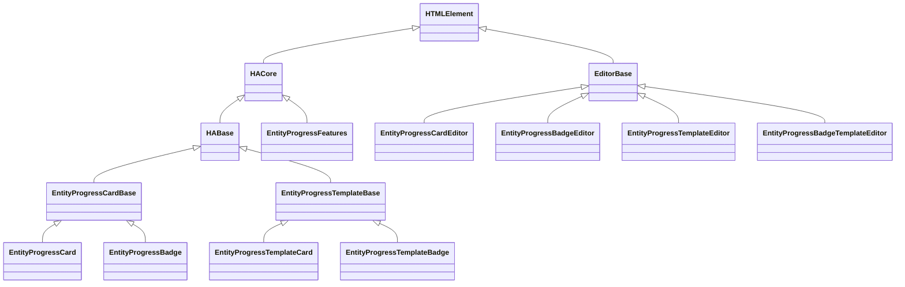
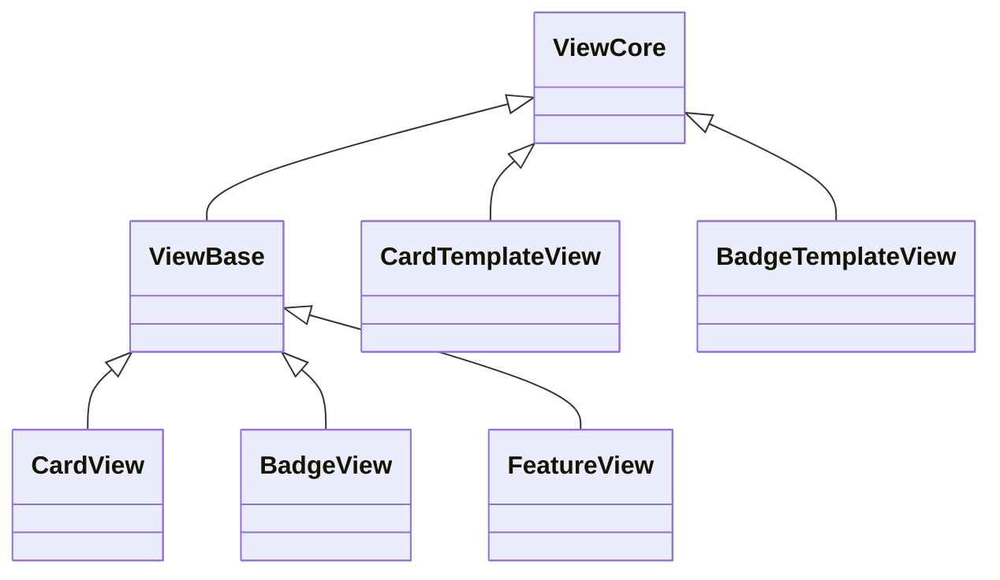
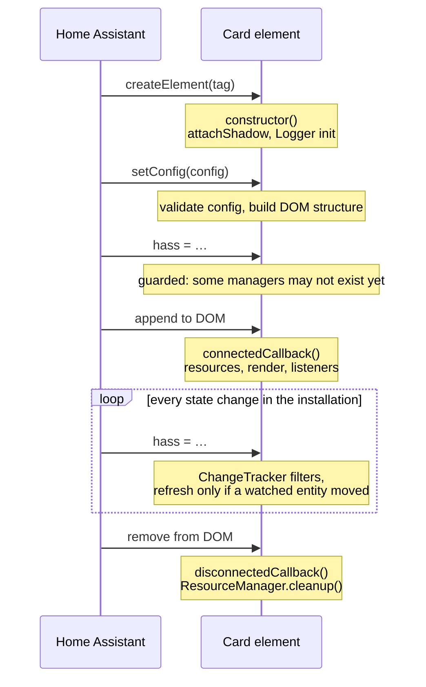

# 🛠️ Development Guide

This document describes the internal architecture of the Entity Progress Card
for contributors and maintainers. It complements the user-facing
[Configuration Reference](configuration.md) and [Theme Guide](theme.md), and the
setup/PR-facing [Contributing Guide](contributing.md).

- [Quick start](#quick-start)
- [Design principles](#design-principles)
- [Object architecture](#object-architecture)
- [Card lifecycle](#card-lifecycle)
- [Home Assistant integration](#home-assistant-integration)
- [Rendering & performance](#rendering--performance)
- [Browser compatibility matrix](#browser-compatibility-matrix)
- [Jinja template subscriptions](#jinja-template-subscriptions)
- [Configuration validation](#configuration-validation)
- [Security](#security)
- [Editor architecture](#editor-architecture)
- [Internationalization](#internationalization)
- [Adding a new option](#adding-a-new-option)
- [Code quality & tooling](#code-quality--tooling)
- [Considered and deferred](#considered-and-deferred)
- [Release process](#release-process)
- [Logging & debugging](#logging--debugging)

---

## Quick start

```bash
git clone https://github.com/francois-le-ko4la/lovelace-entity-progress-card.git
cd lovelace-entity-progress-card
npm install          # Node 24 (see .nvmrc / package.json's engines); also
                      # installs the husky pre-commit hook (format + lint on
                      # staged files)
npm run build:test   # → dist/entity-progress-card_dev.js (readable, not minified)
```

`src/index.ts` is where execution actually starts: it registers the card/badge/
feature custom elements and prints the console banner — everything else in
`src/` is reached from there, directly or transitively.

To see it render against real entities rather than just type-check, there's no
automated test suite (see [Rendering & performance](#rendering--performance)) —
point a Lovelace resource at the dev build and import
[`docs/demo-dashboard-dev.yaml`](demo-dashboard-dev.yaml) into a real Home
Assistant instance. Full steps (and the PR checklist) are in the
[Contributing Guide](contributing.md#contribution-guidelines).

Before opening a PR: `npm run validate` (syntax check + lint + type-check +
translations sync) — the same gate CI runs.

## Design principles

- **Zero runtime dependency.** The card ships as one bundled, dependency-free
  JavaScript file (built from the `src/` module tree by `scripts/build.js`, see
  [Release process](#release-process)) — no Lit, no external sanitizer, no CDN
  request at runtime. This constrains some choices and explains the hand-rolled
  infrastructure described below.
- **Vanilla web components.** Cards are plain `HTMLElement` subclasses with
  shadow DOM. The reactive-update machinery a framework would provide (batching,
  diffing, style sharing) is implemented by dedicated helper classes
  (`DOMHelper`, `ChangeTracker`, `ObjStructure`).
- **Progressive enhancement.** Modern browser APIs (Constructable Stylesheets…)
  are used behind feature detection; older engines covered by the README support
  table fall back to the legacy behavior.
- **Fail soft.** A malformed config, a missing attribute or an unavailable
  entity must degrade into a visible error state or a safe default — never into
  an uncaught exception (Home Assistant would replace the card with a red error
  card).

## Object architecture

`src/` is organized in layers, bottom-up:

```text
┌─────────────────────────────────────────────────────────────────┐
│ Custom elements (cards / badges / feature / editors)            │  HA-facing
├─────────────────────────────────────────────────────────────────┤
│ Views (ViewCore → ViewBase → CardView, BadgeView, …)            │  per-card state
├─────────────────────────────────────────────────────────────────┤
│ Config helpers + validation (BaseConfigHelper, types, schemas)  │  config layer
├─────────────────────────────────────────────────────────────────┤
│ Domain helpers (EntityHelper, PercentHelper, ThemeManager, …)   │  business logic
├─────────────────────────────────────────────────────────────────┤
│ Infrastructure (DOMHelper, ResourceManager, Logger, is/has, …)  │  utilities
└─────────────────────────────────────────────────────────────────┘
```

### Custom element hierarchy


```mermaid
classDiagram
    HTMLElement <|-- HACore
    HACore <|-- HABase
    HACore <|-- EntityProgressFeatures
    HABase <|-- EntityProgressCardBase
    HABase <|-- EntityProgressTemplateBase
    EntityProgressCardBase <|-- EntityProgressCard
    EntityProgressCardBase <|-- EntityProgressBadge
    EntityProgressTemplateBase <|-- EntityProgressTemplateCard
    EntityProgressTemplateBase <|-- EntityProgressTemplateBadge
    HTMLElement <|-- EditorBase
    EditorBase <|-- EntityProgressCardEditor
    EditorBase <|-- EntityProgressBadgeEditor
    EditorBase <|-- EntityProgressTemplateEditor
    EditorBase <|-- EntityProgressBadgeTemplateEditor
```

| Class                                        | Responsibility                                                                                                                                                                                                                                                                                                                                                                                                                                                                                                                                                                                              |
| -------------------------------------------- | ----------------------------------------------------------------------------------------------------------------------------------------------------------------------------------------------------------------------------------------------------------------------------------------------------------------------------------------------------------------------------------------------------------------------------------------------------------------------------------------------------------------------------------------------------------------------------------------------------------- |
| `HACore`                                     | Shadow DOM setup, `setConfig`/`set hass` contract, render pipeline, resource lifecycle, WebSocket watching, Jinja subscription management. Abstract.                                                                                                                                                                                                                                                                                                                                                                                                                                                        |
| `HABase`                                     | Entity-driven rendering: icon, badge, shape, trend, hidden components, standard text fields, base Jinja handlers. Abstract.                                                                                                                                                                                                                                                                                                                                                                                                                                                                                 |
| `EntityProgressCardBase`                     | Full card behavior (auto-refresh for timers, CSS updates, standard fields).                                                                                                                                                                                                                                                                                                                                                                                                                                                                                                                                 |
| `EntityProgressCard` / `EntityProgressBadge` | Concrete card/badge: static metadata (`_cardStructure`, `_baseClass`), stub config.                                                                                                                                                                                                                                                                                                                                                                                                                                                                                                                         |
| `EntityProgressTemplateBase`                 | Jinja-first variants: every visible field comes from a template subscription.                                                                                                                                                                                                                                                                                                                                                                                                                                                                                                                               |
| `EntityProgressFeatures`                     | Tile feature (progress bar embedded in a native Tile card), including the row-size fix for `top`/`bottom` positions. Extends `HACore` directly (not `EntityProgressCardBase`) and has its own `_updateCSS()` — a separate implementation from Card/Badge's shared one, not a missing one. Its view (`FeatureView`) still extends `ViewBase` and its HTML still comes from the same `StructureElements.progressBar` builder as Card/Badge, so anything `ViewBase` exposes (theme, watermark, `bar_stack`, `center_zero`, …) works identically here — YAML-only, since the Tile Feature has no visual editor. |

Each concrete class carries **static** metadata consumed by the shared pipeline:
`_cardStructure` (an `ObjStructure` instance), `_cardStyle` (CSS text),
`_baseClass` (CSS class / type name), `_hiddenComponents`,
`_hasDisabledIconTap`, …

### View hierarchy

Views hold the **per-card state** derived from config + hass. The custom element
delegates every "what should be displayed" question to its view
(`this._cardView`) and keeps only DOM concerns for itself.


```mermaid
classDiagram
    ViewCore <|-- ViewBase
    ViewCore <|-- CardTemplateView
    ViewCore <|-- BadgeTemplateView
    ViewBase <|-- CardView
    ViewBase <|-- BadgeView
    ViewBase <|-- FeatureView
```

- `ViewCore` — config storage, entity value wrappers (`EntityOrValue`),
  watermark values, action helpers, trend memory.
- `ViewBase` — adds the full entity pipeline: `PercentHelper`, `ThemeManager`,
  `EntityCollectionHelper` (bar_stack), max-value entity, color resolution,
  badge info.
- Template views (`CardTemplateView`, `BadgeTemplateView`) intentionally skip
  `ViewBase`: their content comes from Jinja subscriptions, not from entity
  state computation.

Each view owns a matching **config helper** (`CardConfigHelper`,
`BadgeTemplateConfigHelper`, …) that validates and negotiates the raw YAML —
this is the diagram's "Config helpers + validation" layer; see
[Configuration validation](#configuration-validation) for the full detail
(`preProcess`/`postProcess`, schema-derived `Config` type).

### Domain helpers

| Helper                                                    | Role                                                                                                                                                                                                                                                                                                                                                                                                                                                                                                                                                                                                                                                                                                                                                                                                                                                                                                                |
| --------------------------------------------------------- | ------------------------------------------------------------------------------------------------------------------------------------------------------------------------------------------------------------------------------------------------------------------------------------------------------------------------------------------------------------------------------------------------------------------------------------------------------------------------------------------------------------------------------------------------------------------------------------------------------------------------------------------------------------------------------------------------------------------------------------------------------------------------------------------------------------------------------------------------------------------------------------------------------------------- |
| `HassProviderSingleton`                                   | Single access point to the `hass` object: entity props, attributes, names/areas/floors, localization, locale-aware formatting. Shared by all cards on the page.                                                                                                                                                                                                                                                                                                                                                                                                                                                                                                                                                                                                                                                                                                                                                     |
| `ChangeTracker`                                           | Per-card filter deciding whether a `hass` update concerns this card (reference comparison of watched entities' state objects).                                                                                                                                                                                                                                                                                                                                                                                                                                                                                                                                                                                                                                                                                                                                                                                      |
| `EntityHelper` / `EntityOrValue`                          | Wraps one entity (or a literal value): type detection (timer, counter, number, duration), value extraction, validity/availability.                                                                                                                                                                                                                                                                                                                                                                                                                                                                                                                                                                                                                                                                                                                                                                                  |
| `EntityCollectionHelper`                                  | The `bar_stack` feature: `proportional` mode renormalizes shares against the combined total (a.k.a. "100% stacked"), `stacked` places each entity at its own position on the min/max scale, `net` reduces everything to one algebraic total. Width/share math always runs on `#magnitude` (`Math.abs`) - a raw negative value must never produce a negative width. An entity counts as negative (`net`'s sign, or the arm it lands in with `center_zero`) via `#isNegative`: marked `subtract`, **or** its own raw value is already negative - checking both instead of just flipping the sign on `subtract` avoids double-negating an already-negative value back to positive. With `center_zero`, `stacked`/`proportional` split by that same `#isNegative` into two independent arm gradients (`getDivergingGradients`) applied via dedicated CSS variables (`--epb-stack-*`) instead of the single shared fill. |
| `ProgressCalc` / `PercentHelper`                          | Percentage math (min/max/center-zero/reversed) and locale-aware value+unit formatting.                                                                                                                                                                                                                                                                                                                                                                                                                                                                                                                                                                                                                                                                                                                                                                                                                              |
| `ThemeManager`                                            | Built-in & custom themes: color/icon per value zone, `segment`/`rainbow` gradients, HA color name adaptation.                                                                                                                                                                                                                                                                                                                                                                                                                                                                                                                                                                                                                                                                                                                                                                                                       |
| `NumberFormatter`                                         | Value/unit/duration formatting (`Intl.NumberFormat`, timedelta parsing).                                                                                                                                                                                                                                                                                                                                                                                                                                                                                                                                                                                                                                                                                                                                                                                                                                            |
| `ObjStructure` + `StructureTemplates`/`StructureElements` | HTML structure factory: pure string builders + per-option `<template>` cache (see [Rendering](#rendering--performance)).                                                                                                                                                                                                                                                                                                                                                                                                                                                                                                                                                                                                                                                                                                                                                                                            |

### Infrastructure

| Class                | Role                                                                                                                                                                                                                                                                                                                                                                                                                                                                                                                                                                        |
| -------------------- | --------------------------------------------------------------------------------------------------------------------------------------------------------------------------------------------------------------------------------------------------------------------------------------------------------------------------------------------------------------------------------------------------------------------------------------------------------------------------------------------------------------------------------------------------------------------------- |
| `DOMHelper`          | Registered-element map + **RAF-batched, value-cached DOM writes** (`setStyle`, `setHTML`, `toggleClass`, …). A write whose value matches the cache is skipped before touching the DOM; pending writes are flushed once per animation frame. Also hosts the HTML sanitizer. `setStyle` never unsets a value on its own (nullish writes are just skipped) — a CSS custom property that's only conditionally applied (e.g. `bar_stack`'s diverging-arm gradient) needs an explicit `removeStyle` call when the condition stops holding, or it stays stuck from a stale render. |
| `ResourceManager`    | Ownership of every disposable resource (intervals, timeouts, listeners, WS subscriptions, observers) keyed by id; `cleanup()` releases everything on disconnect. Also provides `throttle` / `throttleDebounce`.                                                                                                                                                                                                                                                                                                                                                             |
| `ActionHelper`       | Bridges HA's `action-handler` (tap/hold/double-tap) to `hass-action` events, with icon-vs-card hit detection. Idempotent `init()`.                                                                                                                                                                                                                                                                                                                                                                                                                                          |
| `Logger`             | Per-class leveled logging with optional method wrapping (`wrapAll`) for call tracing.                                                                                                                                                                                                                                                                                                                                                                                                                                                                                       |
| `is` / `has`         | Type guards used everywhere (`is.number` rejects `NaN`/`Infinity`, `is.strictNumericString` vs lax `is.numericString`, …).                                                                                                                                                                                                                                                                                                                                                                                                                                                  |
| `RegistrationHelper` | `customElements.define` + `window.customCards` / `customBadges` / `customCardFeatures` registration.                                                                                                                                                                                                                                                                                                                                                                                                                                                                        |

## Card lifecycle

### The web component contract

Cards are **autonomous custom elements**. The relevant callbacks and the HA
calls interleave like this — note that Home Assistant sets `config` and `hass`
**before** attaching the element to the DOM:


```mermaid
sequenceDiagram
    participant HA as Home Assistant
    participant El as Card element
    HA->>El: createElement(tag)
    Note over El: constructor()<br/>attachShadow, Logger init
    HA->>El: setConfig(config)
    Note over El: validate config, build DOM structure
    HA->>El: hass = …
    Note over El: guarded: some managers may not exist yet
    HA->>El: append to DOM
    Note over El: connectedCallback()<br/>resources, render, listeners
    loop every state change in the installation
        HA->>El: hass = …
        Note over El: ChangeTracker filters,<br/>refresh only if a watched entity moved
    end
    HA->>El: remove from DOM
    Note over El: disconnectedCallback()<br/>ResourceManager.cleanup()
```

Two consequences drive the code style:

1. **Everything reachable from `setConfig`/`set hass` must tolerate a
   not-yet-connected element** (`_resourceManager` may be `null`, the DOM may
   not exist). Guards like `this._resourceManager?.…` are load-bearing, not
   defensive noise.
2. **`connectedCallback` can run many times** (view navigation, edit mode, DOM
   moves). Everything it does must be idempotent: listeners are attached once
   (`ActionHelper.#initialized`), the render is guarded by `#isRendered`,
   resource re-creation is keyed.

### Function chain

**`setConfig(config)`** (HACore):

```text
setConfig
 ├─ reset()                      # if already rendered (editor keystroke)
 │   ├─ remove 'transition-ready' class
 │   ├─ _dom.destroy()           # clear element map + caches
 │   └─ shadowRoot.innerHTML = ''  (adoptedStyleSheets survive)
 ├─ _cardView.config = {…}       # validation + negotiation (ConfigHelper)
 ├─ _registerWatchedEntities()   # rebuild the ChangeTracker watch set
 ├─ render()
 └─ _handleHassUpdate()          # if hass already known
```

**`render()`** (once per connection/config, guarded by `#isRendered`):

```text
render
 ├─ _createCardElements()
 │   ├─ adopt shared CSSStyleSheet   (or legacy <style> fallback)
 │   ├─ create card element, register it in DOMHelper
 │   ├─ _buildStyle()                # base classes, watermark, bar effect
 │   └─ card.replaceChildren(clone)  # <template> cache keyed by structure options
 ├─ shadowRoot.replaceChildren(…)
 ├─ _storeDOM()                      # register the few dynamic elements (_domKeys)
 └─ RAF → add 'transition-ready'     # enables CSS transitions after first paint
```

The `transition-ready` class exists so the bar does **not** animate from 0 on
the very first paint — transitions are only enabled one frame later.

**`set hass(hass)`** (every state change in the installation):

```text
set hass
 ├─ ChangeTracker.hassState = hass   # reference-compare watched entities
 ├─ if first hass or a watched entity changed:
 │   ├─ HassProviderSingleton.hass = hass
 │   └─ _handleHassUpdate()
 │       └─ refresh()
 │           ├─ _cardView.refresh(hass)      # recompute values/percent/theme
 │           ├─ _manageErrorMessage()        # error card state
 │           └─ _updateDynamicElements()
 │               ├─ _showIcon / _showBadge / _manageShape / _updateTrend
 │               ├─ _updateCSS()             # CSS custom properties via DOMHelper
 │               └─ _processJinjaFields()    # throttled; no-op if subscribed
 └─ _watchWebSocket()                 # once
```

All DOM writes in this chain go through `DOMHelper`: value-cached (no-op if
unchanged) and RAF-batched (one flush per frame). An idle card whose watched
entities did not change costs **one Map lookup and n reference comparisons** per
hass update — nothing else. Cards with **no** watched entity (pure Jinja
template cards) skip the refresh entirely: their content arrives via push
subscriptions.

**`disconnectedCallback()`**:

```text
disconnectedCallback
 ├─ ResourceManager.cleanup()   # intervals, listeners, WS subscriptions, observers
 ├─ _resourceManager = null
 └─ clear template-subscription signatures  # allows resubscription on reconnect
```

### Timers: auto-refresh

Running `timer.*` entities need sub-second visual progress although HA only
pushes state changes on start/pause/finish. `_handleHassUpdate` starts a
`ResourceManager`-owned interval (`autoRefresh`) while `_cardView.isActiveTimer`
is true, and stops it otherwise. The interval calls `refresh()` which recomputes
elapsed time from `finishes_at`.

## Home Assistant integration

### Registration

At module load, in `src/index.ts` (the bundle entry point):

```js
RegistrationHelper.registerCard(META.types.card, EntityProgressCard, EntityProgressCardEditor);
RegistrationHelper.registerBadge(META.types.badge, EntityProgressBadge, …);
RegistrationHelper.registerCardFeature(META.types.feature, EntityProgressFeatures);
…
```

`RegistrationHelper` does two things per component:

1. `customElements.define(tag, class)` — guarded by `customElements.get` so a
   double-load (HACS + manual resource) logs a warning instead of throwing.
2. Pushes a descriptor into `window.customCards` / `window.customBadges` /
   `window.customCardFeatures` (deferred by 1 s) so the card appears in HA's
   card picker with name, description and preview support. Card/Badge only, the
   descriptor also carries `getEntitySuggestion` (HA 2026.6+ entity-first card
   picker) — see `src/utils/entity-suggestions.ts` for the domain/ attribute
   rules deciding which entities get a suggestion and what config comes back.
   Template/Badge Template/Feature don't get one: Template needs a hand-written
   Jinja `percent:` to render anything meaningful, and Features are never picked
   through this entity-first flow at all (`customCardFeatures`, not
   `customCards`).

### The HA ↔ card contract

| HA calls                               | Purpose                                                                                                     |
| -------------------------------------- | ----------------------------------------------------------------------------------------------------------- |
| `setConfig(config)`                    | Raw YAML config. Must throw on unusable config (HA shows the error card). Called on every editor keystroke. |
| `hass` setter                          | New immutable snapshot on every state change of the whole installation.                                     |
| `getCardSize()` / `getLayoutOptions()` | Masonry & sections-grid sizing. Derived from layout/bar options by the view.                                |
| `static getConfigElement()`            | Returns the visual editor element (`document.createElement('<tag>-editor')`).                               |
| `static getStubConfig(hass)`           | Initial config in the card picker; picks a sensible entity from `hass`.                                     |

Conventions relied upon:

- **`hass.states` objects are immutable** — the frontend replaces the object on
  change. `ChangeTracker` exploits this: change detection is reference equality,
  exactly like native cards' `shouldUpdate`.
- **Actions** are delegated to HA: the card binds the global `<action-handler>`
  element (created lazily if absent, as the HA frontend does) and emits
  `hass-action` events; HA executes more-info/toggle/navigate.
- **Native components** are reused in the editor (`ha-selector`,
  `ha-expansion-panel`, `ha-filter-chip`, `ha-button`, `ha-svg-icon`) and in the
  card (`ha-card`, `ha-icon`, `ha-state-icon`, `ha-alert`). This keeps look &
  feel aligned with each HA release, at the cost of depending on their (stable)
  public behavior.
- **Theming** goes through HA CSS custom properties (`--primary-color`,
  `--state-icon-color`, `--ha-card-*`) plus the card's public `--epb-*` API (see
  [Theme Guide](theme.md)); dark-mode switches need no JavaScript.

### WebSocket

Beyond the `hass` object, the card talks to HA through the shared WebSocket
connection (`hass.connection`) for Jinja rendering — see next section. The
`disconnected` / `ready` connection events are watched to drop and restore
subscriptions across reconnections (HA restart, network loss).

## Rendering & performance

Techniques used to keep N cards cheap on a dashboard that updates constantly:

1. **Shared constructed stylesheets.** The ~47 KB CSS is parsed once into a
   `CSSStyleSheet` and adopted by reference by every shadow root
   (`getSharedStyleSheet`). Feature-detected; Firefox < 101 / Safari < 16.4 fall
   back to a per-instance `<style>` element.
2. **`<template>` cache.** `ObjStructure.clone(options)` builds the HTML string
   once per unique structure-option set, parses it into a `<template>`, and
   every subsequent render clones the tree. The cache key is the JSON of the
   options object — **the DOM structure depends on config options** (layout, bar
   position, center-zero…), so each distinct combination gets its own template
   and identical cards share one.
3. **Value-cached, RAF-batched DOM writes** (`DOMHelper`, shared by the card and
   by `EditorDOMHelper extends DOMHelper`). Two independent mechanisms, both
   keyed `${key}:${prop}` (the registered element's key + the property being
   written, e.g. `bar_size:style:width`):
   - **Value cache** (`_appliedValues`) — every `setStyle`/`setText`/
     `toggleClass`/… checks this map first and returns immediately if the
     incoming value already equals the last one _applied_; nothing gets enqueued
     at all for a no-op change, so an unrelated hass update that recomputes the
     same values costs a handful of map lookups, not DOM writes.
   - **RAF queue** (`enqueue(key, prop, updateFn)` → `_pendingUpdates`) — writes
     that do need to happen go into a `Map<"key:prop", updateFn>` instead of
     touching the DOM synchronously. Enqueuing again under the _same_ `key:prop`
     before the next frame just overwrites the map entry (last write wins)
     rather than queuing a second one, so N redundant writes to the same target
     collapse into the one that actually mattered. A single
     `requestAnimationFrame` callback flushes the whole map once per frame,
     however many distinct keys ended up queued. This is also the project's
     general-purpose debounce building block — see
     `ResourceManager.setTimeout(handler, ms, id)`'s own cancel-and-replace-
     by-id semantics, used the same way for the Jinja render debounce
     ([Jinja template subscriptions](#jinja-template-subscriptions)).
4. **Reference-based change detection** (`ChangeTracker`), so the per-update
   cost of an idle card is a few `!==`.
5. **Compositor-only animations.** The bar fill animates with
   `transform: translateX/Y`; gradient/glass effects live on a `::before` scaled
   with `transform` too. No `width`/`background-size` animation → no per-frame
   repaint. `contain: layout paint` bounds invalidation to the bar.
6. **Push-based Jinja** with subscription dedup (next section) instead of
   polling or resubscribing.

## Browser compatibility matrix

The card ships to a wide range of Home Assistant setups — including
embedded/kiosk panels running an old, unupdatable browser — so compatibility is
handled as two distinct floors, not one:

| Tier                | Home Assistant | Chrome/Edge | Firefox | Safari  | Opera |
| ------------------- | -------------- | ----------- | ------- | ------- | ----- |
| Functional minimum  | `2024.0+`      | `98+`       | `94+`   | `15.4+` | `84+` |
| Full visual effects | —              | `111+`      | `113+`  | `16.2+` | `97+` |

(kept in sync with the table in the [README](../README.md#prerequisites) —
update both when either floor changes.) Below the functional-minimum row, the
card may not load at all. Between the two rows, it loads and works completely —
every option, every interaction — but a handful of purely decorative touches (a
soft tint behind icons, the pulsing alert/ping animations, the bar's gradient
sheen) fall back to a plainer look instead of the modern one. This is a
deliberate trade-off, not an oversight: full functionality first, full polish
where the browser allows it.

### How the two floors are enforced

- **Syntax** (does the JS itself parse/run) is handled by the **build target**,
  not by writing fallback code — `scripts/build.js` passes `target: 'es2021'` to
  esbuild's minifier, and `npm run check:es-target` (`es-check`, part of the
  release build) re-verifies that language floor on the **minified** output.
  This is the direct fix for
  [issue #128](https://github.com/francois-le-ko4la/lovelace-entity-progress-card/issues/128)
  (filed against Chrome 92): the build used to target `es2022`, which let
  esbuild emit class `static {}` blocks (its `keepNames` technique on static
  members) — a hard `SyntaxError` on any pre-2022 engine, caught by neither
  dev-mode testing (a modern browser) nor `node --check` in CI (Node's own
  parser is newer than the target), so it shipped broken to exactly the
  embedded/kiosk browsers this matters most for. `es2021` keeps every syntax
  feature actually used in `src/` (private fields, `??=`, optional chaining —
  all supported since Chrome ~80-85) while forcing static blocks into an
  es2021-safe form — no fallback branch needed, the build just never emits the
  unsafe syntax in the first place. `eslint-plugin-compat` lints the **source**
  against the same functional-minimum matrix during `npm run lint`, catching a
  problem earlier, before it'd otherwise only surface in `check:es-target` on
  the built output. See [Release process](#release-process) for exactly where
  the build-time check runs.
- **Visual/CSS degradation** is a separate, manual mechanism — there's no build
  target or linter for "does this gradient look right on Safari 15.4". Effects
  that use a modern CSS feature (`color-mix()`, `round()`, Constructable
  Stylesheets) ship a **fallback tier** picked via `@supports` (or a `try/catch`
  around the feature-detection itself, for JS APIs like Constructable
  Stylesheets), and a **modern tier** for browsers that support the real thing.
  Both tiers render the same underlying state, just with a plainer technique on
  the fallback side — never a missing feature.
  `docs/graphic-effects-compatibility.html` is the living side-by-side
  reference: every animation/gradient/effect in the card, fallback tier next to
  modern tier, with a note on exactly what technique change makes each one safe.
  Read it before adding a new visual effect, and add the new effect to it.

### When adding something that needs a newer CSS/JS feature

1. Check whether it's purely decorative (an animation flourish, a gradient
   sheen) or functional (the option doesn't work at all without it). Only
   decorative effects get the two-tier treatment — a functional gap has to be
   solved a different way (a simpler technique that works everywhere, or the
   option genuinely requires the floor to move, which needs a deliberate
   discussion, not a silent regression).
2. Write the fallback tier first (the one that works at the functional- minimum
   floor), confirm it looks reasonable on its own, then add the modern tier
   behind `@supports` (or equivalent feature detection).
3. Add the pair to `docs/graphic-effects-compatibility.html` so it's visible in
   the living comparison, not just correct in isolation.

### Pushing the floor lower where it's cheap

The `98+`/`94+`/`15.4+`/`84+` row is where the project draws the line on
**effort**, not a hard technical wall. Issue #128's own reporter was on Chrome
92 — an embedded kiosk panel, the kind of device that's often the hardest to get
upgraded. The JS syntax side is already covered for that case (the `es2021`
build target above), so this is really about the **CSS fallback tier**: when a
tier you're already writing for `@supports` also happens to work on something
like Chrome 92 at no extra cost, prefer that shape. Don't spend real effort
chasing 92 specifically, and don't let it constrain the modern tier's
implementation — it's "free wins welcome," not a second floor to formally test
against.

## Jinja template subscriptions

Template-capable options (`badge_icon`, `bar_effect`, `hide`, `min_value`,
`max_value`, `watermark.low`, `watermark.high`, `alert_when.above`,
`alert_when.below`, and all fields of the template cards) are rendered
**server-side by HA** via `render_template` WebSocket subscriptions: HA pushes a
new result whenever an entity referenced inside the template changes. The card
never evaluates Jinja itself.

`min_value`/`max_value`/`watermark.low`/`watermark.high`/`alert_when.above`/
`alert_when.below` all share the same explicit shape
(`number | { entity, attribute } | { jinja: "..." }`) rather than sniffing a
bare string for either the entity or the Jinja case — disambiguating either at
runtime from just the value's shape is exactly what this avoids.
`validJinjaFields`'s `rawValueFor` resolves both flat keys (`min_value`) and one
level of nested dot-path keys (`watermark.low`, `alert_when.above`) the same way
`#resolveValue` does for editor fields. The resolved number is cached on the
view (`jinjaMinValue`, `jinjaWatermarkLow`, `jinjaAlertAbove`, …) and read with
`??` ahead of the static value in `#setStdValues`/the `watermark`
getter/`isAlertActive` — never written directly into `EntityOrValue`, which only
understands numbers and entity IDs.

Key mechanics (`_processJinjaFields` / `_subscribeToTemplate`):

- **Signature dedup.** Each subscription is identified by
  `template + '\0' + entity-variable`. If an identical subscription is live or
  in flight, the call is a no-op — refreshes cost zero WS traffic. The signature
  is reserved _before_ the `await`, which also prevents concurrent duplicate
  subscriptions; a superseded in-flight subscription unsubscribes itself on
  resolution.
- **Invalidation.** Signatures are cleared when the WS drops (`disconnected`
  event), on `disconnectedCallback`, and on subscription failure (allowing
  retry). Orphan subscriptions (field removed from config) are cleaned on the
  next processing cycle.
- **Throttling.** `_processJinjaFields` runs through `throttleDebounce(300 ms)`:
  leading execution for responsiveness, trailing execution only for calls
  rejected by the throttle.
- **Result handling.** `render_template` returns **native types** — handlers
  normalize (`list` or comma-string for `bar_effect`/`hide`, number or numeric
  string for `percent`) and render errors are caught and logged rather than
  crashing the WS callback.
- **Per-key render debounce.** Every pushed result funnels through
  `HACore._renderJinja(key, content)`, which debounces ~80ms per `key` (id
  `jinja-render-<key>`) via `ResourceManager.setTimeout` before calling the real
  handler (`#applyJinja`) — no new mechanism, just reusing `ResourceManager`'s
  existing cancel-and-replace-by-id semantics for the same id. This exists
  because a multi-step HA script/automation (e.g. turning on an `input_boolean`,
  then picking an `input_select` option) makes entities referenced by an `and`
  condition change one at a time, not atomically — HA pushes one intermediate
  `render_template` result per entity it touches, not just the final settled
  one. Without the debounce, a field could visibly render (and stay stuck on) a
  transient value nothing in the final state actually supports (issue #135). The
  300ms throttle above governs how often a _subscription_ gets (re)established;
  this 80ms debounce governs how often an already-subscribed field's _result_
  gets applied to the DOM — different problems, both needed.

## Configuration validation

`BaseConfigHelper` subclasses run the raw YAML through a schema built with the
`types` combinators (`YamlSchemaFactory`). Principles:

- **Negotiation, not rejection**: an invalid property is dropped
  (`SKIP_PROPERTY`) or replaced by its default, and a message is surfaced in the
  editor preview; the card still renders whenever possible.
- The negotiated config (`_configHelper.config`) is what views consume; the raw
  config is what the editor round-trips, so user YAML is never rewritten behind
  their back.
- Deprecated options are detected and logged with a migration hint.

### `preProcess` / `postProcess` (`struct()`, `schema.ts`)

Every schema's pipeline is
`preProcess(rawData) → per-field validator() → postProcess(result)`:

- **`preProcess`** runs on the **raw, untyped** `Record<string, unknown>`,
  before any field validator sees it. It's for reshaping input whose YAML
  shorthand differs from the internal shape — e.g. a bare `name: "text"` string
  gets normalized into the real `[{type: 'text', text: ...}]` array the field
  validator expects, so the validator itself only has to handle one shape.
- **`postProcess`** runs on the **validated, typed** result. It's the
  cross-field safety net for "field B is meaningless without field A" — e.g.
  `bar_color_mode`/`interpolate` reset to their defaults once no theme is active
  (`applyBarColorModeRule`/`applyInterpolateRule`), `bar_single_line` resets
  once `bar_position` isn't `overlay`. This runs for _every_ config,
  hand-written YAML included, which is what actually protects rendering — the
  editor's own `onClear`/draft-preservation (see
  [Editor architecture](#editor-architecture)) is a separate, UI-only nicety for
  keeping the _saved_ YAML tidy, not a substitute for this.

**When adding an option gated by another one, add both**: a `postProcess` rule
so a hand-written-YAML user never gets a stuck or silently-wrong render, and an
editor `onClear` so the visual editor doesn't leave a stale value behind when
the gate closes. Neither is where you'd reject bad input — that's the field
validator's own job (throw `ValidationError`, or return `SKIP_PROPERTY` to drop
silently).

### `Config` is derived from the schema, not hand-maintained

`schema.ts`'s `Validator<T>` (and all of its `types` combinators — `string`,
`object`, `array`, `optional`, `enums`, `discriminatedUnion`, …) is generic, so
`struct()` returns a properly typed `{ validate, parse, extend }` instead of
`any`. `Infer<S>` extracts the resulting config type straight from a
`YamlSchemaFactory` entry:

```ts
type Infer<S> = Extract<ReturnType<S['validate']>, { isValid: true }>['config'];
```

`utils/types.ts`'s `Config` is
`Partial<Infer<Card> & Infer<Badge> & Infer<Template> & Infer<BadgeTemplate> & Infer<Feature>>`
— an intersection of all five schemas, then made fully optional. It's an
intersection rather than a union on purpose: shared code (`HACore`, `ViewCore`,
…) reads config fields without knowing which card family is actually running,
and TypeScript only allows property access on a union when the property exists
on every member. When adding or changing a property, edit the relevant
`YamlSchemaFactory` schema — `Config` picks it up automatically, nothing to
update by hand.

## Security

Jinja results rendered as HTML (`name`, `secondary`, `custom_info`, `name_info`)
pass through the allowlist sanitizer in `DOMHelper.setHTML`:

- Tags: `b`, `i`, `u`, `span`, `div`, `br` — anything else is unwrapped (text
  preserved); `script`/`style`/`iframe`/`object`/`embed` are dropped with their
  content.
- Attributes: `class`, plus `style` restricted to `color` / `background-color`.
  Event handlers and URLs never survive.

Rationale: templates are authored by the dashboard owner, but they often
interpolate strings the owner does _not_ control (media titles, network device
names, MQTT payloads). Details in the
[Supported HTML](configuration.md#supported-html) section.

When adding a new render path, use `setText` unless HTML is a documented feature
of the field — and never bypass `setHTML`'s sanitizer with a raw `innerHTML`
assignment.

## Editor architecture

### `EditorFactory` builds the field-def tree

`EditorFactory.build(template, badge)` produces the whole `static _fields` tree
consumed by `EditorBase`, one entry per panel: `general`, `content`, `theme`,
`markers`, `layout`, `interactions`. Every section function takes the same two
booleans (`template`/`badge`) identifying which of the four editable variants
(Card/Badge/Template/Badge Template) is being built, and returns a plain object
of field definitions — there's no class hierarchy here, just parameterized
functions returning data.

The `theme` panel in particular is assembled from a dozen small
`themeXxxFields(...)` helpers (`themeModeFields`, `themeColorModeFields`,
`themeCardOnlyFields`, `themeBarSizingFields`, …) instead of one large function
— this is deliberate, not just tidiness: `theme()`'s own body would trip
`sonarjs/cognitive-complexity`'s 15-branch cap if every card-type ternary lived
inline. Adding a field to that panel usually means extending the right existing
`themeXxxFields` helper, not adding to `theme()` itself.
`valueField`/`nestedValueField` are the equivalent factories for the 3-way
(standard/entity/jinja) value fields
(`min_value`/`max_value`/`watermark.low`/`.high`/`alert_when.above`/ `.below`) —
one implementation, five call sites.

- A declarative **field map** (`static _fields`) organized in expansion panels;
  each field is an `ha-selector` (or a custom element:
  `entity-progress-effect-chips`, `entity-progress-hide-chips`,
  `entity-progress-bar-stack-editor`).

### `EditorBase` runtime conventions

- **Render once, update forever**: the DOM is built on first
  `connectedCallback`; every subsequent `setConfig` only pushes values,
  visibility (`showIf`) and dynamic selectors through `EditorDOMHelper` (same
  RAF-queue + value-cache batching as the card — see
  [Rendering & performance](#rendering--performance)).
- Fields read the **negotiated** config so entity-driven defaults show up,
  except `template`/`action` fields which read the raw config to avoid flicker
  while typing Jinja.
- `virtual` fields (UI-only toggles), `target` remapping, `onChange`/`onClear`
  hooks cover the YAML↔UI mismatches; `_`-prefixed keys carry ephemeral UI state
  and are stripped before `config-changed` is dispatched (never round-tripped to
  the saved YAML), but survive across a `setConfig` round-trip like the rest of
  `#config` does.
- **Draft-preservation pattern**: when a toggle/mode-switch (`badge_toggle`,
  `icon_animation_jinja_toggle`, `min_value_mode`, …) discards a value to switch
  shape, stash it in a matching `_<field>_<mode>_draft` key first (one draft per
  _other_ mode, e.g. `_min_value_entity_draft` + `_min_value_jinja_draft` for
  `min_value_mode`'s 3-way switch) instead of just dropping it. Re-entering that
  mode later reads the draft back before falling to a blank default, so
  switching jinja → standard → jinja restores the typed template instead of
  starting over. `valueField`/`nestedValueField` in `factory.ts` are the
  reference implementation for the 3-way (standard/ entity/jinja) case; every
  2-way jinja toggle (`hide_jinja`, `bar_effect_jinja`, `status_label_toggle`,
  …) follows the same shape with one draft each way.
- **Field `width`** can be a plain string (set once, at build) or a function of
  config (re-evaluated on every relevant update via `EditorDOMHelper`, same as a
  dynamic `type`). Two fields meant to sit side by side in the same flex-wrap
  row must agree on when each goes half vs. full — if field B's `showIf` can go
  false while field A stays visible and half-width, A needs a matching
  conditional width (falling back to `100%`) or it ends up alone with empty
  space beside it. `EditorFactory.themeBarSizingFields` is the most elaborate
  real example (four different pairing rules depending on card type, spelled out
  in its own header comment) - read it before adding a new field to that same
  panel.
- Custom elements that edit an **array of row-objects** (`bar_stack`'s entities,
  `custom_theme`'s zones) share `ListEditorBase`: a label, a list container, the
  build-once/render-on-change lifecycle, and `_deleteRow`/`_updateItem` — the
  same template-method pattern `ChipsBase`/`SingleSelectChipsBase` use for the
  chip family. A concrete row editor only implements
  `_buildDOM()`/`_render()`/`_dispatch()` and its own per-field builders.

## Internationalization

All user-visible strings live in the module-level `TRANSLATIONS` constant — **39
languages**, one flat object per language code:

```js
const TRANSLATIONS = {
  en: {
    card:   { msg:   { entityNotFound: '…', … } },        // runtime messages
    editor: { title: { … },                               // panel headers
              field: { … },                               // field labels
              option: { bar_size: { … }, hide: { … }, … } // select/chip options
            },
  },
  fr: { … },
  …
};
```

- Lookup goes through `HassProviderSingleton.localize('editor.field.unit')` — a
  dot-path resolver over the active language, loaded on the first `hass`
  assignment and reloaded on language change. Missing keys return the key itself
  (never `undefined`), and editor option maps fall back to the default language
  (`CARD.config.language = 'en'`).

> [!IMPORTANT]
>
> **The `TRANSLATIONS` block in the JS is generated — never edit it by hand.**
> The source of truth is the per-language JSON files in
> [`translations/`](../translations) (same `card`/`editor` tree, one file per
> language code). Any language change — new key, fixed wording, new language —
> goes through those JSON files first, then the block is rebuilt into
> `src/utils/translations.js`:
>
> ```bash
> # everything goes through the unified toolchain:
> node scripts/translations.js add-key editor.field.foo --values foo.json
> node scripts/translations.js synchronize --to-js   # regenerate the JS block
> node scripts/translations.js validate              # JSON ↔ JS ↔ template
> ```
>
> A hand edit of the JS block would be silently overwritten by the next
> regeneration — if it happened anyway, `synchronize --to-json` backports it
> into the JSON files.

The toolchain (`node scripts/translations.js`, zero dependency) covers the whole
workflow — run it without argument for the full help:

| Command                                        | Purpose                                                                                                                                                                                         |
| ---------------------------------------------- | ----------------------------------------------------------------------------------------------------------------------------------------------------------------------------------------------- |
| `validate`                                     | Three-way drift report (JSON ↔ JS ↔ `template.json`), exit 1 on drift — CI-friendly.                                                                                                            |
| `synchronize [--to-js\|--to-json] [--dry-run]` | Apply in either direction; `--to-js` is the nominal flow.                                                                                                                                       |
| `orphans`                                      | Heuristic: translated keys never referenced by the code, and `localize()` paths with no translation. Verify candidates manually (some keys are reached dynamically, e.g. `toggle_${childKey}`). |
| `stats`                                        | Per-language coverage vs `template.json`.                                                                                                                                                       |
| `add-key` / `rename-key` / `remove-key`        | Cross-language key surgery, order-preserving, template included.                                                                                                                                |
| `fill <lang> [--mark]`                         | Copy missing keys from another language (optionally `[TODO]`-marked).                                                                                                                           |
| `sort`                                         | Normalize key order of every JSON to the template.                                                                                                                                              |
| `new-lang <code>`                              | Bootstrap a new language file from `en`.                                                                                                                                                        |

- **Every new key must exist at least in `en.json`** (the fallback), and ideally
  in every language file — the trees are strictly parallel.
- Contributor-friendly rule: an imperfect machine translation beats a missing
  key — native speakers regularly submit fixes.

## Adding a new option

### Naming rules

Two naming layers coexist by design, not by accident: these rules govern every
_new_ option, while the existing YAML surface is constrained by backward
compatibility with dashboards already written against it — renaming or reshaping
a shipped key is a breaking change (rule 6 below), so pre-rule options are kept
as-is rather than retrofitted. `color` vs `bar_color`, `disable_unit` vs
`frameless`, `watermark.disable_low`/`disable_high` (a negative boolean, rule 2)
all predate these rules and stay exactly as shipped. **Every new option must
follow these rules**, so the gap between "what's possible now" and "what's
actually out there" stops growing:

1. **Family prefix**: options belonging to a visual family share its prefix —
   `bar_*`, `icon_*`, `badge_*`. A bare name (`color`) is ambiguous forever.
2. **No negative booleans**: `show_x: false`, never `disable_x`/`hide_x`.
3. **Nested object as soon as an option has ≥ 2 sub-settings**
   (`alert_when: {above, color}`), never sibling flat keys (`alert_above` +
   `alert_color`).
4. **Booleans are nouns or adjectives** (`text_shadow`, `frameless`), never
   imperative verbs (`force_*`).
5. **Values in the entity's native unit** by default (like `watermark.low`);
   percent-based needs an explicit `*_as: percent` companion.
6. Renaming an existing option is a breaking change — add an **alias** in the
   negotiation instead, and document the new name as canonical.

### Checklist

Checklist for a new YAML option, in the order that avoids back-tracking:

1. **Default** — add it to the stub/default config object if it has one
   (`CARD.config` area) and decide its default semantics (absent = default;
   never write the default value into the user's YAML).
2. **Validation** — add the property to the relevant schema(s) in
   `YamlSchemaFactory` using the `types` combinators (`optionalString()`,
   `enumsWithDefault(…)`, `fallbackTo(…, SKIP_PROPERTY)`, …). Remember the
   negotiation philosophy: invalid input degrades with an editor message, it
   does not break the card. Card and template schemas are separate — update both
   if the option applies to both families.
3. **Consumption** — read it from the negotiated config
   (`this._configHelper.config.<option>`) in the view; expose a getter on the
   view if the element needs it. If the option changes the **DOM structure**, it
   must flow through `_structureOptions` so the `ObjStructure` template cache
   keys on it.
4. **Rendering** — apply it via `DOMHelper` (class toggle, CSS custom property,
   `setText`/`setHTML`). Never touch the DOM directly. If a CSS custom property
   is only set _conditionally_, pair `setStyle` with `removeStyle` for the case
   where the condition stops holding — `setStyle` never unsets a value on its
   own, so a stale one would otherwise survive into a render where it no longer
   applies.
5. **Editor** — add the field to the relevant `static _fields` maps
   (`EditorFactory`), with `showIf` for conditional visibility and
   `onChange`/`onClear` if the YAML shape differs from the UI shape. New select
   types need an entry in `#getSelectorForType` and an option map in the
   translations.
6. **Translations** — `editor.field.<name>` label (+ `editor.option.<name>` map
   for selects/chips) via `node scripts/translations.js add-key …`, then
   `synchronize --to-js` (see [Internationalization](#internationalization) —
   never edit the JS `TRANSLATIONS` block directly).
7. **Jinja support** (optional) — if the option accepts templates: declare it in
   `validJinjaFields`/`_getJinjaHandlers`, normalize the pushed result (native
   types!), and route any HTML rendering through `setHTML`.
8. **Documentation** — a section in [`docs/configuration.md`](configuration.md)
   (badges, type, example, back-to-top link) and a line in the release notes.
9. **Watched entities** — if the option can reference another entity, add it to
   `_registerWatchedEntities` so state changes trigger a refresh.

## Code quality & tooling

- **Linting** (`eslint.config.mjs`, flat config): `js.configs.recommended` plus
  `eslint-plugin-compat` (browser support matrix — see
  [Browser compatibility matrix](#browser-compatibility-matrix)),
  `eslint-plugin-sonarjs` (`cognitive-complexity` capped at 15,
  duplicate-string/collapsible-if/ identical-functions checks), and
  `eslint-plugin-import-x` (`import-x/ no-cycle` — `src/` has real cross-file
  imports now that the module split exists; nothing currently prevents a future
  circular import from creeping in except this rule). Notable custom rules:
  `eqeqeq: 'smart'` (bans `==`/ `!=` except the `x == null` null-or-undefined
  idiom, used once in `common-checks.ts`), `no-console` (only
  `debug`/`info`/`warn`/`error`/ `groupCollapsed`/`groupEnd` allowed —
  `console.log` is banned everywhere except one inline-disabled call in the
  startup banner), and `lines-between-class-members: 'always'` (no exception for
  short members — every class member gets a blank line before it).
  `npm run lint` / `make lint`.
- **Nearly all TypeScript** (`tsconfig.json`: `allowJs`, `checkJs: false`
  project-wide, `strict: true`): `src/` is virtually 100% `.ts` — the one
  remaining `.js` file, `translations.js`, is generated and never hand-edited
  (see [Internationalization](#internationalization)). `.ts` files are
  type-checked by `npm run type-check` (`tsc`, wired into `validate`).
  `allowJs`/`checkJs: false` stay in place for the day a `.js` file is added: it
  can opt into the same checking without converting, via a `// @ts-check` pragma
  plus JSDoc type annotations. `eslint.config.mjs` has a matching `**/*.ts`
  block (`@typescript-eslint/parser` + plugin) alongside the JS one, sharing the
  same rule set except identifier-resolution rules (`no-undef`/
  `no-unused-vars`), which TS itself already covers more reliably for `.ts`
  files. esbuild bundles the mixed `.ts`/`.js` tree natively — no separate
  compile step, imports keep the `.js` extension even when the real file is
  `.ts` (standard TS/esbuild resolution convention).
- **Formatting**: `.prettierrc` applies to `src/**/*.{js,ts}` too (not just
  markdown) — `npm run format:js` / `format:js:check` / `format` (JS + MD).
  `embeddedLanguageFormatting: "off"` is deliberate: Prettier recognizes the
  `css` identity tag in `src/utils/styles.ts` (see `scripts/build.js`'s CSS
  resolve/minify pass) as CSS-in-JS and would otherwise reformat the CSS _text
  itself_ inside every tagged template literal, producing a massive diff for a
  purely cosmetic change. `src/utils/translations.js` is excluded via
  `.prettierignore` (its own generator serializes it, not Prettier — formatting
  it here would just drift back out of sync on the next `i18n:sync`).
- **Pre-commit hooks** (`husky` + `lint-staged`, `.lintstagedrc.json`): staged
  `src/**/*.{js,ts}` files get `prettier --write` then `eslint --fix`; staged
  `*.md` files get `prettier --write` then `markdownlint-cli2 --fix`. Installed
  automatically via the `prepare` script on `npm ci`/`npm install`.
- **DeepSource** also runs as a CI status check (third-party static analysis,
  separate from ESLint) — treat its findings the same as an ESLint error: fix
  the root cause, don't suppress unless the finding is a false positive.
- `make help` lists every available target (build, lint, type-check, format,
  i18n, release-dry-run...) with a one-line description.
- **Identifier naming** (a followed convention, not lint-enforced): classes
  PascalCase, functions/methods/variables camelCase, private fields
  `#camelCase`, module-level constant objects (`CARD`, `HA_CONTEXT`, `SEV`, …)
  UPPER_SNAKE_CASE, filenames kebab-case. Distinct from the YAML option surface
  (snake_case, see [Naming rules](#naming-rules)) — negotiated/ derived config
  keys deliberately switch to camelCase to mark "computed, not raw YAML":
  `config.resolvedUnit`/`resolvedDecimal`, `center_zero`'s derived
  `{ enabled, zeroValue, growthPercent }` shape (`config-helpers.ts`).

## Considered and deferred

Ideas that came up, were scoped seriously, and were set aside on purpose —
recorded so nobody re-proposes or re-investigates them from zero, and so the
reasoning survives a maintainer handoff instead of living only in chat history.

- **Incremental editor preview** (instead of full reset+render on every
  keystroke). Today `HACore.setConfig` does a full `reset()`
  (`shadowRoot.innerHTML = ''`) + `render()` on every single editor edit, which
  is the dominant cost of typing in the visual editor (well past the field-walk
  itself, already optimized — see [Editor architecture](#editor-architecture)).
  The lever: only reset+render when the DOM **structure** actually changed; a
  same-structure value edit (a color, a threshold, a label) could instead go
  through an incremental update path. `ObjStructure.clone`'s own
  structure-signature (the same options —
  `barType`/`barPosition`/`layout`/`bar_size`/`orientation`/
  `center_zero`/`segments`/… — that already decides the `<template>` cache key,
  see [Rendering & performance](#rendering--performance)) is the natural "did
  structure change" check to reuse rather than re-derive. Risk: any structural
  option missing from that reused signature leaves a stale DOM; the incremental
  path would still need to re-process Jinja and re-register watched entities on
  every edit, just skip the teardown. Real correction surface, not started.
- **A dedicated "+ Add interaction" picker** for the optional action fields
  (`hold_action`, `icon_hold_action`, `double_tap_action`,
  `icon_double_tap_action`) below the existing `show_all_actions` toggle — the
  same "+" pattern Mushroom and HA's native Tile card use. Checked against their
  actual source (`hui-tile-card-editor.ts`, Mushroom's
  `template-card-editor.ts`): that widget is `ha-form`'s native
  `type: "optional_actions"` field, provided by HA for free — not something
  those projects built themselves. This editor is a hand-rolled form engine
  (`EditorFactory`/`EditorBase`/`EditorDOMHelper`), not `ha-form`-based, so it
  can't just declare that field type; migrating the whole editor to `ha-form`
  would be a rewrite far bigger than this one widget justifies. If revisited:
  build an equivalent "+" picker inside the existing custom engine, added below
  `show_all_actions` (`interactions()` in `factory.ts`) as a second, coexisting
  mechanism rather than a replacement — `tap_action`/ `icon_tap_action` are
  correctly out of scope either way (their default depends on the entity's
  domain, already handled separately).
- **The progress bar as a standalone "dumb" web component**
  (`<entity- progress-bar>` receiving pre-computed `%`/color/segments as props,
  with the calculation engine — `HACore`/`ViewCore`/`ProgressCalc` — living
  entirely outside it). Verdict: cosmetic for the current architecture, not
  worth it on its own — the Tile Feature (`entity-progress-feature`) already
  plays the role of a reusable bar-only building block for anything that needs
  one, so a formal smart/dumb split would mostly duplicate that without a
  concrete consumer needing it. Only worth reconsidering inside a genuine
  ground-up rendering rewrite, not as a standalone refactor.

## Release process

- **Versioning**: `const VERSION = 'x.y.z[-dev]'` in `src/utils/parameters.ts`
  is the single source of truth displayed in the console banner; keep it in sync
  with the git tag. `-dev` marks unreleased builds. `package.json`'s own
  `"version": "1.0.0"` is a deliberately frozen stub — this package is never
  published to npm (`private: true`), so it has no consumer; don't bump it,
  `VERSION` above is the only one that matters.
- **CI** (`.github/workflows/`), path-scoped where relevant so a PR only
  triggers the checks that matter for what it touches:
  - `validate-hacs.yaml` — **not** path-scoped, runs on every push/PR: HACS
    validation (`hacs/action`, category `plugin`). Deliberately unscoped — it
    checks `hacs.json`/README compliance too, not just `src/`, so a path filter
    would risk missing a manifest/README-only regression.
  - `validate-js.yaml` — on `src/**`/`eslint.config.mjs`/`package.json`/
    `package-lock.json` changes: `npm run validate` (syntax check, lint, full
    translations sync).
  - `validate-i18n.yaml` — on `translations/**` changes:
    `npm run i18n:validate:structure` (well-formed JSON + template structure
    only — no JS sync required, so a translation-only PR isn't blocked on
    something a contributor can't fix themselves; see
    [Internationalization](#internationalization)).
  - `validate-md.yaml` — on `**/*.md` changes: `npm run lint:md`.
  - `release.yaml` — on a **published GitHub release**:
    `npm run check:release-flags` (safety net — fails if the committed
    `DEBUG_DEFAULTS` baseline has any flag left `true`; `dev` is URL-derived so
    it isn't checked here, see [Logging & debugging](#logging--debugging)),
    `npm run validate`, `npm run build:prod` (esbuild, `--target=es2021`, pinned
    as a devDependency — re-forces `DEBUG_DEFAULTS` all-`false` in the built
    output regardless of the source state, see `scripts/lib/release-flags.js`),
    a `node --check` sanity pass on the minified output,
    `npm run check:es-target` (`es-check`, catches syntax newer than the
    language floor that `node --check` alone can't - Node's own parser is newer
    than the target, see issue #128), then uploads the artifact to the release
    assets. HACS serves that asset.
- **Two build modes** (`scripts/build.js`, bundling `src/index.ts` via esbuild
  with `keepNames: true`): `build:test` → `entity-progress-card_dev.js` (debug
  baseline left as committed) and `build:prod` (`--prod`) →
  `entity-progress-card.js` (minified, `DEBUG_DEFAULTS` re-forced all-`false`,
  see `scripts/lib/release-flags.js`). `dev` mode isn't baked into either — it
  follows the served filename/URL at runtime (see
  [Logging & debugging](#logging--debugging)). Only `build:prod` is minified and
  safe to ship.
- **Language floor**: the esbuild target is `es2021` — private fields, `??=` and
  optional chaining are fine, but syntax newer than es2021 (e.g. class
  `static {}` blocks - esbuild's own `keepNames` technique for those on some
  inputs) will fail `npm run check:es-target` in the release build even though
  it runs in dev (modern browser) and passes `node --check` (Node's parser is
  newer than the target). Test a release build locally with
  `npm run build:prod && npm run check:es-target` when in doubt.
- **HACS**: `hacs.json` declares only the `filename` (no `content_in_root` —
  nothing is served from the repo root). HACS installs from the release asset
  `release.yaml` uploads; there is no in-repo fallback file, matching how other
  HACS plugins (e.g. Mushroom) ship a pure `src/` + release setup.
- Release notes are drafted in `CHANGELOG.md` during the RC cycle, then promoted
  to the GitHub release body.

## Logging & debugging

`dev`/`debug`/`noRegistration` live in `CARD_CONTEXT`
(`src/utils/parameters.ts`).

- **dev** (`-dev` suffix on every registered element name, so a dev build
  coexists with the shipped one) is **baked in per build** (`__EPB_DEV_BUILD__`,
  injected by `scripts/build.js` — `true` in `entity-progress-card_dev.js`,
  `false` in the shipped file), not URL-derived. A dev build can't be shipped by
  accident, and HACS's own `?hacstag=…` doesn't trigger it. `?dev=true` is an
  optional _runtime override_ on the **prod** file on top of that baked value,
  for testing dev behavior against the exact shipped bundle.
- **debug** (`?debug=area1,area2`, or `?debug=all`) turns on per-area console
  logging at runtime, no rebuild, and works against the shipped file too. The
  committed baseline is `DEBUG_DEFAULTS` (all-`false`) — `?debug=` only ever
  turns flags _on_. `check-release-flags.js` verifies `DEBUG_DEFAULTS` is
  all-false and `build:prod` re-forces it, so verbose logging can't ship.
- **`?noRegistration`** loads the whole module (banner, `EPB_DIAG`, everything)
  but defines zero custom elements and pushes nothing to
  `customCards`/`Badges`/`Features` — a diagnostic knob for telling apart "the
  bundle loading at all" from "the bundle registering itself" when chasing a
  freeze/clash (issue #108's own troubleshooting flow). URL-derived only, off
  unless asked.
- **Why `?dev`/`?debug`/`?noRegistration` read `document.currentScript.src`,
  never `import.meta.url`**: a bare `import.meta` is a _parse-time_
  `SyntaxError` when the bundle is loaded as a classic `<script>` (a resource
  typed `js` instead of `module` in HA, or `browser_mod` re-loading it inside a
  popup) — it kills the whole module before any `try/catch` can even run, which
  is exactly what issue #108 turned out to be: a silent freeze with no console
  error, because the failure happens before the module's own error handling
  exists. `document.currentScript.src` is populated for a classic-script load
  and `null` for an ES-module load (`import()`, the real HACS path) — in the
  latter case these three stay off, which is the safe shipped state anyway.
  **Never reintroduce `import.meta` anywhere in `src/`.**
  `CARD_CONTEXT.classicScript` (`document.currentScript !== null`) is the same
  signal, used to show a one-time console nudge toward switching the resource to
  "JavaScript Module" — the classic type still loads fine now, but stays
  deprecated by HA.
- A **console warning** is printed after the load banner whenever dev or any
  debug area is active (listing the active areas), so a non-shipped
  configuration never runs silently. Normal prod loads stay quiet.

**Debug areas** (each traces via a `Logger` that wraps the class's
`_loggedMethods` — `👉` / `✅` / `❌` with timing — or logs directly):

| Area                 | Wired in                                | Traces                                                                        |
| -------------------- | --------------------------------------- | ----------------------------------------------------------------------------- |
| `card`               | `HACore`/`HABase` (`core.ts`)           | lifecycle (connect / disconnect / **adopted** / setConfig / refresh / render) |
| `editor`             | `EditorBase` (`editor/base.ts`)         | `setConfig` in, `config-changed` out                                          |
| `interactionHandler` | `ActionHelper` (`dom-helpers.ts`)       | tap / hold / double-tap action resolution                                     |
| `ressourceManager`   | `ResourceManager`/`DOMHelper`           | timers / listeners / subscriptions                                            |
| `hass`               | `HassProviderSingleton`                 | first hass (HA version, language, connection), language change                |
| `registration`       | `RegistrationHelper` (`register.ts`)    | every `define` (ok/skipped) + `customCards` push, with timing                 |
| `instances`          | value-helper + view class constructors  | per-class instantiation counter (`traceInstance`, leak probe)                 |
| `interference`       | `HACore` `MutationObserver` on the host | external mutations of our own host element (card-mod &c)                      |

To add a debug area: add it to `DEBUG_DEFAULTS` and the `CARD_CONTEXT.debug`
object (`parameters.ts`), the `CLEAN_DEBUG_DEFAULTS_BODY` literal
(`scripts/lib/release-flags.js`), then consume `CARD_CONTEXT.debug.<area>` where
you need it (via `initLogger`/`traceInstance`, or a module-level
`Logger.create`).

Other aids:

- The console banner printed at load confirms which version is actually running
  (cache issues are the #1 support topic). `window.EPB_DIAG.dump()` prints an
  anonymized environment/registration report.
- `?debug=instances` counting relies on `constructor.name`; the esbuild build
  runs with `keepNames: true` so cross-module class names survive
  bundling/minification (otherwise `_ThemeManager` &c would surface in the
  logs).
- `window.customCards` can be inspected to verify registration.
- In DevTools, a card's shadow root should contain **no `<style>` element** on
  modern browsers (adopted stylesheet) — seeing one means the fallback path was
  taken.
