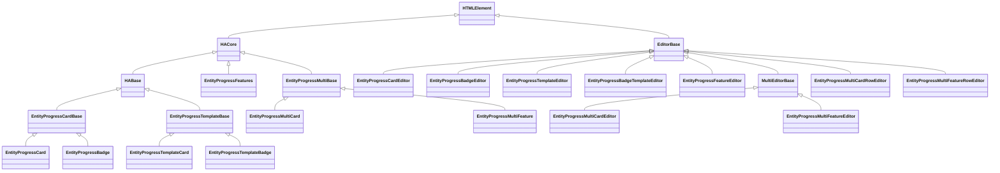
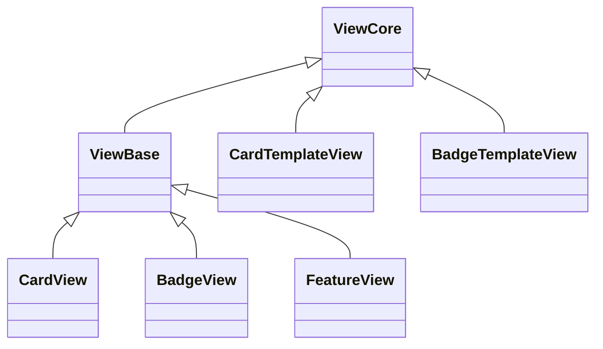
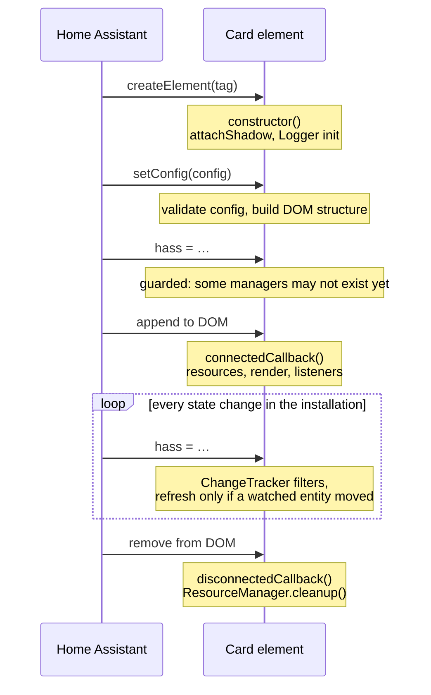

# 🛠️ Development Guide

This document describes the internal architecture of the Entity Progress Card
for contributors and maintainers. It complements the user-facing
[Configuration Reference](configuration.md) and [Theme Guide](theme.md), and the
setup/PR-facing [Contributing Guide](contributing.md).

- [Quick start](#quick-start)
- [Design principles](#design-principles)
- [Object architecture](#object-architecture)
- [Card lifecycle](#card-lifecycle)
- [Home Assistant integration](#home-assistant-integration)
- [Rendering & performance](#rendering--performance)
- [Browser compatibility matrix](#browser-compatibility-matrix)
- [Jinja template subscriptions](#jinja-template-subscriptions)
- [Configuration validation](#configuration-validation)
- [Security](#security)
- [Editor components: native HA elements vs. our own](#editor-components-native-ha-elements-vs-our-own)
- [Editor architecture](#editor-architecture)
- [Internationalization](#internationalization)
- [Adding a new option](#adding-a-new-option)
- [Code quality & tooling](#code-quality--tooling)
- [Considered and deferred](#considered-and-deferred)
- [Release process](#release-process)
- [Logging & debugging](#logging--debugging)

---

## Quick start

```bash
git clone https://github.com/francois-le-ko4la/lovelace-entity-progress-card.git
cd lovelace-entity-progress-card
npm install          # Node 24 (see .nvmrc / package.json's engines); also
                      # installs the husky pre-commit hook (format + lint on
                      # staged files)
npm run build:test   # → dist/entity-progress-card_dev.js (readable, not minified)
```

`src/bootstrap.ts` is where execution actually settles: it registers the card/
badge/feature custom elements and prints the console banner — everything else in
`src/` is reached from there, directly or transitively. `src/index.ts` calls it;
the seven visual editors ship in a file of their own, `src/editor/entry.ts` (see
[The editor file](#the-editor-file)).

Tests come in two layers, run by two different gates:

- **`npm test`** — pure logic (schema validation, math, formatting), in
  `test/card/`, `test/editor/` and `test/utils/`, plus `test/docs/`: the
  documentation checked against the schema — YAML examples, documented defaults,
  compatibility badges, option tables, the demo dashboards, and
  `docs/option-map.md` against what its generator renders today. No DOM, no
  `hass`.
- **`npm run test:dom`** — mounts every registered custom element and builds
  every editor against a real DOM (`happy-dom`), in `test/dom/`, split by domain
  like `src/` (`card/`, `editor/`, `utils/`; the whole bundle at its root). It
  asserts that things mount and build, never what they look like.
  `test/dom-setup.ts` installs the browser globals - **never bind a constructor
  to the window**, it breaks the `HTMLElement` prototype chain and the elements
  silently lose `.style`. `test/ha-stubs.ts` stands in for what Home Assistant
  provides (`ha-card`, `ha-svg-icon`, `action-handler`'s `bind()`) plus a
  `makeHass()` whose `connection` is a real `EventTarget`.

Neither covers rendering, real entity state, or the WebSocket Jinja round trip.
To see the card render against real entities, point a Lovelace resource at the
dev build and import [`docs/demo-dashboard-dev.yaml`](demo-dashboard-dev.yaml)
into a real Home Assistant instance. Full steps (and the PR checklist) are in
the [Contributing Guide](contributing.md#contribution-guidelines).

Three gates, each named for when you run it. Each one contains the previous:

|                | when                           | adds                                                                                                  |
| -------------- | ------------------------------ | ----------------------------------------------------------------------------------------------------- |
| `check:code`   | while you code                 | syntax, format, lint, types, i18n structure, logic tests                                              |
| `check:github` | every push **and** the release | release flags, knip, full i18n sync, markdown, `test:dom`, `build:prod`, language floor on both files |
| `check:push`   | before pushing                 | `check:chrome92`, the dev bundle (`build:test` + `node --check`) and its split guard                  |

`check:github` deliberately never builds the dev bundle - it bakes in
`__EPB_DEV_BUILD__: true` and has no business on a release runner.

## Design principles

- **Zero runtime dependency.** The card ships as one bundled, dependency-free
  JavaScript file (built from the `src/` module tree by `scripts/build.js`, see
  [Release process](#release-process)) — no Lit, no external sanitizer, no CDN
  request at runtime. This constrains some choices and explains the hand-rolled
  infrastructure described below.
- **Vanilla web components.** Cards are plain `HTMLElement` subclasses with
  shadow DOM. The reactive-update machinery a framework would provide (batching,
  diffing, style sharing) is implemented by dedicated helper classes
  (`DOMHelper`, `ChangeTracker`, `ObjStructure`).
- **Progressive enhancement.** Modern browser APIs (Constructable Stylesheets…)
  are used behind feature detection; older engines covered by the README support
  table fall back to the legacy behavior.
- **Fail soft.** A malformed config, a missing attribute or an unavailable
  entity must degrade into a visible error state or a safe default — never into
  an uncaught exception (Home Assistant would replace the card with a red error
  card).

## Object architecture

`src/` is organized in layers, bottom-up:

```text
┌─────────────────────────────────────────────────────────────────┐
│ Custom elements (cards / badges / feature / editors)            │  HA-facing
├─────────────────────────────────────────────────────────────────┤
│ Views (ViewCore → ViewBase → CardView, BadgeView, …)            │  per-card state
├─────────────────────────────────────────────────────────────────┤
│ Config helpers + validation (BaseConfigHelper, types, schemas)  │  config layer
├─────────────────────────────────────────────────────────────────┤
│ Domain helpers (EntityHelper, PercentHelper, ThemeManager, …)   │  business logic
├─────────────────────────────────────────────────────────────────┤
│ Infrastructure (DOMHelper, ResourceManager, Logger, is/has, …)  │  utilities
└─────────────────────────────────────────────────────────────────┘
```

### Two files, one copy of each module

Those layers ship in two files. The editors are the only part of the top layer
that lives apart:

```text
entity-progress-card.js                        entity-progress-card-editor.js
┌──────────────────────────────────┐           ┌──────────────────────────────┐
│ src/index.ts → bootstrap.ts      │  import() │ src/editor/entry.ts          │
│ cards, badges, features, Multis  │ ────────▶ │ 7 editors, 2 row editors,    │
│                                  │  on first │ chips, list editors,         │
│ shared: parameters, schema,      │  opening  │ EditorFactory                │
│ config-helpers, hass-provider,   │           │                              │
│ styles, log, register, …         │ ◀──────── │ reads the shared modules     │
│ → host table (Symbol.for key)    │   table   │ back, never bundles them     │
└──────────────────────────────────┘           └──────────────────────────────┘
```

- **The bundle owns every piece of state**: one `HassProviderSingleton`, one
  `CARD_CONTEXT`, one set of shared stylesheets, one schema. The editor file
  runs on the same objects the cards do.
- **The seam is computed, not declared**: `scripts/build.js` shares whatever
  card module the editor's own code imports, and fails the build if any module
  ends up in both files.
- **Each side keeps its own job**: the bundle registers the cards and answers
  `getConfigElement()`; the editor file defines the editors and nothing else.
  Neither reads the other's source at runtime - only the table.

Mechanism, key and failure modes: [The editor file](#the-editor-file) and
[Loading the editor](#loading-the-editor).

### Custom element hierarchy


```mermaid
classDiagram
    HTMLElement <|-- HACore
    HACore <|-- HABase
    HACore <|-- EntityProgressFeatures
    HABase <|-- EntityProgressCardBase
    HABase <|-- EntityProgressTemplateBase
    EntityProgressCardBase <|-- EntityProgressCard
    EntityProgressCardBase <|-- EntityProgressBadge
    EntityProgressTemplateBase <|-- EntityProgressTemplateCard
    EntityProgressTemplateBase <|-- EntityProgressTemplateBadge
    HACore <|-- EntityProgressMultiBase
    EntityProgressMultiBase <|-- EntityProgressMultiCard
    EntityProgressMultiBase <|-- EntityProgressMultiFeature
    HTMLElement <|-- EditorBase
    EditorBase <|-- EntityProgressCardEditor
    EditorBase <|-- EntityProgressBadgeEditor
    EditorBase <|-- EntityProgressTemplateEditor
    EditorBase <|-- EntityProgressBadgeTemplateEditor
    EditorBase <|-- EntityProgressFeatureEditor
    EditorBase <|-- MultiEditorBase
    MultiEditorBase <|-- EntityProgressMultiCardEditor
    MultiEditorBase <|-- EntityProgressMultiFeatureEditor
    EditorBase <|-- EntityProgressMultiCardRowEditor
    EditorBase <|-- EntityProgressMultiFeatureRowEditor
```

Everything under `HACore` ships in the bundle; everything under `EditorBase` in
the editor file.

| Class                                        | Responsibility                                                                                                                                                                                                                                                                                                                                                                                                                                                                                                                                                                                                                                                                                                                                                                                                                              |
| -------------------------------------------- | ------------------------------------------------------------------------------------------------------------------------------------------------------------------------------------------------------------------------------------------------------------------------------------------------------------------------------------------------------------------------------------------------------------------------------------------------------------------------------------------------------------------------------------------------------------------------------------------------------------------------------------------------------------------------------------------------------------------------------------------------------------------------------------------------------------------------------------------- |
| `HACore`                                     | Shadow DOM setup, `setConfig`/`set hass` contract, render pipeline, resource lifecycle, WebSocket watching, Jinja subscription management. Abstract.                                                                                                                                                                                                                                                                                                                                                                                                                                                                                                                                                                                                                                                                                        |
| `HABase`                                     | Entity-driven rendering: icon, badge, shape, trend, hidden components, standard text fields, base Jinja handlers. Abstract.                                                                                                                                                                                                                                                                                                                                                                                                                                                                                                                                                                                                                                                                                                                 |
| `EntityProgressCardBase`                     | Full card behavior (auto-refresh for timers, CSS updates, standard fields).                                                                                                                                                                                                                                                                                                                                                                                                                                                                                                                                                                                                                                                                                                                                                                 |
| `EntityProgressCard` / `EntityProgressBadge` | Concrete card/badge: static metadata (`_cardStructure`, `_baseClass`), stub config.                                                                                                                                                                                                                                                                                                                                                                                                                                                                                                                                                                                                                                                                                                                                                         |
| `EntityProgressTemplateBase`                 | Jinja-first variants: every visible field comes from a template subscription.                                                                                                                                                                                                                                                                                                                                                                                                                                                                                                                                                                                                                                                                                                                                                               |
| `EntityProgressFeatures`                     | Tile feature (progress bar embedded in a native Tile card), including the row-size fix for `top`/`bottom` positions. Extends `HACore` directly (not `EntityProgressCardBase`) and has its own `_updateCSS()` — a separate implementation from Card/Badge's shared one, not a missing one. Its view (`FeatureView`) still extends `ViewBase` and its HTML still comes from the same `StructureElements.progressBar` builder as Card/Badge, so anything `ViewBase` exposes (theme, watermark, `bar_stack`, `center_zero`, `peak_marker`, …) works identically here. `entity` is optional: `set context()` falls back to the parent Tile's own entity (`LovelaceCardFeatureContext.entity_id`) when the feature's own config omits one. Has its own visual editor (`EntityProgressFeatureEditor`, `EditorFactory.buildFeature()`) - see below. |

Each concrete class carries **static** metadata consumed by the shared pipeline:
`_cardStructure` (an `ObjStructure` instance), `_cardStyle` (CSS text),
`_baseClass` (CSS class / type name), `_hiddenComponents`,
`_hasDisabledIconTap`, …

### View hierarchy

Views hold the **per-card state** derived from config + hass. The custom element
delegates every "what should be displayed" question to its view
(`this._cardView`) and keeps only DOM concerns for itself.


```mermaid
classDiagram
    ViewCore <|-- ViewBase
    ViewCore <|-- CardTemplateView
    ViewCore <|-- BadgeTemplateView
    ViewBase <|-- CardView
    ViewBase <|-- BadgeView
    ViewBase <|-- FeatureView
```

- `ViewCore` — config storage, entity value wrappers (`EntityOrValue`),
  watermark values, action helpers, trend memory.
- `ViewBase` — adds the full entity pipeline: `PercentHelper`, `ThemeManager`,
  `EntityCollectionHelper` (bar_stack), max-value entity, color resolution,
  badge info.
- Template views (`CardTemplateView`, `BadgeTemplateView`) intentionally skip
  `ViewBase`: their content comes from Jinja subscriptions, not from entity
  state computation.

Each view owns a matching **config helper** (`CardConfigHelper`,
`BadgeTemplateConfigHelper`, …) that validates and negotiates the raw YAML —
this is the diagram's "Config helpers + validation" layer; see
[Configuration validation](#configuration-validation) for the full detail
(`preProcess`/`postProcess`, schema-derived `Config` type).

### Domain helpers

| Helper                                                    | Role                                                                                                                                                                                                                                                                                                                                                                                                                                                                                                                                                                                                                                                                                                                                                                                                                                                                                                            |
| --------------------------------------------------------- | --------------------------------------------------------------------------------------------------------------------------------------------------------------------------------------------------------------------------------------------------------------------------------------------------------------------------------------------------------------------------------------------------------------------------------------------------------------------------------------------------------------------------------------------------------------------------------------------------------------------------------------------------------------------------------------------------------------------------------------------------------------------------------------------------------------------------------------------------------------------------------------------------------------- |
| `HassProviderSingleton`                                   | Single access point to the `hass` object: entity props, attributes, names/areas/floors, localization, locale-aware formatting. Shared by all cards on the page.                                                                                                                                                                                                                                                                                                                                                                                                                                                                                                                                                                                                                                                                                                                                                 |
| `ChangeTracker`                                           | Per-card filter deciding whether a `hass` update concerns this card (reference comparison of watched entities' state objects).                                                                                                                                                                                                                                                                                                                                                                                                                                                                                                                                                                                                                                                                                                                                                                                  |
| `EntityHelper` / `EntityOrValue`                          | Wraps one entity (or a literal value): its value kind (`timer`, `counter`, `number`, `duration`, `default`, from `HA_CONTEXT.domains` then the device class), value extraction, validity/availability, default color (resolved once per refresh).                                                                                                                                                                                                                                                                                                                                                                                                                                                                                                                                                                                                                                                               |
| `hasUsableHistory`                                        | The one rule for what the recorder keeps a usable numeric history of (no attribute, no `timer`/`counter`/`duration` value kind): the card fetches history by it, the editor offers `peak_marker` by it.                                                                                                                                                                                                                                                                                                                                                                                                                                                                                                                                                                                                                                                                                                         |
| `ha-state.ts`                                             | HA's own reading of a domain/state pair, over the `HA_CONTEXT` mirrors of HA frontend/core: `isStateActive` (`state_active.ts`), `stateColor` (`state_color.ts`: the first `--state-*-color` candidate HA's themes define wins, cached per domain/device class/state, battery and group rules included), `isToggleDomain` (where the tile card icon toggles by default), `domainTraits` (our own per-domain value kind, percent attribute, animation).                                                                                                                                                                                                                                                                                                                                                                                                                                                          |
| `EntityCollectionHelper`                                  | The `bar_stack` feature: `proportional` mode renormalizes shares against the combined total (a.k.a. "100% stacked"), `stacked` places each entity at its own position on the min/max scale, `net` reduces everything to one algebraic total. Width/share math always runs on `#magnitude` (`Math.abs`) - a raw negative value must never produce a negative width. An entity counts as negative (`net`'s sign, or the arm it lands in with `center_zero`) via `#isNegative`: marked `subtract`, **or** its own raw value is already negative - checking both instead of just flipping the sign on `subtract` avoids double-negating an already-negative value back to positive. With `center_zero`, `stacked`/`proportional` split by that same `#isNegative` into two independent arm gradients (`getDivergingGradients`) applied via dedicated CSS variables (`--stack-*`) instead of the single shared fill. |
| `ProgressCalc` / `PercentHelper`                          | Percentage math (min/max/center-zero/reversed) and locale-aware value+unit formatting.                                                                                                                                                                                                                                                                                                                                                                                                                                                                                                                                                                                                                                                                                                                                                                                                                          |
| `ProgressMath`                                            | The percentage formulas themselves (min/max, reversed, `bar_scale`, center-zero), immutable: the whole input comes in through the constructor, so no formula reads what it was not given. `ProgressCalc` feeds it.                                                                                                                                                                                                                                                                                                                                                                                                                                                                                                                                                                                                                                                                                              |
| `ValueHelper` / `DecimalHelper` / `UnitHelper`            | `value-primitives.ts`: a validated value with its fallback, a decimal count, a unit and its display flag - the bricks `ProgressCalc` holds.                                                                                                                                                                                                                                                                                                                                                                                                                                                                                                                                                                                                                                                                                                                                                                     |
| `ThemeManager`                                            | Built-in & custom themes: color/icon per value zone, `segment`/`rainbow` gradients, HA color name adaptation.                                                                                                                                                                                                                                                                                                                                                                                                                                                                                                                                                                                                                                                                                                                                                                                                   |
| `NumberFormatter`                                         | Value/unit/duration formatting (`Intl.NumberFormat`, timedelta parsing).                                                                                                                                                                                                                                                                                                                                                                                                                                                                                                                                                                                                                                                                                                                                                                                                                                        |
| `ObjStructure` + `StructureTemplates`/`StructureElements` | HTML structure factory: pure string builders + per-option `<template>` cache (see [Rendering](#rendering--performance)).                                                                                                                                                                                                                                                                                                                                                                                                                                                                                                                                                                                                                                                                                                                                                                                        |

### Infrastructure

| Class                | Role                                                                                                                                                                                                                                                                                                                                                                                                                                                                                                                                                                        |
| -------------------- | --------------------------------------------------------------------------------------------------------------------------------------------------------------------------------------------------------------------------------------------------------------------------------------------------------------------------------------------------------------------------------------------------------------------------------------------------------------------------------------------------------------------------------------------------------------------------- |
| `DOMHelper`          | Registered-element map + **RAF-batched, value-cached DOM writes** (`setStyle`, `setHTML`, `toggleClass`, …). A write whose value matches the cache is skipped before touching the DOM; pending writes are flushed once per animation frame. Also hosts the HTML sanitizer. `setStyle` never unsets a value on its own (nullish writes are just skipped) — a CSS custom property that's only conditionally applied (e.g. `bar_stack`'s diverging-arm gradient) needs an explicit `removeStyle` call when the condition stops holding, or it stays stuck from a stale render. |
| `ResourceManager`    | Ownership of every disposable resource (intervals, timeouts, listeners, WS subscriptions, observers) keyed by id; `cleanup()` releases everything on disconnect. Also provides `throttle` / `throttleDebounce`.                                                                                                                                                                                                                                                                                                                                                             |
| `ActionHelper`       | Bridges HA's `action-handler` (tap/hold/double-tap) to `hass-action` events, with icon-vs-card hit detection. Idempotent `init()`.                                                                                                                                                                                                                                                                                                                                                                                                                                          |
| `Logger`             | Per-class leveled logging with optional method wrapping (`wrapAll`) for call tracing.                                                                                                                                                                                                                                                                                                                                                                                                                                                                                       |
| `is` / `has`         | Type guards used everywhere (`is.number` rejects `NaN`/`Infinity`, `is.strictNumericString` vs lax `is.numericString`, …).                                                                                                                                                                                                                                                                                                                                                                                                                                                  |
| `RegistrationHelper` | `customElements.define` + `window.customCards` / `customBadges` / `customCardFeatures` registration.                                                                                                                                                                                                                                                                                                                                                                                                                                                                        |

### The Multi cards

`entity-progress-multi-card` and `entity-progress-multi-feature`
(`card/multi.ts`) render no bar of their own. Each row is a real
`entity-progress-card`, created with `document.createElement` (synchronous, no
`loadCardHelpers`) inside a `.multi-item` wrapper, and handed its own config and
`hass`: it watches, refreshes, formats and opens its more-info by itself. The
aggregator only stacks the rows and gives each an equal slice of the height
through the child's own height variable.

- **A row's config**: `rowConfigsOf` (`multi-rows.ts`) merges the top level into
  each row ([Shared values](#shared-values-one-factorisation)) and `toRowConfig`
  imposes the row shape — `density: single_line`, `frameless`, `marginless` —
  which the row schemas therefore leave out. `bar_size` defaults to `small`.
- **Validation**: the aggregator's own keys (`AGGREGATOR_FIELDS`: `entities`,
  `rows`) by its schema; each row by the full card schema, in its child. A row
  identity (`ROW_IDENTITY_FIELDS`: `entity`, `attribute`, `name`, `icon`) is
  never shared.
- **The two variants** differ only in two hooks: the card wraps the stack in its
  own `ha-card` and lets the Sections grid impose the height (`getGridOptions`,
  `rows`); the feature renders bare in its tile row, takes HA's
  `--feature-height` as its unit, and hides each child's shape through
  `forceHidden`, called before `setConfig`. What a slice of a 42 px row can't
  hold (icon actions, `trend_indicator`, `status_label`, the icon badge,
  `alert_when`) its row schema, `multiFeatureRow`, doesn't accept at all.
- **Bars line up** through `bar_aligned`, true by default here: a row knows it
  is one by its `.multi-item` parent (see
  [Rendering & performance](#rendering--performance)).
- **The editor** is a list (`entity-progress-multi-row-editor`,
  `list-editors.ts`) whose pencil opens a row editor — the card editor itself,
  built by `EditorFactory.buildMultiRow` — and writes back through `MULTI_ROWS`.

## Card lifecycle

### The web component contract

Cards are **autonomous custom elements**. The relevant callbacks and the HA
calls interleave like this — note that Home Assistant sets `config` and `hass`
**before** attaching the element to the DOM:


```mermaid
sequenceDiagram
    participant HA as Home Assistant
    participant El as Card element
    HA->>El: createElement(tag)
    Note over El: constructor()<br/>attachShadow, Logger init
    HA->>El: setConfig(config)
    Note over El: validate config, build DOM structure
    HA->>El: hass = …
    Note over El: guarded: some managers may not exist yet
    HA->>El: append to DOM
    Note over El: connectedCallback()<br/>resources, render, listeners
    loop every state change in the installation
        HA->>El: hass = …
        Note over El: ChangeTracker filters,<br/>refresh only if a watched entity moved
    end
    HA->>El: remove from DOM
    Note over El: disconnectedCallback()<br/>ResourceManager.cleanup()
```

Two consequences drive the code style:

1. **Everything reachable from `setConfig`/`set hass` must tolerate a
   not-yet-connected element** (`_resourceManager` may be `null`, the DOM may
   not exist). Guards like `this._resourceManager?.…` are load-bearing, not
   defensive noise.
2. **`connectedCallback` can run many times** (view navigation, edit mode, DOM
   moves). Everything it does must be idempotent: listeners are attached once
   (`ActionHelper.#initialized`), the render is guarded by `#isRendered`,
   resource re-creation is keyed.

### Function chain

**`setConfig(config)`** (HACore):

```text
setConfig
 ├─ reset()                      # if already rendered (editor keystroke)
 │   ├─ remove 'transition-ready' class
 │   ├─ _dom.destroy()           # clear element map + caches
 │   └─ shadowRoot.innerHTML = ''  (adoptedStyleSheets survive)
 ├─ _cardView.config = {…}       # validation + negotiation (ConfigHelper)
 ├─ _registerWatchedEntities()   # rebuild the ChangeTracker watch set
 ├─ render()
 └─ _handleHassUpdate()          # if hass already known
```

**`render()`** (once per connection/config, guarded by `#isRendered`):

```text
render
 ├─ _createCardElements()
 │   ├─ adopt shared CSSStyleSheet   (or legacy <style> fallback)
 │   ├─ create card element, register it in DOMHelper
 │   ├─ _buildStyle()                # base classes, watermark, bar effect
 │   └─ card.replaceChildren(clone)  # <template> cache keyed by structure options
 ├─ shadowRoot.replaceChildren(…)
 ├─ _storeDOM()                      # register the few dynamic elements (_domKeys)
 └─ RAF → add 'transition-ready'     # enables CSS transitions after first paint
```

The `transition-ready` class exists so the bar does **not** animate from 0 on
the very first paint — transitions are only enabled one frame later.

**`set hass(hass)`** (every state change in the installation):

```text
set hass
 ├─ ChangeTracker.hassState = hass   # reference-compare watched entities
 ├─ if first hass or a watched entity changed:
 │   ├─ HassProviderSingleton.hass = hass
 │   └─ _handleHassUpdate()
 │       └─ refresh()
 │           ├─ _cardView.refresh(hass)      # recompute values/percent/theme
 │           ├─ _manageErrorMessage()        # error card state
 │           └─ _updateDynamicElements()
 │               ├─ _showIcon / _showBadge / _manageShape / _updateTrend
 │               ├─ _updateCSS()             # CSS custom properties via DOMHelper
 │               └─ _processJinjaFields()    # throttled; no-op if subscribed
 └─ _watchWebSocket()                 # once
```

All DOM writes in this chain go through `DOMHelper`: value-cached (no-op if
unchanged) and RAF-batched (one flush per frame). An idle card whose watched
entities did not change costs **one Map lookup and n reference comparisons** per
hass update — nothing else. Cards with **no** watched entity (pure Jinja
template cards) skip the refresh entirely: their content arrives via push
subscriptions.

**`disconnectedCallback()`**:

```text
disconnectedCallback
 ├─ ResourceManager.cleanup()   # intervals, listeners, WS subscriptions, observers
 ├─ _resourceManager = null
 └─ clear template-subscription signatures  # allows resubscription on reconnect
```

### The local tick (auto-refresh)

A running `timer`, a relative `last_changed`/`last_updated` and a
`peak_marker`/`trend_indicator` window all move with no state change from HA.
`_manageAutoRefresh`, after every hass update and every tick, arms one
`ResourceManager`-owned `setTimeout` (`autoRefresh`) for the view's
`nextTickAt(now)`: the next instant something shown changes, `null` when nothing
will. A timer's value turns on its own clock (`finishes_at - duration`), a
relative time where `relativeAge` (`utils/clock.ts`, shared with the formatter)
says its reading changes, a window at most a minute on. An earlier deadline
re-arms at once; a timer firing early waits for its own.

A tick is not a refresh: hass hasn't changed, only time has. The view re-reads
what time moves (`refreshClock()`: current value, percent, peak marks, theme
value), then the bar, the value text, alerts, the status label and the trend
follow. Tick text goes through `setTextNow`: synchronous, still skipped when
unchanged.

## Home Assistant integration

### Registration

At module load, in `src/bootstrap.ts`:

```js
RegistrationHelper.registerCard(META.types.card, EntityProgressCard);
RegistrationHelper.registerBadge(META.types.badge, EntityProgressBadge);
RegistrationHelper.registerCardFeature(META.types.feature, EntityProgressFeatures);
…
```

The editors register later, from their own file: `src/editor/entry.ts` defines
each one under `devName(META.types.*.editor)` when `getConfigElement()` imports
it. The bundle only ever holds the tag name.

`RegistrationHelper` does two things per component:

1. `customElements.define(tag, class)` — guarded by `customElements.get` so a
   double-load (HACS + manual resource) logs a warning instead of throwing.
2. Pushes a descriptor into `window.customCards` / `window.customBadges` /
   `window.customCardFeatures` (deferred by 1 s) so the card appears in HA's
   card picker with name, description and preview support. Card/Badge only, the
   descriptor also carries `getEntitySuggestion` (HA 2026.6+ entity-first card
   picker) — see `src/utils/entity-suggestions.ts` for the domain/ attribute
   rules deciding which entities get a suggestion and what config comes back. It
   resolves off the same `HA_CONTEXT.domains` (`percent`) the card itself reads
   for a default attribute, so a picked entity and a hand-written one agree. A
   battery (`device_class: battery`) gets two: the plain card, then the same one
   under `theme: battery_adaptive`, labelled with that theme's own editor label
   (HA titles it "<card> - <label>"). Template/Badge Template/Feature don't get
   one: Template needs a hand-written Jinja `percent:` to render anything
   meaningful, and Features are never picked through this entity-first flow at
   all (`customCardFeatures`, not `customCards`).
3. `customCardFeatures` entries also need `configurable: true` for the edit
   pencil to appear in HA's tile-feature list at all
   (`hui-card-features- editor.ts`'s `_isFeatureTypeEditable`) - entirely
   independent of whether `getConfigElement()`/`customElements.define()` for the
   editor actually work. With the editor in its own file, that is literally the
   case: the pencil shows before the editor file was ever fetched.
4. Features answer both `isSupported` (HA 2025.6+) and the older `supported`: HA
   2025.6+ only asks the first, and a feature answering `supported` alone is
   skipped by any host card without an entity of its own (Mushroom's template
   card).

### The HA ↔ card contract

| HA calls                               | Purpose                                                                                                     |
| -------------------------------------- | ----------------------------------------------------------------------------------------------------------- |
| `setConfig(config)`                    | Raw YAML config. Must throw on unusable config (HA shows the error card). Called on every editor keystroke. |
| `hass` setter                          | New immutable snapshot on every state change of the whole installation.                                     |
| `getCardSize()` / `getLayoutOptions()` | Masonry & sections-grid sizing. Derived from layout/bar options by the view.                                |
| `static getConfigElement()`            | Returns the visual editor element (`document.createElement('<tag>-editor')`).                               |
| `static getStubConfig(hass)`           | Initial config in the card picker; picks a sensible entity from `hass`.                                     |

Conventions relied upon:

- **`hass.states` objects are immutable** — the frontend replaces the object on
  change. `ChangeTracker` exploits this: change detection is reference equality,
  exactly like native cards' `shouldUpdate`.
- **Actions** are delegated to HA: the card binds the global `<action-handler>`
  element (created lazily if absent, as the HA frontend does) and emits
  `hass-action` events; HA executes more-info/toggle/navigate.
- **Native components** are reused in the editor (`ha-selector`,
  `ha-expansion-panel`, `ha-filter-chip`, `ha-button`, `ha-svg-icon`) and in the
  card (`ha-card`, `ha-icon`, `ha-state-icon`, `ha-alert`). This keeps look &
  feel aligned with each HA release, at the cost of depending on their (stable)
  public behavior.
- **Theming** goes through HA CSS custom properties (`--primary-color`,
  `--state-icon-color`, `--ha-card-*`) plus the card's public `--epb-*` API (see
  [Theme Guide](theme.md)); dark-mode switches need no JavaScript. The `--epb-*`
  prefix means exactly that: every one of them is a documented, user-settable
  hook listed in [Theme Guide](theme.md). A variable the card sets
  programmatically as a render channel (`--stack-*`, `--mark-*`, `--current-*`)
  never takes it.
- **State colors and activity mirror HA frontend**: `HA_CONTEXT` copies HA's
  `--state-*-color` names, `STATE_COLORED_DOMAIN`, `state_active.ts` and the
  battery steps, each pinned to its source; `ha-state.ts` reads them. An
  entity's default color is therefore the one HA's own tiles show, theme
  included. Re-sync the mirrors from HA's source, never by hand-guessing.

### WebSocket

Beyond the `hass` object, the card talks to HA through the shared WebSocket
connection (`hass.connection`) for Jinja rendering — see next section. The
`disconnected` / `ready` connection events are watched to drop and restore
subscriptions across reconnections (HA restart, network loss).

### History

`trend_indicator` with a `window` and `peak_marker` start from the recorder's
history, then follow the live value.

- **Who may ask**: `hasUsableHistory` (`entity-helper.ts`) — the same rule the
  editor uses to offer `peak_marker`: no attribute, no `timer`/`counter`, no
  `device_class: duration`.
- **The request**: `_fetchHistory` sends one `history/history_during_period`
  over the shared connection. Two features asking for the same window share one
  in-flight call (`#inFlightHistoryFetches`), and `_seedFromHistory` drops a
  reply whose entity, attribute or window changed while it was in flight.
- **The samples**: `SampleRing` keeps (time, value) pairs in growable typed
  arrays, not an object per reading — Float32 percents for `TrendTracker`,
  Float64 raw values for `PeakTracker` (min, max, time-weighted average). Both
  trim to their window, and the window slides with time, not only with new
  readings.

## Rendering & performance

Techniques used to keep N cards cheap on a dashboard that updates constantly:

1. **Shared constructed stylesheets.** The ~47 KB CSS is parsed once into a
   `CSSStyleSheet` and adopted by reference by every shadow root
   (`getSharedStyleSheet`). Feature-detected; Firefox < 101 / Safari < 16.4 fall
   back to a per-instance `<style>` element.
2. **`<template>` cache.** `ObjStructure.clone(options)` builds the HTML string
   once per unique structure-option set, parses it into a `<template>`, and
   every subsequent render clones the tree. The cache key is the JSON of the
   options object — **the DOM structure depends on config options** (layout, bar
   position, center-zero…), so each distinct combination gets its own template
   and identical cards share one.
3. **Value-cached, RAF-batched DOM writes** (`DOMHelper`, shared by the card and
   by `EditorDOMHelper extends DOMHelper`). Two independent mechanisms, both
   keyed `${key}:${prop}` (the registered element's key + the property being
   written, e.g. `bar_size:style:width`):
   - **Value cache** (`_appliedValues`) — every `setStyle`/`setText`/
     `toggleClass`/… checks this map first and returns immediately if the
     incoming value already equals the last one _applied_; nothing gets enqueued
     at all for a no-op change, so an unrelated hass update that recomputes the
     same values costs a handful of map lookups, not DOM writes.
   - **RAF queue** (`enqueue(key, prop, updateFn)` → `_pendingUpdates`) — writes
     that do need to happen go into a `Map<"key:prop", updateFn>` instead of
     touching the DOM synchronously. Enqueuing again under the _same_ `key:prop`
     before the next frame just overwrites the map entry (last write wins)
     rather than queuing a second one, so N redundant writes to the same target
     collapse into the one that actually mattered. A single
     `requestAnimationFrame` callback flushes the whole map once per frame,
     however many distinct keys ended up queued. This is also the project's
     general-purpose debounce building block — see
     `ResourceManager.setTimeout(handler, ms, id)`'s own cancel-and-replace-
     by-id semantics, used the same way for the Jinja render debounce
     ([Jinja template subscriptions](#jinja-template-subscriptions)).
4. **Reference-based change detection** (`ChangeTracker`), so the per-update
   cost of an idle card is a few `!==`.
5. **Compositor-only animations.** The bar fill animates with
   `transform: translateX/Y`; gradient/glass effects live on a `::before` scaled
   with `transform` too. No `width`/`background-size` animation → no per-frame
   repaint. `contain: layout paint` bounds invalidation to the bar.
6. **Push-based Jinja** with subscription dedup (next section) instead of
   polling or resubscribing.
7. **`bar_aligned` only grows at once** (`card/aligned-bars.ts`). The column is
   a single_line row's text, or the value beside a default-row bar
   (`HAS_EFFECT.barAligned`). A row joins its group at render - its Multi for
   `true`, the name otherwise - and leaves with its other resources. A text
   change (`MutationObserver`) measures that row alone: wider than the column,
   it widens every row at once; narrower, the column shrinks only if the widths
   already read still say so 30 s later - a timer, no measurement. A resize
   (`ResizeObserver`), a leave or a late web font measures the whole group
   again. One `requestAnimationFrame` settles everything marked - all releases
   to `max-content`, then all reads, then all writes - so one forced layout for
   the page, never one per row, and a `hass` update that leaves the text alone
   costs nothing.
8. **The ring is the shape's `::after`, not a bar.** `bar_position: icon` builds
   no straight bar (`hasStraightBar` turns `center_zero`, `bar_effect`,
   `bar_stack` and `bar_segments` inert there). A conic-gradient under a radial
   mask draws the ring outside the shape (`--ring-offset`), inside a fixed 44 px
   envelope, so the icon never shrinks under it. Its fill animates through
   `--entity-progress-ring-value`, registered with `CSS.registerProperty` in
   `bootstrap.ts` so it can transition, and held at 0 until `transition-ready`,
   as the bar is. Colours come from `ThemeManager` with `isRing` (a conic
   gradient over the whole track), and the marks are `.ring-*` layers driven by
   the bar's own `shown`/`wm-*` classes: no second mark pipeline.

## Browser compatibility matrix

The card ships to a wide range of Home Assistant setups — including
embedded/kiosk panels running an old, unupdatable browser — so compatibility is
handled as two distinct floors, not one:

| Tier                | Home Assistant | Chrome/Edge | Firefox | Safari  | Opera |
| ------------------- | -------------- | ----------- | ------- | ------- | ----- |
| Functional minimum  | `2024.0+`      | `98+`       | `94+`   | `15.4+` | `84+` |
| Full visual effects | —              | `111+`      | `113+`  | `16.2+` | `97+` |

(kept in sync with the table in the [README](../README.md#prerequisites) —
update both when either floor changes.) Below the functional-minimum row, the
card may not load at all. Between the two rows, it loads and works completely —
every option, every interaction — but a handful of purely decorative touches (a
soft tint behind icons, the pulsing alert/ping animations, the bar's gradient
sheen) fall back to a plainer look instead of the modern one. This is a
deliberate trade-off, not an oversight: full functionality first, full polish
where the browser allows it.

### How the two floors are enforced

- **Syntax** (does the JS itself parse/run) is handled by the **build target**,
  not by writing fallback code — `scripts/lib/esbuild-settings.js` holds
  `target: 'es2021'` and `NATIVE_CLASS_FEATURES`, read by `build.js`'s minifier
  and by `test.js`, so the tests compile as the shipped bundle does;
  `npm run check:es-target` (part of the release build) re-verifies that
  language floor on the **minified** output. This is the direct fix for
  [issue #128](https://github.com/francois-le-ko4la/lovelace-entity-progress-card/issues/128)
  (filed against Chrome 92): the build used to target `es2022`, which let
  esbuild emit class `static {}` blocks — a hard `SyntaxError` on Chrome 92,
  caught by neither dev-mode testing (a modern browser) nor `node --check` in CI
  (Node's own parser is newer than the target), so it shipped broken to exactly
  the embedded/kiosk browsers this matters most for. Static blocks are the only
  es2022 syntax Chrome 92 lacks: class fields, private fields and methods, and
  `#x in obj` all run natively there (Chrome 72-91), so `esbuild-settings.js`
  declares them supported (`NATIVE_CLASS_FEATURES`) and keeps them native
  instead of lowered to `WeakMap` helpers. `check:es-target` mirrors that split:
  `es-check es2022` for the syntax level, then
  `scripts/check-no-static-blocks.js`, because es-check passes or fails static
  blocks together with the rest of es2022. The build also avoids esbuild's
  `keepNames`: without static blocks, esbuild can only name a class by lowering
  all of it, private members included (226 `WeakMap`/`WeakSet`, ~35 KB) —
  loggers name themselves instead, see
  [Logging & debugging](#logging--debugging). `eslint-plugin-compat` lints the
  **source** against the same functional-minimum matrix during `npm run lint`,
  catching a problem earlier, before it'd otherwise only surface in
  `check:es-target` on the built output. See [Release process](#release-process)
  for exactly where the build-time check runs.
- **Runtime APIs** (does the method exist at all) are neither syntax nor CSS, so
  neither mechanism catches them: esbuild's target rewrites syntax and leaves
  `Object.hasOwn` exactly as written, and `es-check` only parses. Two modules
  encapsulate the ones this card uses — `common-checks.ts`'s `has.own` and
  `browser-support.ts`'s `deepClone` — each picking the modern API or a fallback
  on `IN_SUPPORTED_MATRIX`; every other module goes through them.
  `npm run check:chrome92` (in `check:push`, local only — Chrome 92 is best
  effort, not something a release runner should block on) re-runs
  `eslint-plugin-compat` against `Chrome >= 92` with those two files exempted,
  so a direct call anywhere else is a finding. It reads source rather than the
  bundle, and sees globals and static methods but not prototype methods on an
  untyped receiver — a pass is encouraging, not proof. The worked example:
  `Object.hasOwn` sat unguarded in `formatting.ts` for months, harmless because
  nothing on a load-time path reached it, until a `peak_marker` schema default
  began calling it _while the schema was being built_ — taking the whole card
  down on Chrome 92, on every dashboard.
- **Visual/CSS degradation** is a separate, manual mechanism — there's no build
  target or linter for "does this gradient look right on Safari 15.4". Effects
  that use a modern CSS feature (`color-mix()`, `round()`, Constructable
  Stylesheets) ship a **fallback tier** picked via `@supports` (or a `try/catch`
  around the feature-detection itself, for JS APIs like Constructable
  Stylesheets), and a **modern tier** for browsers that support the real thing.
  Both tiers render the same underlying state, just with a plainer technique on
  the fallback side — never a missing feature.
  `docs/graphic-effects-compatibility.html` is the living side-by-side
  reference: every animation/gradient/effect in the card, fallback tier next to
  modern tier, with a note on exactly what technique change makes each one safe.
  Read it before adding a new visual effect, and add the new effect to it.

### When adding something that needs a newer CSS/JS feature

1. Check whether it's purely decorative (an animation flourish, a gradient
   sheen) or functional (the option doesn't work at all without it). Only
   decorative effects get the two-tier treatment — a functional gap has to be
   solved a different way (a simpler technique that works everywhere, or the
   option genuinely requires the floor to move, which needs a deliberate
   discussion, not a silent regression).
2. Write the fallback tier first (the one that works at the functional- minimum
   floor), confirm it looks reasonable on its own, then add the modern tier
   behind `@supports` (or equivalent feature detection).
3. Add the pair to `docs/graphic-effects-compatibility.html` so it's visible in
   the living comparison, not just correct in isolation.

### Pushing the floor lower where it's cheap

The `98+`/`94+`/`15.4+`/`84+` row is where the project draws the line on
**effort**, not a hard technical wall. Issue #128's own reporter was on Chrome
92 — an embedded kiosk panel, the kind of device that's often the hardest to get
upgraded. The JS syntax side is already covered for that case (the build target
and static-block check above), so this is really about the **CSS fallback
tier**: when a tier you're already writing for `@supports` also happens to work
on something like Chrome 92 at no extra cost, prefer that shape. Don't spend
real effort chasing 92 specifically, and don't let it constrain the modern
tier's implementation — it's "free wins welcome," not a second floor to formally
test against.

## Jinja template subscriptions

Template-capable options (`badge_icon`, `bar_effect`, `hide`, `min_value`,
`max_value`, `watermark.low`, `watermark.high`, `alert_when.above`,
`alert_when.below`, and all fields of the template cards) are rendered
**server-side by HA** via `render_template` WebSocket subscriptions: HA pushes a
new result whenever an entity referenced inside the template changes. The card
never evaluates Jinja itself.

`min_value`/`max_value`/`watermark.low`/`watermark.high`/`alert_when.above`/
`alert_when.below` all share the same explicit shape
(`number | { entity, attribute } | { jinja: "..." }`) rather than sniffing a
bare string for either the entity or the Jinja case — disambiguating either at
runtime from just the value's shape is exactly what this avoids.
`validJinjaFields`'s `rawValueFor` resolves both flat keys (`min_value`) and one
level of nested dot-path keys (`watermark.low`, `alert_when.above`) the same way
`#resolveValue` does for editor fields. The resolved number is cached on the
view (`jinjaMinValue`, `jinjaWatermarkLow`, `jinjaAlertAbove`, …) and read with
`??` ahead of the static value in `#setStdValues`/the `watermark`
getter/`isAlertActive` — never written directly into `EntityOrValue`, which only
understands numbers and entity IDs.

Key mechanics (`_processJinjaFields` / `_subscribeToTemplate`):

- **Signature dedup.** Each subscription is identified by
  `template + '\0' + entity-variable`. If an identical subscription is live or
  in flight, the call is a no-op — refreshes cost zero WS traffic. The signature
  is reserved _before_ the `await`, which also prevents concurrent duplicate
  subscriptions; a superseded in-flight subscription unsubscribes itself on
  resolution.
- **Invalidation.** Signatures are cleared when the WS drops (`disconnected`
  event), on `disconnectedCallback`, and on subscription failure (allowing
  retry). Orphan subscriptions (field removed from config) are cleaned on the
  next processing cycle.
- **Throttling.** `_processJinjaFields` runs through `throttleDebounce(300 ms)`:
  leading execution for responsiveness, trailing execution only for calls
  rejected by the throttle.
- **Result handling.** `render_template` returns **native types** — handlers
  normalize (`list` or comma-string for `bar_effect`/`hide`, number or numeric
  string for `percent`) and render errors are caught and logged rather than
  crashing the WS callback.
- **Per-key render debounce.** Every pushed result funnels through
  `HACore._renderJinja(key, content)`, which debounces ~80ms per `key` (id
  `jinja-render-<key>`) via `ResourceManager.setTimeout` before calling the real
  handler (`#applyJinja`) — no new mechanism, just reusing `ResourceManager`'s
  existing cancel-and-replace-by-id semantics for the same id. This exists
  because a multi-step HA script/automation (e.g. turning on an `input_boolean`,
  then picking an `input_select` option) makes entities referenced by an `and`
  condition change one at a time, not atomically — HA pushes one intermediate
  `render_template` result per entity it touches, not just the final settled
  one. Without the debounce, a field could visibly render (and stay stuck on) a
  transient value nothing in the final state actually supports (issue #135). The
  300ms throttle above governs how often a _subscription_ gets (re)established;
  this 80ms debounce governs how often an already-subscribed field's _result_
  gets applied to the DOM — different problems, both needed.

## Configuration validation

`BaseConfigHelper` subclasses run the raw YAML through a schema built with the
`types` combinators (`YamlSchemaFactory`), one helper per variant:

| Helper                                                 | Schema                                  | Extends             |
| ------------------------------------------------------ | --------------------------------------- | ------------------- |
| `CardConfigHelper`                                     | `card` (legacy migrations, defaults)    | `BaseConfigHelper`  |
| `BadgeConfigHelper` / `FeatureConfigHelper`            | `badge` / `feature`                     | `CardConfigHelper`  |
| `TemplateConfigHelper` / `BadgeTemplateConfigHelper`   | `template` / `badgeTemplate`            | `BaseConfigHelper`  |
| `MultiCardConfigHelper` / `MultiFeatureConfigHelper`   | `multiCard` / `multiFeature`            | `MultiConfigHelper` |
| `MultiRowConfigHelper` / `MultiFeatureRowConfigHelper` | `multiRow` / `multiFeatureRow` (editor) | `MultiConfigHelper` |

Principles:

- **Negotiation, not rejection**: an invalid property is dropped
  (`SKIP_PROPERTY`) or replaced by its default, and a message is surfaced in the
  editor preview; the card still renders whenever possible.
- The negotiated config (`_configHelper.config`) is what views consume; the raw
  config is what the editor round-trips, so user YAML is never rewritten behind
  their back.
- Deprecated options are detected and logged with a migration hint.
- **Migration is per-class, not automatic** —
  `BaseConfigHelper._customizeConfig` calls `_migrateLegacyOptions`
  polymorphically, but only `CardConfigHelper` (Card/Badge/Feature) overrode it
  with real transformations until #140:
  `TemplateConfigHelper`/`BadgeTemplateConfigHelper` inherited
  `BaseConfigHelper`'s no-op, so `watermark.low`/`.high`'s legacy forms were
  silently dropped there despite the shared console warning claiming otherwise.
  A migration that applies to every variant belongs in
  `BaseConfigHelper._migrateLegacyOptions` itself (see
  `_migrateWatermarkOptions`), not bolted onto `CardConfigHelper` alone — check
  which config helpers actually call the override before adding a migration only
  one subclass will ever run.

### `preProcess` / `postProcess` (`struct()`, `schema.ts`)

Every schema's pipeline is
`preProcess(rawData) → per-field validator() → postProcess(result)`:

- **`preProcess`** runs on the **raw, untyped** `Record<string, unknown>`,
  before any field validator sees it. It's for reshaping input whose YAML
  shorthand differs from the internal shape — e.g. a bare `name: "text"` string
  gets normalized into the real `[{type: 'text', text: ...}]` array the field
  validator expects, so the validator itself only has to handle one shape.
- **`postProcess`** runs on the **validated, typed** result. It's the
  cross-field safety net for "field B is meaningless without field A":
  `INERT_OPTIONS` lists each such option with its `HAS_EFFECT` predicate and its
  fallback (the schema default), and wherever the option has no effect
  `postProcess` puts the fallback back — `bar_color_mode`/`interpolate` once no
  theme is active, `bar_single_line` once `bar_position` isn't `overlay`. This
  runs for _every_ config, hand-written YAML included, which is what actually
  protects rendering.

**When adding an option gated by another one**, give it a `HAS_EFFECT` predicate
and an `INERT_OPTIONS` entry. From that one line the schema resets it, and the
editor hides its field and parks its value (see
[Editor architecture](#editor-architecture)). Neither is where you'd reject bad
input — that's the field validator's own job (throw `ValidationError`, or return
`SKIP_PROPERTY` to drop silently).

### `Config` is derived from the schema, not hand-maintained

`schema.ts`'s `Validator<T>` (and all of its `types` combinators — `string`,
`object`, `array`, `optional`, `enums`, `discriminatedUnion`, …) is generic, so
`struct()` returns a properly typed `{ validate, parse, extend }` instead of
`any`. `Infer<S>` extracts the resulting config type straight from a
`YamlSchemaFactory` entry:

```ts
type Infer<S> = Extract<ReturnType<S['validate']>, { isValid: true }>['config'];
```

`utils/types.ts`'s `Config` is
`Partial<Infer<Card> & Infer<Badge> & Infer<Template> & Infer<BadgeTemplate> & Infer<Feature>>`
— an intersection of all five schemas, then made fully optional. It's an
intersection rather than a union on purpose: shared code (`HACore`, `ViewCore`,
…) reads config fields without knowing which card family is actually running,
and TypeScript only allows property access on a union when the property exists
on every member. When adding or changing a property, edit the relevant
`YamlSchemaFactory` schema — `Config` picks it up automatically, nothing to
update by hand.

### Defaults and allowed values are read off the live validators

Two more things come from the schema rather than a parallel table, through
`struct()`'s own introspection methods:

- `fieldDefault(name)` — a field's real default, walking `_schema` and reading
  the `defaultValue` that `types.fallbackTo` attaches. Feeds `SCHEMA_DEFAULTS`.
- `fieldOptions(name)` — a field's allowed values, reading the `allowedValues`
  that `types.enums`/`theme`/`jinjaOrArrayWithValidatedElem` attach, forwarded
  through `optional`/`fallbackTo`/`union` by `withOptions`. Accepts a dot path
  (`'watermark.type'`). Feeds the editor's dropdowns (`SELECT_TYPES`) and
  `hide`'s chip list, per variant.

> [!WARNING]
>
> `withOptions` deliberately forwards a separate `_optionsSchema` view instead
> of `_schema` itself. `_schema` carries default semantics too, and widening its
> reach through `optional` turns absent defaults into real ones — measured:
> `alert_when` gains `{ highlight: 'border' }` and `bar_stack`
> `{ mode: 'stacked' }`, injected into cards that never configured either.

### The schema holds every option rule

`schema.ts` started as the validator. It is now where every rule about an option
lives, and the card, the editor, the diagnostics and the docs all read it there
instead of keeping their own copy:

- **What each variant accepts**: its field list, shared by `.delete()`/
  `.extend()`. The editor offers exactly those fields (`editor-coverage.test`).
- **Types, defaults, allowed values**: `Config`, `SCHEMA_DEFAULTS`,
  `fieldOptions` — the sections above.
- **Where an option has an effect**: `HAS_EFFECT` and `INERT_OPTIONS` (with the
  fallback an inert option gets back), and `densityOverrides` (what a density
  imposes). `postProcess` applies them to the negotiated config, the editor
  hides and parks a field by them, and `card-audit.ts` reports "no effect" by
  them — in `EPB.doctor` and the issue report.
- **Marks**: `MARK_FIELDS`, which mark has which field and whether it inherits
  ([Shared values](#shared-values-one-factorisation)).
- **The Multi's split**: `AGGREGATOR_FIELDS` (the aggregator's own keys) and
  `ROW_IDENTITY_FIELDS` (never shared between rows).
- **The documentation**: `test/docs/` checks `configuration.md`'s defaults,
  compatibility badges and option tables, and every documented YAML example,
  against it; `docs/option-map.md` is generated from it.

A new rule about an option goes in `schema.ts`, exported, never written in the
card or the editor alone — two copies of one rule drift apart without a line of
code in common to give them away.

## Security

Jinja results rendered as HTML (`name`, `secondary`, `custom_info`, `name_info`)
pass through the allowlist sanitizer in `DOMHelper.setHTML`:

- Tags: `b`, `i`, `u`, `span`, `div`, `br` — anything else is unwrapped (text
  preserved); `script`/`style`/`iframe`/`object`/`embed` are dropped with their
  content.
- Attributes: `class`, plus `style` restricted to `color` / `background-color`.
  Event handlers and URLs never survive.

Rationale: templates are authored by the dashboard owner, but they often
interpolate strings the owner does _not_ control (media titles, network device
names, MQTT payloads). Details in the
[Supported HTML](configuration.md#supported-html) section.

When adding a new render path, use `setText` unless HTML is a documented feature
of the field — and never bypass `setHTML`'s sanitizer with a raw `innerHTML`
assignment.

## Editor components: native HA elements vs. our own

### Why this is a real constraint, not a style preference

Home Assistant's own `ha-*` elements (`ha-selector`, `ha-button`, `ha-form`, …)
are internal implementation details of the frontend, not a published, versioned
API for third-party cards. Depending on them directly is a known risk: HA can
rename or restructure any of them without notice, and a change that breaks a
community card is a real, precedented failure mode — HA 0.115 introduced
lazy-loading for these elements specifically, which broke custom card editors
relying on them being already loaded, badly enough that the change was reverted
in 0.115.3 while a real fix was worked out (see
[home-assistant/frontend#11294][ha-11294]).

That discussion is also where Thomas Loven (of `card-mod`/`layout-card` fame)
laid out the community's still-current workaround, quoted directly there: force
an element to load as a side effect of using `window.loadCardHelpers()` (a
helper HA itself exposes for custom cards, undocumented on the official site but
stable in practice) — e.g.
`(await window.loadCardHelpers()).createRowElement({type: "..."})` for a row
type that internally imports the target element — rather than depending on it
directly. His [`lovelace-card-tools`][card-tools] library packages the same idea
as a reusable `load_lovelace()` helper (loads the whole Lovelace panel, and with
it every native element it registers).

[ha-11294]: https://github.com/home-assistant/frontend/discussions/11294
[card-tools]: https://github.com/thomasloven/lovelace-card-tools

### How this project's approach evolved

Early on, this project used that same preload trick — it's a genuinely clever
piece of community engineering, and it was the right call at the time: it's what
let this card have a real visual editor at all, years before writing one this
way would even have been an option. As the editor grew, the project moved to a
factory built directly on `ha-selector` (`EditorBase#getSelectorForType`, see
below) — `ha-selector` is itself HA's own dispatcher component: mount it with a
`.selector` config object and it renders whichever concrete widget HA currently
ships for that selector type. That means this editor picks up HA's own selector
improvements (the WebAwesome-based restyling referenced throughout this
document, for one) automatically, with no maintenance here — less a correction
of the earlier approach than a natural next step once the editor had enough
surface for that to pay off.

No explicit preload step is needed in practice anymore: reaching this editor at
all requires going through HA's own "Edit card" dialog first, which already uses
`ha-selector` pervasively for its own built-in card editors — by the time our
editor mounts, it's already registered.

### Two strategies, side by side

#### `ha-selector` — for anything HA's own selector system already models

`EditorBase#getSelectorForType` maps this project's own field-type strings to a
native `Selector` config object — the exact shape HA's own built-in card editors
pass to `<ha-selector>` (cross-checked against HA's source, e.g. the `box`-mode
`select` with tile images mirrors `hui-tile-card-editor.ts`, linked directly in
the code). This covers most of the field surface:
entity/attribute/action/color/icon/text/number/boolean pickers, and any generic
dropdown.

Check [HA's own `Selector` union type][ha-selector-ts] before building anything
custom — if the shape you need already exists there, mapping it in
`#getSelectorForType` is the whole job, and it stays free of maintenance as HA's
own widget evolves.

[ha-selector-ts]:
  https://github.com/home-assistant/frontend/blob/dev/src/data/selector.ts

#### Our own components — for anything it doesn't

HA's selector system has no public field type for a few things this editor
needs: a fused 2-mode segmented pill, a repeatable-row list editor, a
progressive-disclosure "+" picker (confirmed by checking `ha-form`'s own
`LOAD_ELEMENTS` registry — see the `entity-progress-action-picker` note above).
For those, two class families follow the same template-method pattern:

- `ChipsBase`/`SingleSelectChipsBase` (`chips.ts`) — chip sets and 2-mode
  segmented pills.
- `ListEditorBase` (`list-editors.ts`) — repeatable row editors (`bar_stack`
  entities, `custom_theme` zones) and `EntityProgressActionPicker`.

**Construction**: plain `HTMLElement` subclasses, their own shadow DOM, a
build-once/render-on-`value`-change lifecycle, dispatching a
`VALUE_CHANGED_EVENT` that bubbles out — the same event contract `<ha-selector>`
itself uses, so `EditorBase#onChanged` handles both kinds of field identically
without knowing which one it's talking to.

**Reproducing HA's look & feel**: styled from HA's own CSS custom properties,
not one-off colors, with a fallback chain that keeps working on HA installs
still on the pre-WebAwesome theme system:

```css
--chip-accent: var(--wa-color-brand-fill-loud, var(--primary-color));
--chip-accent-text: var(--wa-color-brand-on-loud, var(--text-primary-color, #fff));
--chip-standby: var(--wa-color-brand-fill-normal, var(--secondary-background-color));
--chip-standby-text: var(--wa-color-brand-on-normal, var(--primary-text-color));
```

(`CHIPS_HOST_STYLE`, `styles.ts`) — "loud" = selected/active, "normal" =
standby/inactive, traced directly from `ha-button.ts`'s own
`:host([variant="brand"])` block and `wa.globals.ts`. Every left-hand variable
is HA-owned; every fallback resolves to a pre-WebAwesome HA variable, never a
literal color, so theming keeps working either way.

Where a genuine native element already exists with no selector wrapper around
it, use it directly instead of imitating its look: the "+ Add …" buttons
(`EntityProgressBarStackEditor`, `EntityProgressCustomThemeEditor`,
`EntityProgressActionPicker`) are real `document.createElement('ha-button')`
instances — `appearance="filled" size="s"`, matching how HA's own
`ha-form-optional_actions.ts` builds its own "+ Add interaction" button — not a
lookalike, so it's theme-reactive automatically and stays visually in sync with
HA for free.

## Editor architecture

### `EditorFactory` builds the field-def tree

`EditorFactory.build(template, badge)` produces the whole `static _fields` tree
consumed by `EditorBase`, one entry per panel: `general`, `content`, `theme`,
`markers`, `layout`, `interactions`. Every section function takes the same two
booleans (`template`/`badge`) identifying which of the four editable variants
(Card/Badge/Template/Badge Template) is being built, and returns a plain object
of field definitions — there's no class hierarchy here, just parameterized
functions returning data.

The `theme` panel in particular is assembled from a dozen small
`themeXxxFields(...)` helpers (`themeModeFields`, `themeColorModeFields`,
`themeCardOnlyFields`, `themeBarSizingFields`, …) instead of one large function
— this is deliberate, not just tidiness: `theme()`'s own body would trip
`sonarjs/cognitive-complexity`'s 15-branch cap if every card-type ternary lived
inline. Adding a field to that panel usually means extending the right existing
`themeXxxFields` helper, not adding to `theme()` itself.
`valueField`/`nestedValueField` are the equivalent factories for the 3-way
(standard/entity/jinja) value fields
(`min_value`/`max_value`/`watermark.low`/`.high`/`alert_when.above`/ `.below`) —
one implementation, five call sites.

- A declarative **field map** (`static _fields`) organized in expansion panels;
  each field is an `ha-selector` (or a custom element:
  `entity-progress-effect-chips`, `entity-progress-hide-chips`,
  `entity-progress-mode-chips`, `entity-progress-bar-stack-editor`,
  `entity-progress-custom-theme-editor`, `entity-progress-multi-row-editor`,
  `entity-progress-action-picker`), or `type: 'section_label'` - a
  non-interactive caption grouping the fields after it (no value, no
  `ha-selector`; see `EditorFieldsType.sectionLabel`).
  `entity-progress-action-picker` is the interactions panel's "+ Add
  interaction" reveal-one-at-a-time picker (`hold_action`, `icon_hold_action`,
  `double_tap_action`, `icon_double_tap_action`) - the same UX as `ha-form`'s
  native `optional_actions` field type, built on this custom engine instead
  since the editor isn't `ha-form`-based. `_visible_actions` (ephemeral) tracks
  manually-revealed keys; `interactions()` in `factory.ts` derives the
  hidden/shown split.

### `EditorBase` runtime conventions

- **A feature's tile entity**: Home Assistant hands a feature's editor its
  tile's `context`. `EditorBase` keeps `context.entity_id` under
  `_context_entity` (an ephemeral key, never written), negotiates defaults off
  it when the feature sets no entity of its own, and an entity-gated field asks
  `effectiveEntity()` (`factory.ts`), never `c.entity` alone. The entity field
  itself shows only what the YAML holds.
- **Render once, update forever**: the DOM is built on first
  `connectedCallback`; every subsequent `setConfig` only pushes values,
  visibility (`showIf`) and dynamic selectors through `EditorDOMHelper` (same
  RAF-queue + value-cache batching as the card — see
  [Rendering & performance](#rendering--performance)).
- Fields read the **negotiated** config so entity-driven defaults show up,
  except `template`/`action` fields which read the raw config to avoid flicker
  while typing Jinja.
- An emptied field (`''`, `null`, `undefined` — never `0`/`false`) unsets its
  key instead of saving `''`; a nested one keeps its parent, whose presence is
  what turns the section on. `onClear` only drops what depended on the key.
- `virtual` fields (UI-only toggles), `target` remapping, `onChange`/`onClear`
  hooks cover the YAML↔UI mismatches; `_`-prefixed keys carry ephemeral UI state
  and are stripped before `config-changed` is dispatched (never round-tripped to
  the saved YAML), but survive across a `setConfig` round-trip like the rest of
  `#config` does.
- **Draft-preservation pattern**: when a toggle/mode-switch (`badge_toggle`,
  `icon_animation_mode`, `min_value_mode`, …) discards a value to switch shape,
  stash it in a matching `_<field>_<mode>_draft` key first (one draft per
  _other_ mode, e.g. `_min_value_entity_draft` + `_min_value_jinja_draft` for
  `min_value_mode`'s 3-way switch) instead of just dropping it. Re-entering that
  mode later reads the draft back before falling to a blank default, so
  switching jinja → standard → jinja restores the typed template instead of
  starting over. `valueField`/`nestedValueField` in `factory.ts` are the
  reference implementation for the 3-way (standard/ entity/jinja) case; every
  2-way jinja toggle (`hide_mode`, `bar_effect_mode`, `status_label_toggle`, …)
  follows the same shape with one draft each way.
- **Inert options are parked, not kept**: on every write, an
  `OPTIONS_WITHOUT_EFFECT` entry (`INERT_OPTIONS` plus `bar_size`) that has no
  effect in the new config moves to `_<key>_inert_draft` and leaves the YAML; it
  comes back once it has an effect again, unless the user set it anew meanwhile.
  Apart from `draftToggle`'s `_<key>_draft`, which holds a value the user
  switched off and must not return on its own. **Migrate config** shows for such
  an option too: its click's own write parks it. Not on a Multi host
  (`_parksInertOptions = false`): its shared level is a partial config.
- **Field `width`** can be a plain string (set once, at build) or a function of
  config (re-evaluated on every relevant update via `EditorDOMHelper`, same as a
  dynamic `type`). Two fields meant to sit side by side in the same flex-wrap
  row must agree on when each goes half vs. full — if field B's `showIf` can go
  false while field A stays visible and half-width, A needs a matching
  conditional width (falling back to `100%`) or it ends up alone with empty
  space beside it. `EditorFactory.themeBarSizingFields` is the most elaborate
  real example (four different pairing rules depending on card type, spelled out
  in its own header comment) - read it before adding a new field to that same
  panel.
- Custom elements that edit an **array of row-objects** (`bar_stack`'s entities,
  `custom_theme`'s zones) share `ListEditorBase`: a label, a list container, the
  build-once/render-on-change lifecycle, and `_deleteRow`/`_updateItem` — the
  same template-method pattern `ChipsBase`/`SingleSelectChipsBase` use for the
  chip family. A concrete row editor only implements
  `_buildDOM()`/`_render()`/`_dispatch()` and its own per-field builders.

### Shared values: one factorisation

`card/factorization.ts` is the one rule for every "set once on top, exceptions
below" level: the mark families (`MARK_FACTORIZATION`, built from schema.ts's
`MARK_FIELDS` table) and the Multi's rows (`MULTI_ROWS`, `multi-cascade.ts`). A
`Factorization` is stateless, built from a spec (where the shared values and
items live, how an item reads and writes a key, which keys an item inherits,
pins or owns, which items have a say). The card reads through `resolve` (an
item's own value, else the shared one if it inherits); the editor writes through
`setLocal`, which calls `settle`.

`settle` moves where values are written, never what a shown item uses: the
values in use are read first; a strict majority (at least 2 voters, or the only
one) becomes the shared value; a tie keeps the current one; an item using no
value at all blocks the rule (there is no "nothing" to write as its exception);
a pinned key found on top is pushed back down. Hidden marks don't vote and are
left as they are.

`MARK_FIELDS` is the single table of which mark has which field and whether it
inherits — the editor's fields, the card's resolution and `markIds` all derive
from it (`mark-cascade.test`). The Multi card's own merge (`multi-rows.ts`,
`rowConfigsOf`) is checked against `MULTI_ROWS.resolve` (`factorization.test`),
and a property test holds the invariant over random configs.

## Internationalization

All user-visible strings live in two module-level constants — **39 languages**,
248 leaf keys:

```js
const TRANSLATION_KEYS = ['card.msg.entityNotFound', 'editor.field.unit', …]; // stated once
const TRANSLATIONS_FLAT = {
  en: ['…', '…', …], // one value per TRANSLATION_KEYS entry, same order
  fr: ['…', 0, …],   // 0 = "same as English" (untranslated or genuinely identical)
  …
};
```

Not a per-language nested tree: the key path (`editor.field.unit`) used to be
repeated in full 39 times, once per language object — restructured (1.6.2) into
a shared key list plus flat value arrays, cutting the shipped bundle by ~27%. A
value identical to English (roughly half of them, mostly untranslated technical
terms) is stored as the sentinel `0` instead of the string again.

- Lookup goes through `HassProviderSingleton.localize('editor.field.unit')` — a
  dot-path resolver over the active language's **reconstructed** nested tree
  (`buildTranslationTree()`, rebuilt once per language load/change, never per
  lookup — the resolver itself never changed). Missing keys return the key
  itself (never `undefined`), and editor option maps fall back to the default
  language (`CARD.config.language = 'en'`).

> [!IMPORTANT]
>
> **The `TRANSLATION_KEYS`/`TRANSLATIONS_FLAT` block in the JS is generated —
> never edit it by hand.** The source of truth is the per-language JSON files in
> [`translations/`](../translations) (same `card`/`editor` tree, one file per
> language code, still fully nested — only the generated JS shape changed). Any
> language change — new key, fixed wording, new language — goes through those
> JSON files first, then the block is rebuilt into `src/utils/translations.js`:
>
> ```bash
> # everything goes through the unified toolchain:
> node scripts/translations.js add-key editor.field.foo --values foo.json
> node scripts/translations.js synchronize --to-js   # regenerate the JS block
> node scripts/translations.js validate              # JSON ↔ JS ↔ template
> ```
>
> A hand edit of the JS block would be silently overwritten by the next
> regeneration — if it happened anyway, `synchronize --to-json` backports it
> into the JSON files.

The toolchain (`node scripts/translations.js`, zero dependency) covers the whole
workflow — run it without argument for the full help:

| Command                                        | Purpose                                                                                                                                                                                         |
| ---------------------------------------------- | ----------------------------------------------------------------------------------------------------------------------------------------------------------------------------------------------- |
| `validate`                                     | Three-way drift report (JSON ↔ JS ↔ `template.json`), exit 1 on drift — CI-friendly.                                                                                                            |
| `synchronize [--to-js\|--to-json] [--dry-run]` | Apply in either direction; `--to-js` is the nominal flow.                                                                                                                                       |
| `orphans`                                      | Heuristic: translated keys never referenced by the code, and `localize()` paths with no translation. Verify candidates manually (some keys are reached dynamically, e.g. `toggle_${childKey}`). |
| `stats`                                        | Per-language coverage vs `template.json`.                                                                                                                                                       |
| `add-key` / `rename-key` / `remove-key`        | Cross-language key surgery, order-preserving, template included.                                                                                                                                |
| `fill <lang> [--mark]`                         | Copy missing keys from another language (optionally `[TODO]`-marked).                                                                                                                           |
| `sort`                                         | Normalize key order of every JSON to the template.                                                                                                                                              |
| `new-lang <code>`                              | Bootstrap a new language file from `en`.                                                                                                                                                        |

- **Every new key must exist at least in `en.json`** (the fallback), and ideally
  in every language file — the trees are strictly parallel.
- Contributor-friendly rule: an imperfect machine translation beats a missing
  key — native speakers regularly submit fixes.

### Cross-checking wording against Home Assistant's own translations

For any string whose _concept_ already exists natively in HA (interaction labels
like "Hold behavior", generic action/entity terminology, …), HA's own
translation is a better reference than translating from scratch — it's what
users already see everywhere else in their dashboard, in every supported
language, done by HA's own translator community.

`home-assistant/frontend`'s repo only commits `src/translations/en.json`
directly — the other 60+ languages are managed in Lokalise and never land in
git. But the **deployed** frontend (e.g. the public demo at
`demo.home-assistant.io`, no auth needed) serves every language's fully compiled
translations as plain static JSON, fetchable directly:

1. Fetch the site's main JS entry chunk (its hashed filename is in the page's
   own `<script src="...">`, e.g. `/frontend_latest/main.<hash>.js`).
2. Search it for the per-language hash table: a JSON-ish literal shaped like
   `"fr":{"nativeName":"Français","hash":"<32 hex chars>"}` — one entry per
   supported language code.
3. Build the URL:
   `https://demo.home-assistant.io/static/translations/<fragment/>/<lang>-<hash>.json`.
   - Omit `<fragment>/` for the "core" bundle (most common UI strings).
   - Use `lovelace/` for anything under a Lovelace card/editor (confirmed
     working: `ui.panel.lovelace.editor.card.generic.*`, `...card.tile.*`, and
     generally anything under `ui.panel.lovelace.*`) — other panels (`config/`,
     `history/`, …) likely follow the same pattern, not yet verified.
4. The result is a **flat** object —
   `"ui.panel.lovelace.editor.card.tile.icon_hold_action"` as one literal key,
   not a nested tree. Look the key up directly (find it first in the fetched
   `en.json`/`en` fragment by searching for the English string you already
   know).

> [!WARNING]
>
> **Not every language has every string translated in HA itself.** When a
> language's value is byte-identical to the English one, that's HA's own
> untranslated fallback, not a real translation — fetch the `en` fragment the
> same way and diff against it before trusting a value. Copying an English
> fallback into our own `<lang>.json` would silently reintroduce the exact
> "shows English in a non-English language" bug this project has repeatedly had
> to hunt down.

This only helps for strings that overlap HA's own vocabulary — most of this
project's option-specific wording (`bar_effect`, `watermark`, …) has no HA
equivalent to check against, so still needs translating from scratch.

### Borrowing a label from Home Assistant

A key whose concept HA already names stores a pointer rather than a copy, at its
own place in `translations/*.json`:

```json
"add_entity": "@ui.panel.lovelace.editor.entities.add|Add entity"
```

The same marker goes in every language file — it is not a translation, so it
folds to the `0` sentinel everywhere but English and costs nothing per language.
`HassProviderSingleton`'s `resolveLabel` expands it when the translation tree is
built, never at read time: every reader — `localize`, `localizeGroup`,
`EditorBase#labelFor` — receives a finished string, and no call site can reach a
label without the resolution. That property is the point; resolving at each read
is how four label sites once quietly shipped English.

Timing is what makes `ui.panel.lovelace.editor.*` keys work at all: they live in
HA's lovelace translation fragment, which is absent on a plain dashboard. The
editor half of the tree is only ever built from `ensureEditorTranslations()`,
called from `getConfigElement` — with an editor opening, so with the fragment
loaded.

When HA doesn't know a key — an older version, a fragment that never loads — its
`localize()` returns `''` and the English text after the `|` is used, for that
key alone. See the section above for how to find a key and check it is really
translated in the language you expect.

### The translation table is cut in two

Roughly 89% of the translated text is editor-only — measured on
`translations/*.json`, `editor.*` weighs 114 KB across the 39 languages against
16 KB for `card.*`. A dashboard that is merely displayed never reads a single
one of those keys, so they do not ship inside the bundle.

The cut is positional. `TRANSLATION_KEYS` lists every key once;
`EDITOR_KEY_START` is the index of the first `editor.*` one, and
`scripts/translations.js`'s `editorStartOf` refuses to generate anything if a
`card.*` key ever lands after it — the whole scheme is one `slice()` on both
sides, so the two groups have to stay contiguous.

What the generated `src/utils/translations.js` exports, and who reads it:

| binding                  | ships in the bundle | read by            |
| ------------------------ | ------------------- | ------------------ |
| `TRANSLATION_KEYS`       | yes                 | `hass-provider.ts` |
| `EDITOR_KEY_START`       | yes                 | `hass-provider.ts` |
| `TRANSLATIONS_CARD`      | yes, 39 languages   | `hass-provider.ts` |
| `TRANSLATIONS_EDITOR_EN` | yes, English only   | `hass-provider.ts` |
| `TRANSLATIONS_EDITOR`    | **no**              | `scripts/build.js` |

Nothing under `src/` imports `TRANSLATIONS_EDITOR`, so esbuild drops it.
`scripts/build.js` writes it out instead as one file per language,
`dist/entity-progress-card-<lang>.json`, a positional array carrying the same
`0` sentinels as the bundled half — 1 to 2 KB gzipped each. English has no file:
it stays in the bundle as the fallback dictionary every other language resolves
its sentinels against, which is also what a failed fetch falls back to.

`knip.json` excludes the generated file from `lint:unused` for that same reason:
`TRANSLATIONS_EDITOR` is an unused export on purpose, and knip has no way to
know it.

That "nothing imports it" is an assumption no type checker can hold, and
breaking it silently adds ~110 KB to every install, so
`scripts/check-i18n-split.js` asserts it against the built bundle — the shipped
file must not contain a non-English editor label, and every language's file must
sit beside it with the expected length. `check:github` runs it after
`build:prod`, `check:push` again after the dev build.

### The editor file

The editors ship beside the bundle, in `<stem>-editor.js`, and load the first
time one opens — the way Home Assistant loads its own cards' editors. A
dashboard never downloads, parses or compiles them.

What both files need exists once, in the bundle. `scripts/build.js` runs three
passes:

1. **Find the seam**: build `src/index.ts` and `src/editor/entry.ts` for their
   metafiles only. Every card module an editor-only module imports is shared.
   Nothing lists them by hand.
2. **The bundle**: `src/index.ts`, then a table holding those modules
   (`import * as`), frozen under
   `globalThis[Symbol.for('epb-host:<stem>:<VERSION>')]`. The key carries the
   file and the version: a dev and a prod bundle loaded side by side never read
   each other's table, and an editor file left over from another version finds
   none. The first copy wins and the slot is locked (non-writable,
   non-configurable): a second load of the same version — HACS plus a manual
   resource — keeps the table of the bundle whose cards actually registered, and
   no later script can swap it.
3. **The editor file**: `src/editor/entry.ts`, with a plugin that turns every
   import of a shared module into a read of that table. A table that is missing
   throws while the file evaluates.

The build then fails if any module was bundled into both files: a second
`HassProviderSingleton`, a second schema, a second set of shared stylesheets
would all look fine until they drifted. Neither file has an `import` or `export`
statement left, so both still load as a classic script (#108).

`src/` knows none of this: `src/editor/` imports `../card/schema.js` like any
other module, and the tests bundle it that way — a DOM test that mounts an
editor imports `src/editor/entry.js` itself. `test/bundle-suite.ts` is the one
that loads the real pair from `dist/`, the editor file after the bundle.

### Loading the editor

`HACore.getConfigElement` is `async`: it imports the editor file, unless its
elements are already defined, and awaits
`HassProviderSingleton.ensureEditorTranslations()` alongside. One import serves
the page; a failed one is retried at the next opening. A failure, or a file that
defined nothing, answers `null`, and Home Assistant offers its own YAML editor
instead. Home Assistant awaits `getConfigElement()` on all three element
families — see `hui-card-element-editor.ts` and its badge/feature twins in
`home-assistant/frontend` — so the editor element is only created once the
dictionary is in. Nothing is ever rendered in English and swapped afterwards.

Both files are fetched from the directory the bundle itself was served from
(`sidecarUrl()`): `CARD_CONTEXT.moduleUrl` (`document.currentScript?.src`, or
the Resource Timing entry matching `CARD_CONTEXT.bundleStem` for a module load —
never `import.meta`, see issue #108), falling back to
`/hacsfiles/lovelace-entity-progress-card/`. Its query string is the bundle's
own - HACS's `hacstag`, a dev's `?v=` - plus `version=<VERSION>`: whatever makes
the browser fetch a new bundle makes it fetch new sibling files too, and a
manual install without a query still changes URL with each version.

Failure is not an error state. A 404, a timeout (4 s), a payload of the wrong
length — any of these resolve the promise with the editor in English rather than
blocking it. The promise itself is the lock, cached per language, so seven
element types opened in a row share one request.

Release-side, `.github/workflows/release.yaml` uploads
`dist/entity-progress-card[.-]*` as a glob — the pattern deliberately excludes
the `_dev` build. HACS downloads every asset attached to the release, which is
what puts the editor file and the JSON files next to the bundle in the install
directory.

## Adding a new option

### Naming rules

Two naming layers coexist by design, not by accident: these rules govern every
_new_ option, while the existing YAML surface is constrained by backward
compatibility with dashboards already written against it — renaming or reshaping
a shipped key is a breaking change (rule 6 below), so pre-rule options are kept
as-is rather than retrofitted. `color` vs `bar_color` and `disable_unit` vs
`frameless` predate these rules and stay exactly as shipped;
`watermark.disable_low`/`disable_high` (a negative boolean, rule 2) is the same
case but has since been reshaped into `low`/`high: false` - the old form still
works as a migrated alias. **Every new option must follow these rules**, so the
gap between "what's possible now" and "what's actually out there" stops growing:

1. **Family prefix**: options belonging to a visual family share its prefix —
   `bar_*`, `icon_*`, `badge_*`. A bare name (`color`) is ambiguous forever.
2. **No negative booleans**: `show_x: false`, never `disable_x`/`hide_x`.
3. **Nested object as soon as an option has ≥ 2 sub-settings**
   (`alert_when: {above, color}`), never sibling flat keys (`alert_above` +
   `alert_color`).
4. **Booleans are nouns or adjectives** (`text_shadow`, `frameless`), never
   imperative verbs (`force_*`).
5. **Values in the entity's native unit** by default (like `watermark.low`);
   percent-based needs an explicit `*_as: percent` companion.
6. Renaming an existing option is a breaking change — add an **alias** in the
   negotiation instead, and document the new name as canonical.

### Checklist

Checklist for a new YAML option, in the order that avoids back-tracking:

1. **Default** — add it to the stub/default config object if it has one
   (`CARD.config` area) and decide its default semantics (absent = default;
   never write the default value into the user's YAML).
2. **Validation** — add the property to the relevant schema(s) in
   `YamlSchemaFactory` using the `types` combinators (`optionalString()`,
   `enumsWithDefault(…)`, `fallbackTo(…, SKIP_PROPERTY)`, …). Remember the
   negotiation philosophy: invalid input degrades with an editor message, it
   does not break the card. Card and template schemas are separate — update both
   if the option applies to both families.
3. **Consumption** — read it from the negotiated config
   (`this._configHelper.config.<option>`) in the view; expose a getter on the
   view if the element needs it. If the option changes the **DOM structure**, it
   must flow through `_structureOptions` so the `ObjStructure` template cache
   keys on it.
4. **Rendering** — apply it via `DOMHelper` (class toggle, CSS custom property,
   `setText`/`setHTML`). Never touch the DOM directly. If a CSS custom property
   is only set _conditionally_, pair `setStyle` with `removeStyle` for the case
   where the condition stops holding — `setStyle` never unsets a value on its
   own, so a stale one would otherwise survive into a render where it no longer
   applies.
5. **Editor** — add the field to the relevant `static _fields` maps
   (`EditorFactory`), with `showIf` for conditional visibility and
   `onChange`/`onClear` if the YAML shape differs from the UI shape. A new
   select type needs an entry in `SELECT_TYPES` (editor/base.ts) and an option
   map in the translations. **Never restate the allowed values there**: point
   the entry at the schema with `from(variant, field)` — dot paths work
   (`from('card', 'watermark.type')`) — so the dropdown lists exactly what that
   variant validates, in the enum's own order. Only a genuine editor-side
   restriction (offering less than the schema accepts, like
   `bar_position_density_compact`) is written out by hand.
6. **Translations** — `editor.field.<name>` label (+ `editor.option.<name>` map
   for selects/chips) via `node scripts/translations.js add-key …`, then
   `synchronize --to-js` (see [Internationalization](#internationalization) —
   never edit the generated JS block directly).
7. **Jinja support** (optional) — if the option accepts templates: declare it in
   `validJinjaFields`/`_getJinjaHandlers`, normalize the pushed result (native
   types!), and route any HTML rendering through `setHTML`.
8. **Documentation** — a section in [`docs/configuration.md`](configuration.md)
   (badges, type, example, back-to-top link) and a line in the release notes.
   Then `npm run docs:options` regenerates the [option map](option-map.md):
   where each option is accepted, edited, documented, shown and tested.
9. **Watched entities** — if the option can reference another entity, add it to
   `_registerWatchedEntities` so state changes trigger a refresh.
10. **Value-shape/mark reuse** — if the option is a value/entity/jinja triad
    (like `min_value`) or a "mark" (a per-item override falling back to a shared
    default, like `watermark.low`/`peak_marker.min`), read and write it
    exclusively through schema.ts's own exported helpers (`entityOf`/
    `attributeOf`/`jinjaOf` for the triad; `markValue`/`markAs`/`markType`/
    `markOpacity`/`markColor`/`isMarkOverride` for marks). Never re-derive the
    discriminator (`'entity' in x` vs. `'value' in x`) ad hoc in a new spot —
    this exact drift produced the same bug independently in 5+ places in one
    session before being consolidated onto these helpers.
11. **Legacy migration reach** — a migration added to `_migrateLegacyOptions`
    only runs for the config helpers whose `_customizeConfig` actually calls it.
    Check whether it belongs on `BaseConfigHelper` (every variant) or is safely
    `CardConfigHelper`-only (Card/Badge/Feature) because the option doesn't
    exist on Template/Badge Template's schema — getting this wrong silently
    drops the legacy value instead of migrating it (#140).

## Code quality & tooling

- **Linting** (`eslint.config.mjs`, flat config): `js.configs.recommended` plus
  `eslint-plugin-compat` (browser support matrix — see
  [Browser compatibility matrix](#browser-compatibility-matrix)),
  `eslint-plugin-sonarjs` (`cognitive-complexity` capped at 15,
  duplicate-string/collapsible-if/ identical-functions checks), and
  `eslint-plugin-import-x` (`import-x/ no-cycle` — `src/` has real cross-file
  imports now that the module split exists; nothing currently prevents a future
  circular import from creeping in except this rule). Notable custom rules:
  `eqeqeq: 'smart'` (bans `==`/ `!=` except the `x == null` null-or-undefined
  idiom, used once in `common-checks.ts`), `no-console` (only
  `debug`/`info`/`warn`/`error`/ `groupCollapsed`/`groupEnd` allowed —
  `console.log` is banned everywhere except one inline-disabled call in the
  startup banner), and `lines-between-class-members: 'always'` (no exception for
  short members — every class member gets a blank line before it).
  `npm run lint` / `make lint`.
- **Nearly all TypeScript** (`tsconfig.json`: `allowJs`, `checkJs: false`
  project-wide, `strict: true`): `src/` is virtually 100% `.ts` — the one
  remaining `.js` file, `translations.js`, is generated and never hand-edited
  (see [Internationalization](#internationalization)). `.ts` files are
  type-checked by `npm run type-check` (`tsc`, wired into `check:code`).
  `allowJs`/`checkJs: false` stay in place for the day a `.js` file is added: it
  can opt into the same checking without converting, via a `// @ts-check` pragma
  plus JSDoc type annotations. `eslint.config.mjs` has a matching `**/*.ts`
  block (`@typescript-eslint/parser` + plugin) alongside the JS one, sharing the
  same rule set except identifier-resolution rules (`no-undef`/
  `no-unused-vars`), which TS itself already covers more reliably for `.ts`
  files. esbuild bundles the mixed `.ts`/`.js` tree natively — no separate
  compile step, imports keep the `.js` extension even when the real file is
  `.ts` (standard TS/esbuild resolution convention).
- **Formatting**: `.prettierrc` applies to `src/**/*.{js,ts}` too (not just
  markdown) — `npm run format:js` / `format:js:check` / `format` (JS + MD).
  `embeddedLanguageFormatting: "off"` is deliberate: Prettier recognizes the
  `css` identity tag in `src/utils/styles.ts` (see `scripts/build.js`'s CSS
  resolve/minify pass) as CSS-in-JS and would otherwise reformat the CSS _text
  itself_ inside every tagged template literal, producing a massive diff for a
  purely cosmetic change. `src/utils/translations.js` is excluded via
  `.prettierignore` (its own generator serializes it, not Prettier — formatting
  it here would just drift back out of sync on the next `i18n:sync`).
- **Generated docs**: `docs/option-map.md` is written by `npm run docs:options`
  (`scripts/option-map.js`, which renders `test/docs/option-map.ts`). Never edit
  it by hand: `option-map.test` fails when it differs from what the generator
  renders, so a change that moves an option's coverage needs a regeneration. It
  is in `.prettierignore`: a reformatted table would never match again.
- **Pre-commit hooks** (`husky` + `lint-staged`, `.lintstagedrc.json`): staged
  `src/**/*.{js,ts}` files get `prettier --write` then `eslint --fix`; staged
  `*.md` files get `prettier --write` then `markdownlint-cli2 --fix`. Installed
  automatically via the `prepare` script on `npm ci`/`npm install`.
- **DeepSource** also runs as a CI status check (third-party static analysis,
  separate from ESLint) — treat its findings the same as an ESLint error: fix
  the root cause, don't suppress unless the finding is a false positive.
- `make help` lists every available target (build, lint, type-check, format,
  i18n, release-dry-run...) with a one-line description.
- **Identifier naming** (a followed convention, not lint-enforced): classes
  PascalCase, functions/methods/variables camelCase, private fields
  `#camelCase`, module-level constant objects (`CARD`, `HA_CONTEXT`, `SEV`, …)
  UPPER_SNAKE_CASE, filenames kebab-case. Distinct from the YAML option surface
  (snake_case, see [Naming rules](#naming-rules)) — negotiated/ derived config
  keys deliberately switch to camelCase to mark "computed, not raw YAML":
  `config.resolvedUnit`/`resolvedDecimal`, `center_zero`'s derived
  `{ enabled, zeroValue, growthPercent }` shape (`config-helpers.ts`).

## Considered and deferred

Ideas that came up, were scoped seriously, and were set aside on purpose —
recorded so nobody re-proposes or re-investigates them from zero, and so the
reasoning survives a maintainer handoff instead of living only in chat history.

- **Incremental editor preview** (instead of full reset+render on every
  keystroke). Today `HACore.setConfig` does a full `reset()`
  (`shadowRoot.innerHTML = ''`) + `render()` on every single editor edit, which
  is the dominant cost of typing in the visual editor (well past the field-walk
  itself, already optimized — see [Editor architecture](#editor-architecture)).
  The lever: only reset+render when the DOM **structure** actually changed; a
  same-structure value edit (a color, a threshold, a label) could instead go
  through an incremental update path. `ObjStructure.clone`'s own
  structure-signature (the same options —
  `barType`/`barPosition`/`layout`/`bar_size`/`orientation`/
  `center_zero`/`segments`/… — that already decides the `<template>` cache key,
  see [Rendering & performance](#rendering--performance)) is the natural "did
  structure change" check to reuse rather than re-derive. Risk: any structural
  option missing from that reused signature leaves a stale DOM; the incremental
  path would still need to re-process Jinja and re-register watched entities on
  every edit, just skip the teardown. Real correction surface, not started.
- **The progress bar as a standalone "dumb" web component**
  (`<entity- progress-bar>` receiving pre-computed `%`/color/segments as props,
  with the calculation engine — `HACore`/`ViewCore`/`ProgressCalc` — living
  entirely outside it). Verdict: cosmetic for the current architecture, not
  worth it on its own — the Tile Feature (`entity-progress-feature`) already
  plays the role of a reusable bar-only building block for anything that needs
  one, so a formal smart/dumb split would mostly duplicate that without a
  concrete consumer needing it. Only worth reconsidering inside a genuine
  ground-up rendering rewrite, not as a standalone refactor.

## Release process

- **Versioning**: `const VERSION = 'x.y.z[-dev]'` in `src/utils/parameters.ts`
  is the single source of truth displayed in the console banner; keep it in sync
  with the git tag. `-dev` marks unreleased builds. `package.json`'s own
  `"version": "1.0.0"` is a deliberately frozen stub — this package is never
  published to npm (`private: true`), so it has no consumer; don't bump it,
  `VERSION` above is the only one that matters.
- **CI** (`.github/workflows/`), path-scoped where relevant so a PR only
  triggers the checks that matter for what it touches:
  - `validate-hacs.yaml` — **not** path-scoped, runs on every push/PR: HACS
    validation (`hacs/action`, category `plugin`). Deliberately unscoped — it
    checks `hacs.json`/README compliance too, not just `src/`, so a path filter
    would risk missing a manifest/README-only regression.
  - `validate-js.yaml` — on `src/**`/`test/**`/`scripts/**`/
    `.github/workflows/**`/`translations/**`/`eslint.config.mjs`/
    `package.json`/`package-lock.json` changes: `npm run check:github`, the same
    gate `release.yaml` runs — whatever would block a release blocks the push
    that feeds it.
  - `validate-i18n.yaml` — on `translations/**` changes:
    `npm run i18n:validate:structure` (well-formed JSON + template structure
    only — no JS sync required, so a translation-only PR isn't blocked on
    something a contributor can't fix themselves; see
    [Internationalization](#internationalization)).
  - `validate-md.yaml` — on `**/*.md` changes: `npm run lint:md`.
  - `release.yaml` — on a **published GitHub release**:
    `node scripts/check-release-tag.js` first (the three things a push cannot
    check, because no tag exists yet: the tag equals `VERSION` in `meta.ts`,
    `CHANGELOG.md` has that version's section, and the tagged commit is
    reachable from `main` — hence the `fetch-depth: 0` checkout), then
    `npm run check:github`, then uploads the artifact to the release assets.
    That single gate opens on `check:release-flags` (safety net — fails if the
    committed `DEBUG_DEFAULTS` baseline has any flag left `true`; `dev` is
    URL-derived so it isn't checked here, see
    [Logging & debugging](#logging--debugging)) and ends on `build:prod`
    (esbuild, `--target=es2021`, pinned as a devDependency — re-forces
    `DEBUG_DEFAULTS` all-`false` in the built output regardless of the source
    state, see `scripts/lib/release-flags.js`), a `node --check` sanity pass on
    the minified output and `npm run check:es-target` (`es-check es2022` plus
    the static-block check, catches syntax newer than the language floor that
    `node --check` alone can't - Node's own parser is newer than the target, see
    issue #128). The upload glob, `dist/entity-progress-card[.-]*`, takes the
    bundle, its editor file and its language files, never the `_dev` build. HACS
    serves those assets.
- **Two build modes** (`scripts/build.js`, esbuild): `build:test` →
  `entity-progress-card_dev.js` (debug baseline left as committed) and
  `build:prod` (`--prod`) → `entity-progress-card.js` (minified,
  `DEBUG_DEFAULTS` re-forced all-`false`, see `scripts/lib/release-flags.js`),
  each with its `-editor.js` and `-<lang>.json` files beside it (see
  [The editor file](#the-editor-file)). `dev` mode isn't baked into either — it
  follows the served filename/URL at runtime (see
  [Logging & debugging](#logging--debugging)). Only `build:prod` is minified and
  safe to ship.
- **Language floor**: the esbuild target is `es2021`, with class features
  declared native (`NATIVE_CLASS_FEATURES`) — private fields, `??=` and optional
  chaining are fine. esbuild lowers any other newer syntax, class `static {}`
  blocks included; a build config that stops doing so fails
  `npm run check:es-target` in the release build, even though its output runs in
  dev (modern browser) and passes `node --check` (Node's parser is newer than
  the target). Test a release build locally with
  `npm run build:prod && npm run check:es-target` when in doubt.
- **HACS**: `hacs.json` declares only the `filename` (no `content_in_root` —
  nothing is served from the repo root). HACS installs from the release asset
  `release.yaml` uploads; there is no in-repo fallback file, matching how other
  HACS plugins (e.g. Mushroom) ship a pure `src/` + release setup.
- Release notes are drafted in `CHANGELOG.md` during the RC cycle, then promoted
  to the GitHub release body.
- **`docs/images/` is content-addressed and append-only.** README.md is the only
  doc HACS renders in its own in-app viewer, and that viewer needs absolute
  `raw.githubusercontent.com/.../main/...` URLs to resolve at all — every other
  doc (cookbook/theme/troubleshooting/...) is only ever viewed on GitHub
  directly, where a relative path (`images/x.png`) resolves against **the ref
  actually being browsed**, tag included - so those use relative paths instead.
  Absolute URLs resolve against `main` **at view time**, not at the tag's commit
  — a tagged release's README text is frozen, but its image URLs keep following
  `main` forever, so renaming or replacing a file under its existing name
  silently breaks every past release's README (issue found post-1.6.1:
  `RVB.png`, `stack.png`, and others were renamed/replaced in place). The fix,
  applied uniformly across every doc (not just README) so nothing needs
  re-thinking the day an image moves between docs: every file actually
  referenced anywhere is named `<name>-<sha256:6>.<ext>` (computed once with
  `sha256sum file | cut -c1-6`, no script) — same content always yields the same
  hash, so a real content change always produces a new filename instead of
  overwriting one an old release still points to. Never delete or overwrite a
  file already referenced anywhere; add a new hashed file and repoint current
  docs to it instead. Optimize losslessly before hashing (`optipng -o7` for PNG;
  verified pixel-identical output, including its palette/grayscale color-type
  conversions) - `gifsicle -O3` merges duplicate GIF frames instead, changing
  frame count/timing rather than pixels, so it's excluded until that's verified
  too.

## Logging & debugging

`dev`/`suffix`/`debug`/`noRegistration` live in `CARD_CONTEXT`
(`src/utils/parameters.ts`).

- **dev** (`-dev` suffix on every registered element name, so a dev build
  coexists with the shipped one) is **baked in per build** (`__EPB_DEV_BUILD__`,
  injected by `scripts/build.js` — `true` in `entity-progress-card_dev.js`,
  `false` in the shipped file), not URL-derived. This is also why
  [`docs/demo-dashboard-dev.yaml`](demo-dashboard-dev.yaml) exists as its own
  file rather than a URL flag on `demo-dashboard.yaml`: every card type in it
  carries the same `-dev` suffix, so it only renders against the dev build, side
  by side with a production install. The `-dev` file is a **superset**: every
  showroom view exists in both, card for card, `-dev` suffixes as the only
  difference — and the two views nobody but a developer opens (the regression
  bench, one card per closed bug, and the deprecated-options bench) live in the
  `-dev` file alone. A bug is confirmed fixed against a dev build, never against
  the shipped one, so its card has no reason to reach a user's dashboard. A dev
  build can't be shipped by accident, and HACS's own `?hacstag=…` doesn't
  trigger it. `?dev=true` is an optional _runtime override_ on the **prod** file
  on top of that baked value, for testing dev behavior against the exact shipped
  bundle.
- **suffix** (`?suffix=rc`) renames and nothing else: every element, editor and
  card-picker entry of that copy gets `-rc` / `(rc)`, and its diagnostic becomes
  `EPB_RC` — a test copy of the shipped file beside a HACS install, no dev build
  needed (`docs/rc-testing.md`, Method 2). Lowercase letters and digits, 16 at
  most, or it is ignored; a dev build defaults to `dev` (`suffixOf`). Every tag
  goes through `suffixedName()`. One limit: two copies of the **same version**
  share one host table (its key is fixed at build time), so the second one's
  editors never register.
- **debug** (`?debug=area1,area2`, or `?debug=all`) turns on per-area console
  logging at runtime, no rebuild, and works against the shipped file too. The
  committed baseline is `DEBUG_DEFAULTS` (all-`false`) — `?debug=` only ever
  turns flags _on_. `check-release-flags.js` verifies `DEBUG_DEFAULTS` is
  all-false and `build:prod` re-forces it, so verbose logging can't ship.
- **`?noRegistration`** loads the whole module (banner, `EPB`, everything) but
  defines zero custom elements and pushes nothing to
  `customCards`/`Badges`/`Features` — a diagnostic knob for telling apart "the
  bundle loading at all" from "the bundle registering itself" when chasing a
  freeze/clash (issue #108's own troubleshooting flow). URL-derived only, off
  unless asked.
- **Why `?dev`/`?debug`/`?noRegistration` read `document.currentScript.src`,
  never `import.meta.url`**: a bare `import.meta` is a _parse-time_
  `SyntaxError` when the bundle is loaded as a classic `<script>` (a resource
  typed `js` instead of `module` in HA, or `browser_mod` re-loading it inside a
  popup) — it kills the whole module before any `try/catch` can even run, which
  is exactly what issue #108 turned out to be: a silent freeze with no console
  error, because the failure happens before the module's own error handling
  exists. **Never reintroduce `import.meta` anywhere in `src/`.**
  `document.currentScript.src` is populated for a classic-script load and `null`
  for an ES-module load (`import()`, the real HACS/"JavaScript Module" path) —
  in the latter case `MODULE_URL` reads the bundle's own URL off the stack of an
  `Error` created while it loads (`scriptUrlFromStack`): a frame names the exact
  file it runs from, query string included, in Chrome, Firefox and Safari. Two
  copies with one file name — a stable and a `?suffix=` test one — each find
  their own. The Resource Timing API is the last resort
  (`performance.getEntriesByType('resource')`), matching the first _script_
  entry whose path ends with this exact build's own filename
  (`entity-progress-card(_dev)?.js`, `isBundleEntry`). Script only, and the end
  of the path, not anywhere in the URL: the editor file is imported from beside
  that URL, so an image or a fetch carrying the same name must never get to pick
  where executable code comes from. Still anchored to the **resource's own URL**
  either way, never the dashboard page's URL. `CARD_CONTEXT.classicScript`
  (`document.currentScript !== null`) is a separate signal, used to show a
  one-time console nudge toward switching the resource to "JavaScript Module" —
  the classic type still loads fine now, but stays deprecated by HA.
- **The editor file reads none of this itself.** `CARD_CONTEXT` lives in
  `parameters.ts`, one of the modules it reads off the bundle's host table: the
  same object, so `?debug=`, `?dev=true`, `?suffix=` and `?noRegistration` set
  on the resource reach the editors too, and their suffixed tags always match
  the cards'. The file itself loads under the resource's own query string plus
  `version=<VERSION>`, for the cache only - nothing reads it.
- A **console warning** is printed after the load banner whenever dev or any
  debug area is active (listing the active areas), so a non-shipped
  configuration never runs silently. Normal prod loads stay quiet.

**Debug areas** (each traces via a `Logger` that wraps the class's
`_loggedMethods` — `👉` / `✅` / `❌` with timing — or logs directly):

| Area                 | Wired in                                | Traces                                                                        |
| -------------------- | --------------------------------------- | ----------------------------------------------------------------------------- |
| `card`               | `HACore`/`HABase` (`core.ts`)           | lifecycle (connect / disconnect / **adopted** / setConfig / refresh / render) |
| `editor`             | `EditorBase` (`editor/base.ts`)         | `setConfig` in, `config-changed` out                                          |
| `interactionHandler` | `ActionHelper` (`dom-helpers.ts`)       | tap / hold / double-tap action resolution                                     |
| `ressourceManager`   | `ResourceManager`/`DOMHelper`           | timers / listeners / subscriptions                                            |
| `hass`               | `HassProviderSingleton`                 | first hass (HA version, language, connection), language change                |
| `registration`       | `RegistrationHelper` (`register.ts`)    | every `define` (ok/skipped) + `customCards` push, with timing                 |
| `instances`          | value-helper + view class constructors  | per-class instantiation counter (`traceInstance`, leak probe)                 |
| `interference`       | `HACore` `MutationObserver` on the host | external mutations of our own host element (card-mod &c)                      |

To add a debug area: add it to `DEBUG_DEFAULTS` and the `CARD_CONTEXT.debug`
object (`parameters.ts`), the `CLEAN_DEBUG_DEFAULTS_BODY` literal
(`scripts/lib/release-flags.js`), then consume `CARD_CONTEXT.debug.<area>` where
you need it (via `initLogger`/`traceInstance`, or a module-level
`Logger.create`).

Other aids:

- The console banner printed at load confirms which version is actually running
  (cache issues are the #1 support topic). `window.EPB` is the console helper:
  `EPB.version`, `EPB.help()`, and `EPB.doctor.dump()`, an anonymized
  environment/registration report - `EPB_DEV` in a dev build, `EPB_RC` under
  `?suffix=rc`, so copies loaded side by side each keep their own. Published
  once and locked (`diagnostic.ts`); `EPB_DIAG`, its 1.6.2 name, stays as an
  alias that points to it. The dump's `editor` line says where the editor file
  is loaded from and whether it loaded (`loadEditor`, `hass-provider.ts`). With
  no card of ours on screen yet, it reads hass off Home Assistant's root element
  (`currentHass`), and so does `EPB.doctor.audit()`, which lists every card, on
  every dashboard, with deprecated options or options without effect
  (`card-audit.ts`). `EPB.doctor.cards()` and `.inspect(n | $0)`
  (`card/doctor.ts`) walk every shadow root for cards of ours, a Multi's rows
  included; `inspect` climbs from any element inside a card to it, and reports
  `ViewBase.drawnFrom` - the value and range the bar is drawn from.
- The editor's bug icon copies an issue report: `environmentReport()` (what
  `dump()` prints), then the YAML Home Assistant holds, written by
  `yaml-writer.ts` with `notesByPath` comments. Multi rows don't offer it.
- Logger and `?debug=instances` names are passed explicitly (`initLogger`,
  `traceInstance`), never read from `constructor.name`: the prod build minifies
  class names. An element passes its `localName` (the tag), a helper a literal;
  `?debug=instances` counts per root class.
- `window.customCards` can be inspected to verify registration.
- In DevTools, a card's shadow root should contain **no `<style>` element** on
  modern browsers (adopted stylesheet) — seeing one means the fallback path was
  taken.
